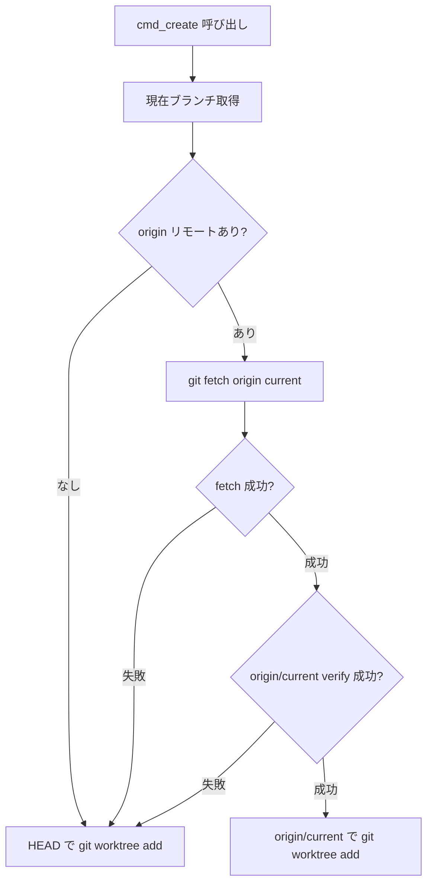

# worktree-tool base ref — 古い HEAD からの分岐防止

## 概要

`worktree-tool.py` の `cmd_create` はワークツリー作成時に `origin/<current_branch>` を fetch して base ref に使う。
ローカル master が古いまま分岐して、後で `git merge master` した際に大量ファイルが「自分側に存在しない＝削除候補」と誤認される事故を防ぐ。

## 動作フロー

## フォールバック条件

| 条件 | 動作 |
| --- | --- |
| `git branch --show-current` 失敗 | HEAD にフォールバック |
| `origin` リモートが無い | HEAD にフォールバック |
| `git fetch origin <current>` 失敗 | HEAD にフォールバック（stderr に警告出力） |
| `git rev-parse origin/<current>` 失敗 | HEAD にフォールバック |

## 参考リンク

- `plugins/work/scripts/worktree/worktree-tool.py`: `cmd_create` / `_resolve_base_ref`
