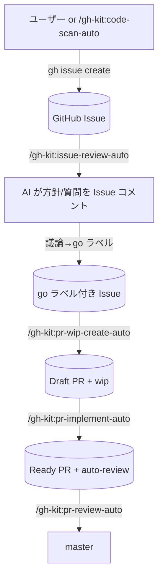
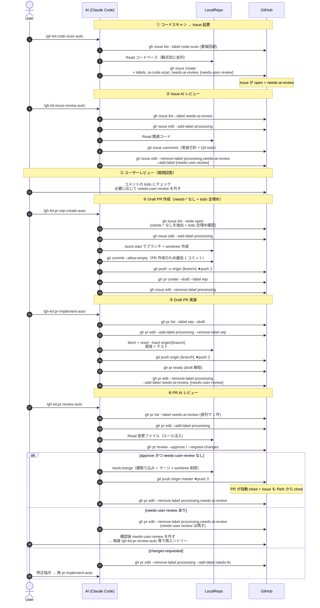
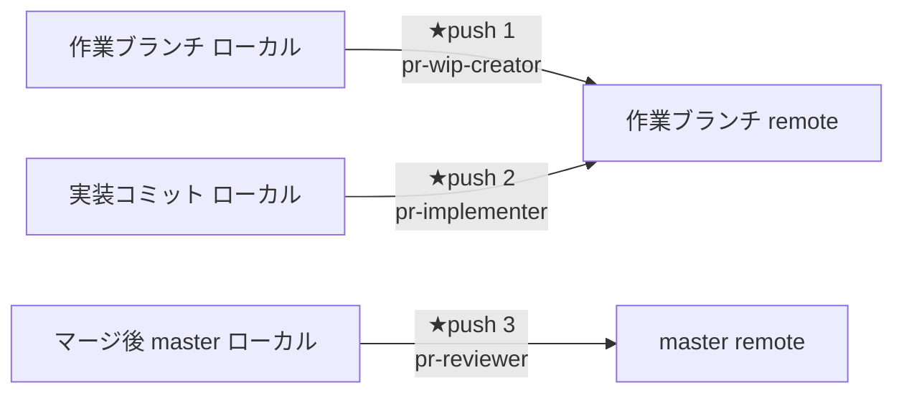

# gh-kit プラグイン — GitHub Issues/PR を真実のソースとした作業フローキット

## 概要

GitHub Issues / Pull Request を真実のソースとして作業を回すプラグインキット。
GitHub 操作はすべて `gh` CLI に統一し、MCP は使わない（CLI 直叩きで認可・レート制御がシンプル）。
タスクドキュメント・ローカルイシュー管理は持たず、GitHub の Issue/PR ライフサイクルにすべて乗せる。
マージは `pr-review-auto` 1 経路に集約し `pr-reviewer` を直列起動することで master 取り込み競合を構造的に防ぐ。

## ワークフロー

## セットアップ

| No | 手順 |
|---|---|
| 1 | `gh` CLI をインストール（https://cli.github.com/） |
| 2 | `gh auth login` で認証（or `GH_TOKEN` 環境変数を設定） |
| 3 | `gh auth status` で接続確認 |

## スキル一覧

| No | スキル | 概要 |
|---|---|---|
| 1 | `/gh-kit:code-scan-auto` | 観点別スキャン → `code-scanner` が `gh issue create` で直接起票（`needs-ai-review` 必須付与） |
| 2 | `/gh-kit:issue-review-auto` | `needs-ai-review` 付きの Issue に AI 方針/質問を投稿 |
| 3 | `/gh-kit:pr-wip-create-auto` | needs-* なしの open Issue 全件 → Draft PR 生成（`wip` 付与） |
| 4 | `/gh-kit:pr-implement-auto` | `wip` Draft PR を N 件並列実装 → Ready 化（`needs-ai-review` 必須付与 + `needs-user-review` 状況判断） |
| 5 | `/gh-kit:pr-review-auto` | `needs-ai-review` Ready PR を直列でレビュー → 合格 + needs-user-review なしならマージ |

## サブエージェント一覧

| No | エージェント | 呼び元 | 役割 |
|---|---|---|---|
| 1 | `code-scanner` | `/gh-kit:code-scan-auto` | 1 観点でファイル走査し `gh issue create` で直接起票 |
| 2 | `issue-reviewer` | `/gh-kit:issue-review-auto` | 1 Issue を読みコメント本文を返す（投稿はメイン） |
| 3 | `pr-wip-creator` | `/gh-kit:pr-wip-create-auto` | `/work:start` でブランチ作成 → Draft PR 起票 |
| 4 | `pr-implementer` | `/gh-kit:pr-implement-auto` | 既存 Draft PR に実装コミットを積み Ready 化 |
| 5 | `pr-reviewer` | `/gh-kit:pr-review-auto` | レビュー → 合格時は `/work:merge` まで実行 |

## テンプレート（共通リソース）

| ファイル | 用途 |
|---|---|
| `plugins/gh-kit/templates/観点メニュー.md` | コード品質観点リスト（code-scan-auto / pr-reviewer が共通参照） |
| `plugins/gh-kit/templates/ファイル解決.md` | code-scanner の観点→ファイル変換ルール |
| `plugins/gh-kit/templates/イシュー本文テンプレート.md` | code-scanner が起票する Issue 本文 |
| `plugins/gh-kit/templates/ユーザーレビュー要否判定.md` | `needs-user-review` 判定基準（ブラックリスト） |
| `plugins/gh-kit/templates/レビュー結果コメント.md` | issue-reviewer が投稿するレビュー結果コメント本文 |
| `plugins/gh-kit/templates/PR本文テンプレート.md` | pr-wip-creator が `gh pr create --body-file` に渡す PR 本文 |
| `plugins/gh-kit/scripts/labels.sh` | ラベル名一元定義 |

SKILL/agent 先頭に `!`cat "${CLAUDE_PLUGIN_ROOT}/scripts/labels.sh"`` を置くことでロード時に
ラベル定数（`$LABEL_*`）がコンテキストへ展開され、後続コマンドは `$LABEL_NEEDS_AI_REVIEW` などで参照する。
テンプレート本体も同様に `!`cat "${CLAUDE_PLUGIN_ROOT}/templates/..."`` で展開する。

## ラベル設計

詳細は `.work/notes/プラグイン/gh-kitラベル設計.md` を参照。ラベル名は `plugins/gh-kit/scripts/labels.sh` に一元化。

要点:

| ラベル種 | 例 |
|---|---|
| 共通排他 | `processing` |
| 共通レビュー | `needs-ai-review` / `needs-user-review` / `needs-fix` |
| Issue 出自 | `ai-code-scan` / `type:*` / `priority:*` |
| PR フェーズ | `wip` |

## 直列マージ原則

| 原則 | 内容 |
|---|---|
| 並列起動禁止 | `pr-review-auto` は `pr-reviewer` を 1 件ずつ呼ぶ |
| ラベル排他 | `processing` が付いた対象は他セッションが触らない |
| Draft 隔離 | `wip` + `draft: true` の PR は `pr-review-auto` の対象外 |
| マージ可能条件 | `needs-*` がすべて外れた + processing なし + draft でない + open |
| コンフリクト方針 | `/work:merge` SKILL.md の方針に従う |
| Issue 早期クローズ防止 | PR 本文は `Refs #N`（`Closes` ではない） |

## work プラグイン依存

| 機能 | 依存先 |
|---|---|
| ブランチ + worktree 作成 | `/work:start` |
| 親取り込み + コンフリクト処理 + マージ + worktree 削除 | `/work:merge` |
| 危険操作ガード | work プラグインの hooks |

## 全体シーケンス（スキャン → マージ → push まで）

登場人物:

| 登場人物 | 役割 |
|---|---|
| **User** | 人間。Issue にコメント / ラベル付け外しで AI と会話 |
| **AI (Claude Code)** | スキル / サブエージェントを実行する主体 |
| **LocalRepo** | メインリポジトリ + `.claude/worktrees/{type}-{title}` 配下のワークツリー |
| **GitHub** | リモートリポジトリ + Issues + PR + ラベル（真実のソース） |

**push のタイミングは 2 つだけ**:

| No | 誰 | いつ | 何を |
|---|---|---|---|
| 1 | `pr-wip-creator` | Draft PR 作成直前 | 作業ブランチを `git push -u origin {branch}`（`--allow-empty` の空コミット 1 個） |
| 2 | `pr-implementer` | 実装コミット後・PR Ready 化直前 | 作業ブランチを `git push origin {branch}` |
| 3 | `pr-reviewer` | `/work:merge` 完了直後 | base ブランチ（通常 master）を `git push origin {base}`（マージコミット含む） |

つまり「作業ブランチは Draft PR 作成時 + 実装後 の 2 回」「master は最終マージ後 1 回」が push 発生点。`code-scanner` `issue-reviewer` `pr-wip-create`（メイン側）`pr-implement-auto`（メイン側）`pr-review-auto`（メイン側）は push しない。

### シーケンス図

### 凡例: push 発生点

## 参考リンク

- `plugins/gh-kit/CLAUDE.md`: 同梱ドキュメント
- `plugins/gh-kit/skills/`: 5 スキルの SKILL.md
- `plugins/gh-kit/agents/`: 5 サブエージェント定義
- `plugins/gh-kit/templates/`: 観点メニュー / ファイル解決 / イシュー本文テンプレート / ユーザーレビュー要否判定 / レビュー結果コメント / PR本文テンプレート
- `.work/notes/プラグイン/gh-kitラベル設計.md`: ラベル一覧・状態遷移図
- [gh CLI manual](https://cli.github.com/manual/)
