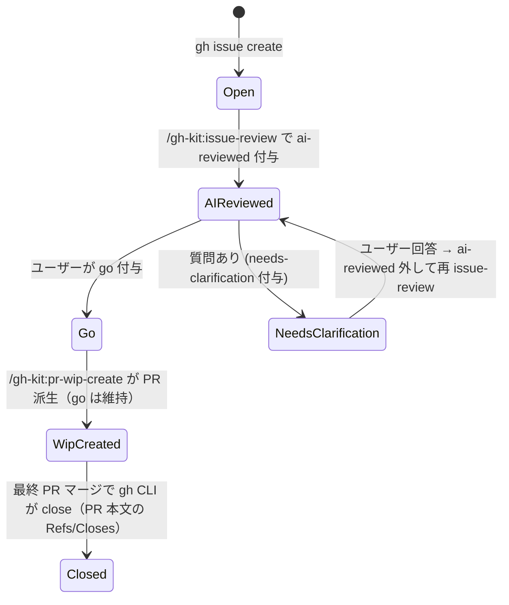
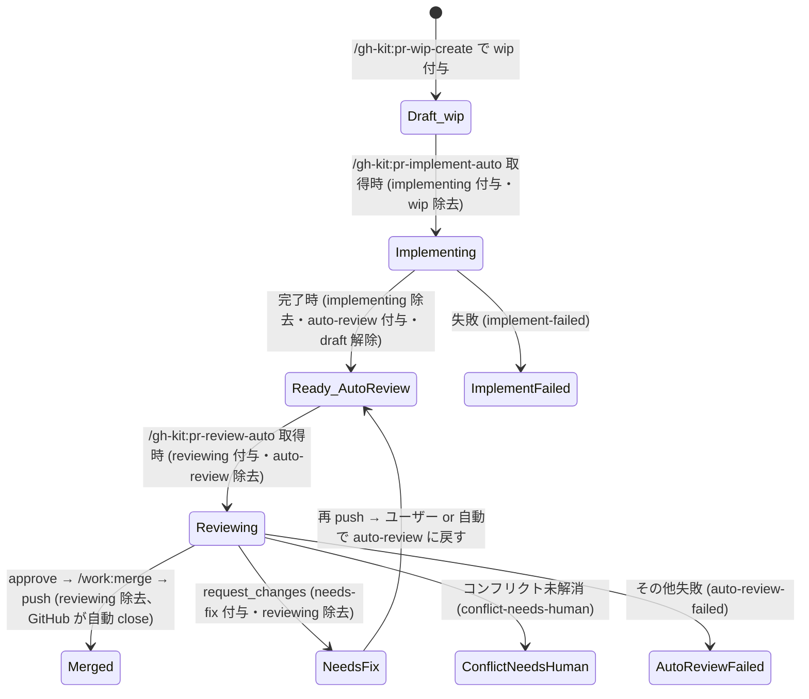

# gh-kit ラベル設計 — Issue/PR の状態を表すラベル一覧

## 概要

gh-kit プラグインは Issue と PR を GitHub のラベルで状態管理する。
状態遷移はラベルの付け外しで表現し、各スキル/エージェントは特定ラベルの付与・除去を排他制御兼マーカーとして使う。
**「ラベル」が真実のソース** — ローカルに状態ファイルは持たない。

## 状態遷移図

### Issue

### PR

## Issue ラベル一覧

| No | ラベル | 意味 | 付与 | 外す |
|---|---|---|---|---|
| 1  | `code-scan` | `/gh-kit:code-scan-auto` で起票された Issue | `code-scanner` | 通常外さない（出自タグ） |
| 2  | `type:{refactor,bug,feat,docs,chore,test}` | Issue の種類 | `code-scanner` / ユーザー | 必要なら手動 |
| 3  | `priority:{high,medium,low}` | 優先度 | `code-scanner` / ユーザー | 必要なら手動 |
| 4  | `ai-reviewed` | `/gh-kit:issue-review` 済み | `issue-review` | 再レビューしたいとき手動 |
| 5  | `needs-clarification` | AI から QA を投げた状態（ユーザー回答待ち） | `issue-review` | ユーザー回答後、`ai-reviewed` も外して再レビュー |
| 6  | `ready-for-go` | AI レビューで質問なく方針確定。go 候補 | `issue-review` | `go` 付与時に手動 or 自動 |
| 7  | `split-needed` | AI レビューで分割提案あり | `issue-review` | 分割完了後に手動 |
| 8  | `go` | 実装着手 OK（ユーザー承認サイン） | ユーザー | 全派生 PR 完了時に手動 |
| 9  | `wip-creating` | `/gh-kit:pr-wip-create` 処理中（排他） | `pr-wip-create` 取得時 | 完了時 |

### Issue 用ステータス補足

| 状況 | 該当ラベル |
|---|---|
| 起票直後（AI レビュー未） | （ラベルなし）or `code-scan` のみ |
| AI レビュー済み・ユーザー判断待ち | `ai-reviewed` + `ready-for-go` / `needs-clarification` / `split-needed` |
| ユーザー go 出した | `ai-reviewed` + `go` |
| 派生 PR が走っている | `ai-reviewed` + `go` + (一時的に `wip-creating`) |
| 完了（GitHub が自動 close） | open でなくなる |

## PR ラベル一覧

| No | ラベル | 意味 | 付与 | 外す |
|---|---|---|---|---|
| 1  | `wip` | Draft PR（実装待ち） | `pr-wip-create` | `pr-implement-auto` 取得時 |
| 2  | `implementing` | `pr-implement-auto` 処理中（排他） | `pr-implement-auto` 取得時 | 完了時 |
| 3  | `auto-review` | レビュー対象（Ready PR） | `pr-implement-auto` 完了時 | `pr-review-auto` 取得時 |
| 4  | `reviewing` | `pr-review-auto` 処理中（排他） | `pr-review-auto` 取得時 | 完了時 |
| 5  | `needs-fix` | `request_changes` された PR | `pr-review-auto` | 再 push 後にユーザー or 自動で `auto-review` に戻す |
| 6  | `conflict-needs-human` | マージコンフリクトが自走解消できなかった | `pr-review-auto` | 人手解消後に手動 |
| 7  | `auto-review-failed` | レビュー or マージで失敗 | `pr-review-auto` | 人手対応後に手動 |
| 8  | `implement-failed` | 実装で失敗 | `pr-implement-auto` | 人手対応後に手動 |

### PR 用ステータス補足

| 状況 | 該当ラベル + draft |
|---|---|
| Draft 雛形作成直後 | `draft: true` + `wip` |
| 実装中 | `draft: true` + `implementing` |
| 実装完了・レビュー待ち | `draft: false` + `auto-review` |
| レビュー中 | `draft: false` + `reviewing` |
| 修正待ち | `draft: false` + `needs-fix` |
| コンフリクト発生 | `draft: false` + `conflict-needs-human` |
| マージ済み（GitHub が自動 close） | open でなくなる |

## 排他制御の根拠

並列セッションが同じ Issue/PR を二重処理しないよう、取得時に「処理中ラベル」を付ける:

| 取得処理 | 付ける処理中ラベル | 外す処理中ラベル（前段） |
|---|---|---|
| `pr-wip-create` が `go` Issue を拾う | `wip-creating` | （なし） |
| `pr-implement-auto` が `wip` PR を拾う | `implementing` | `wip` |
| `pr-review-auto` が `auto-review` PR を拾う | `reviewing` | `auto-review` |

別セッションは処理中ラベル付きを **常にスキップ**。

## 出自タグ vs 状態タグ vs 排他タグ

| 種類 | 例 | 寿命 | 外すか |
|---|---|---|---|
| 出自タグ | `code-scan` / `type:*` / `priority:*` | 永続 | 通常外さない |
| AI レビュー結果タグ | `ai-reviewed` / `needs-clarification` / `ready-for-go` / `split-needed` | 状態と連動 | 状態が変われば外す |
| ユーザーシグナル | `go` | 派生完了まで | ユーザー判断で外す |
| 排他タグ | `wip-creating` / `implementing` / `reviewing` | 取得〜完了 | スキル完了時に必ず外す |
| 失敗タグ | `implement-failed` / `auto-review-failed` / `conflict-needs-human` / `needs-fix` | 人手対応まで | 人手対応後に外す |
| 進捗タグ（PR） | `wip` / `auto-review` | 次フェーズで自動入れ替え | 次フェーズが外す |

## 検討事項（未確定 — 設計レビュー対象）

| No | 論点 | 案 |
|---|---|---|
| 1 | `code-scan` を出自タグとして残すか、状態が進んだら外すか | 残す案を採用中（`gh issue list --label code-scan` で出自で絞り込める）|
| 2 | `ready-for-go` と `go` の二段階は冗長か | `go` だけにする案もある。`ready-for-go` は AI 提案、`go` はユーザー承認サイン、と分けると意味は明確だが運用が冗長 |
| 3 | 失敗系（`implement-failed` 等）から人手対応後に再エントリーする経路 | ユーザーが失敗ラベルを外して `wip` / `auto-review` に戻す手動運用 |
| 4 | `needs-clarification` 解消後の再レビュー起動方法 | ユーザーが `ai-reviewed` を外して `/gh-kit:issue-review {N}` を再実行 |
| 5 | `code-scanner` が type / priority ラベルを推定するルール | 観点と問題内容から推定。明確な根拠が無ければ付けない |

## 参考リンク

- `plugins/gh-kit/CLAUDE.md`: 同梱ドキュメント
- `plugins/gh-kit/skills/*/SKILL.md`: 各スキルでのラベル操作
- `plugins/gh-kit/agents/*.md`: 各エージェントでのラベル操作
- [gh issue edit reference](https://cli.github.com/manual/gh_issue_edit)
- [gh pr edit reference](https://cli.github.com/manual/gh_pr_edit)
