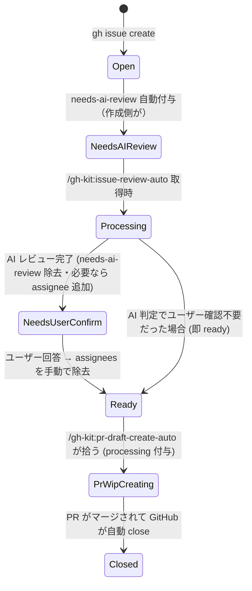
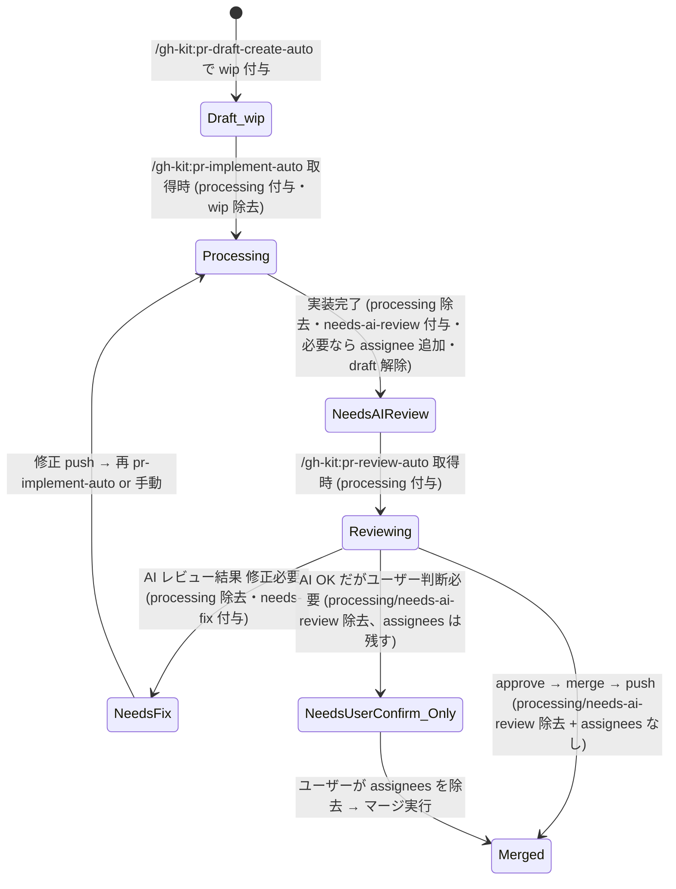

# gh-kit ラベル設計 — Issue/PR の状態を表すラベル一覧

## 概要

gh-kit プラグインは Issue と PR を GitHub のラベルで状態管理する。
状態遷移はラベルの付け外しで表現し、各スキル/エージェントは特定ラベルの付与・除去を排他制御兼マーカーとして使う。
**「ラベル」が真実のソース** — ローカルに状態ファイルは持たない。

ラベル名は `plugins/gh-kit/scripts/labels.sh` に集約。変更するときはここだけ書き換える。

## ラベル一覧（共通）

| No | ラベル | 意味 | 付与 | 外す |
|---|---|---|---|---|
| 1 | `processing` | 何らかの作業中（排他マーカー） | 各スキルが対象を拾った瞬間 | 完了/失敗時に必ず |
| 2 | `needs-ai-review` | AI レビュー必要。**Issue/PR 作成時に必ず付く** | AI が自動 | AI レビュー完了時 |
| 3 | `needs-fix` | レビュー結果、修正必要 | AI/ユーザーがレビューで判断 | 修正完了後にレビューしたほうが外す |

## ユーザー確認待ち（assignees）

`needs-user-review` ラベルは廃止し、assignees で管理する。

| 操作 | コマンド |
|---|---|
| ユーザー確認が必要と判断 | `gh {issue\|pr} edit {N} --add-assignee "$(gh api user --jq '.login')"` |
| ユーザーが確認済み | assignees を手動で外す（次工程に自動進行） |

判定基準: `templates/ユーザー確認要否判定.md`

- Issue の場合: `issue-review-auto` ステップ 4 で assignee 追加
- PR の場合: `pr-implement-auto` の戻り値 `needs_user_review: true` 時に呼び出し側が assignee 追加。conflict/failed 時も assignee 追加

## ラベル一覧（Issue 専用）

| No | ラベル | 意味 | 付与 | 外す |
|---|---|---|---|---|
| 1 | `ai-code-scan` | claude code がスキャンして起票（出自タグ） | `code-scanner` | 通常外さない |
| 2 | `type:{refactor,bug,feat,docs,chore,test}` | 種別 | `code-scanner` / ユーザー | 必要に応じて |
| 3 | `priority:{high,medium,low}` | 優先度 | `code-scanner` / ユーザー | 必要に応じて |

## ラベル一覧（PR 専用）

| No | ラベル | 意味 | 付与 | 外す |
|---|---|---|---|---|
| 1 | `wip` | Draft 雛形 PR | `pr-draft-create` | `pr-implement-auto` が実装に入るとき |

## 状態遷移図

### Issue



「Ready」= needs-* なし + assignees 空、open、質問にすべて回答済み。`/gh-kit:pr-draft-create-auto` の対象。

### PR



「マージ可能」= needs-* がすべて外れた + assignees 空 + processing なし + draft でない + CI green。

## ライフサイクル詳細

### Issue 側

1. AI（`code-scanner`）または人間が Issue 作成
2. AI が `needs-ai-review` を自動付与
   - `code-scanner` 起票なら起票時に
   - 人間起票なら `/gh-kit:issue-review-auto` 起動時に「未付与なら付ける」
3. AI が `templates/ユーザー確認要否判定.md` に従い assignee 追加が必要か判定し、必要なら `gh issue edit --add-assignee` で自分を追加
4. `/gh-kit:issue-review-auto` が `needs-ai-review` 付きを拾う → `processing` 付与
5. AI レビュー実施（実装方針案・QA todo・分割提案）
6. 完了 → `processing` 除去、`needs-ai-review` 除去、コメント投稿
7. ユーザーが QA todo にチェックを入れる
8. ユーザーが内容に満足したら assignees を手動で外す（不要なら最初から assignee なし）
9. **次工程に進める条件**: open + needs-* なし + assignees 空 + processing なし + 質問の todo がすべて埋まっている
10. `/gh-kit:pr-draft-create-auto` の対象になる

### PR 側

1. `/gh-kit:pr-draft-create-auto` が Issue から Draft PR を作成し `wip` 付与
2. `/gh-kit:pr-implement-auto` が `wip` を拾う → `processing` 付与、`wip` 除去
3. 実装完了 → `processing` 除去、`needs-ai-review` を必ず付与、ユーザー確認が必要な場合は `gh pr edit --add-assignee` で assignee 追加、`gh pr ready` で draft 解除
4. `/gh-kit:pr-review-auto` が `needs-ai-review` を拾う → `processing` 付与
5. AI レビュー実施
   - 合格 → `processing` / `needs-ai-review` 除去
     - assignees が空なら即マージ
     - assignees があれば残す（ユーザー確認待ち）
   - 修正必要 → `processing` 除去、`needs-fix` 付与
   - conflict/failed → `processing` 除去、`needs-fix` 付与、assignee 追加
6. ユーザーが assignees を手動で外す
7. **マージ可能条件**: open + needs-* なし + assignees 空 + processing なし + draft でない + CI green

`needs-fix` 解消フロー: 修正 push 後にユーザーまたは AI が `needs-fix` を外し、再度 `needs-ai-review` を付ければレビューフェーズに戻る。

## 排他制御

`processing` がついた Issue/PR は **他セッションが触らない**。各スキルは取得時に必ず:

```bash
gh {issue|pr} edit {N} --add-label "$LABEL_PROCESSING" --remove-label "$LABEL_<前段>"
```

完了/失敗時に必ず:

```bash
gh {issue|pr} edit {N} --remove-label "$LABEL_PROCESSING" [--add-label "$LABEL_<次段>"]
```

## 検討事項（残課題）

| No | 論点 | 現状の方針 |
|---|---|---|
| 1 | 失敗系（旧 `implement-failed` 等）の扱い | タグでは管理せず、PR にコメントで失敗理由を残す。再着手は `needs-fix` 付与 + 修正 push 経由 |
| 2 | コンフリクト時の扱い（旧 `conflict-needs-human`） | `needs-fix` + assignee 追加の組み合わせで表現。コメントで diff を残す |
| 3 | `needs-fix` を AI が解消するスキルを設けるか | 当面は手動。需要が出たら別スキルを検討 |
| 4 | ユーザー確認要否の自動判定の精度 | `templates/ユーザー確認要否判定.md` を運用しながら磨く。疑わしきは assignee 追加側に倒す |

## 参考リンク

- `plugins/gh-kit/scripts/labels.sh`: ラベル名定義（変更時はここだけ）
- `plugins/gh-kit/templates/ユーザー確認要否判定.md`: ユーザー確認要否の判定基準と assignee 操作手順
- `plugins/gh-kit/CLAUDE.md`: 同梱ドキュメント
- `plugins/gh-kit/skills/*/SKILL.md` / `plugins/gh-kit/agents/*.md`: 各スキル・エージェントのラベル操作
- [gh issue edit reference](https://cli.github.com/manual/gh_issue_edit)
- [gh pr edit reference](https://cli.github.com/manual/gh_pr_edit)
