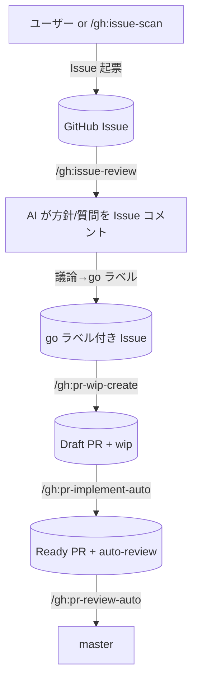

# gh プラグイン — GitHub Issues/PR を真実のソースとした作業フロー

## 概要

GitHub 公式 MCP（Remote HTTP）を `.mcp.json` で同梱し、Issues / Pull Request を真実のソースとして作業を回すプラグイン。タスクドキュメント・ローカルイシュー管理は持たず、GitHub の Issue/PR ライフサイクルにすべて乗せる。マージは `pr-review-auto` 1 経路に集約し `pr-reviewer` を直列起動することで master 取り込み競合を構造的に防ぐ。

## ワークフロー

## セットアップ

| No | 手順 |
|---|---|
| 1 | https://github.com/settings/tokens で PAT 発行（`repo` / `read:org`） |
| 2 | `~/.bashrc` 等に `export GITHUB_PERSONAL_ACCESS_TOKEN=ghp_xxx` |
| 3 | Claude Code 再起動後 `/mcp` で `github` connected を確認 |

## 同梱 MCP

| サーバー | エンドポイント | toolsets |
|---|---|---|
| `github` | `https://api.githubcopilot.com/mcp/` | default（`context, repos, issues, pull_requests, users`） |

## スキル一覧

| No | スキル | 概要 |
|---|---|---|
| 1 | `/gh:issue-scan` | 観点別スキャン → `create_issue` で Issue 起票 |
| 2 | `/gh:issue-review` | 未レビュー Issue を読み AI 方針/質問を Issue コメント投稿 |
| 3 | `/gh:pr-wip-create` | `go` ラベル Issue を全件取り各 Issue から Draft PR を作成（1 Issue 複数派生可） |
| 4 | `/gh:pr-implement-auto` | `wip` Draft PR を N 件並列実装 → Ready 化 |
| 5 | `/gh:pr-review-auto` | `auto-review` Ready PR を直列でレビュー → 合格ならマージ |

## サブエージェント一覧

| No | エージェント | 呼び元 | 役割 |
|---|---|---|---|
| 1 | `issue-scanner` | `/gh:issue-scan` | 1 観点でファイル走査し findings を返す |
| 2 | `issue-reviewer` | `/gh:issue-review` | 1 Issue を読みコメント本文を返す |
| 3 | `pr-wip-creator` | `/gh:pr-wip-create` | `/work:start` でブランチ作成 → Draft PR 起票 |
| 4 | `pr-implementer` | `/gh:pr-implement-auto` | 既存 Draft PR に実装コミットを積み Ready 化 |
| 5 | `pr-reviewer` | `/gh:pr-review-auto` | 注入ルール準拠を中心にレビュー → 合格時は `/work:merge` まで実行 |

## ラベル設計

| ラベル | 意味 | 付与 | 外し |
|---|---|---|---|
| `scan` / `scan:{scope}` | `/gh:issue-scan` 起票 / 観点識別 | `issue-scan` | 通常外さない |
| `ai-reviewed` | `/gh:issue-review` 済み | `issue-review` | 再レビュー時は手動 |
| `needs-clarification` | QA 待ち | `issue-review` | 議論で解消後に手動 |
| `ready-for-go` | go 候補 | `issue-review` | `go` 付与時に手動 |
| `split-needed` | 分割推奨 | `issue-review` | 分割完了後に手動 |
| `go` | 実装着手 OK | ユーザー | 全派生 PR 完了時に手動 |
| `wip` | Draft PR | `pr-wip-create` | `pr-implement-auto` 取得時 |
| `wip-creating` | Draft PR 作成中（排他） | `pr-wip-create` | 完了時 |
| `implementing` | 実装中（排他） | `pr-implement-auto` | 完了時 |
| `auto-review` | レビュー対象 | `pr-implement-auto` 完了時 | `pr-review-auto` 取得時 |
| `reviewing` | レビュー中（排他） | `pr-review-auto` | 完了時 |
| `needs-fix` | request_changes された | `pr-review-auto` | 再 push 後に手動 |
| `conflict-needs-human` | コンフリクト未解消 | `pr-review-auto` | 人手解消後 |
| `auto-review-failed` | レビュー/マージ失敗 | `pr-review-auto` | 人手対応後 |
| `implement-failed` | 実装失敗 | `pr-implement-auto` | 人手対応後 |

## 直列マージ原則

| 原則 | 内容 |
|---|---|
| 並列起動禁止 | `pr-review-auto` は `pr-reviewer` を 1 件ずつ呼ぶ |
| ラベル排他 | `reviewing` / `resolving` が付いた対象は他セッションが触らない |
| Draft 隔離 | `wip` ラベル + `draft: true` の PR は `pr-review-auto` の対象外 |
| コンフリクト方針 | `/work:merge` SKILL.md の方針に従う（一括 `-X` 禁止・両側の意味の強さで判断・サブエージェント委譲禁止） |
| Issue 早期クローズ防止 | PR 本文は `Refs #N`（`Closes` ではない）— 1 Issue 複数 PR でも Issue が早期に閉じない |

## work プラグイン依存

| 機能 | 依存先 |
|---|---|
| ブランチ + worktree 作成 | `/work:start` |
| 親取り込み + コンフリクト処理 + マージ + worktree 削除 | `/work:merge` |
| 危険操作ガード（`-X ours/theirs` 等） | work プラグインの hooks |

## 参考リンク

- `plugins/gh/CLAUDE.md`: 同梱ドキュメント
- `plugins/gh/.mcp.json`: GitHub MCP 接続定義
- `plugins/gh/skills/`: 5 スキルの SKILL.md
- `plugins/gh/agents/`: 5 サブエージェント定義
- [GitHub MCP Server (公式)](https://github.com/github/github-mcp-server)
- [Install GitHub MCP in Claude Code](https://github.com/github/github-mcp-server/blob/main/docs/installation-guides/install-claude.md)
