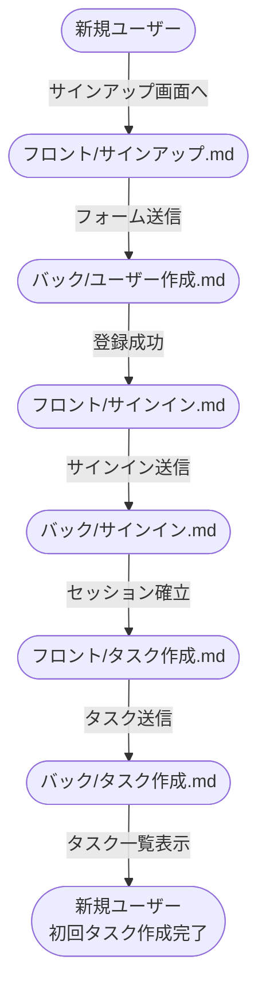
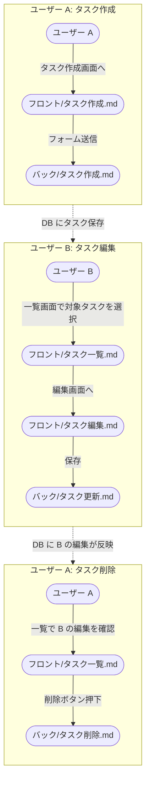

# gh-kit テンプレート: シナリオ

**複数の結合フローをまたぐ連続フロー**（E2E 相当）をまとめる書式。
バックエンド結合 / フロントエンド結合 が「1 結合 = 1 ファイル」なのに対し、シナリオは「複数結合を組み合わせた業務シナリオ = 1 ファイル」。

例: 新規ユーザー登録 → タスク作成 → 別ユーザーが画面で確認 → コメント投稿 のような **複数画面 + 複数 API** をまたぐフロー。

外部 API は **Mock 前提**（実通信は外部疎通テストで別途）。シナリオは「自プロジェクト内のフロー結合確認」が主眼。

## ファイル構成

`docs/wiki/設計図/シナリオ/` 配下に **シナリオ単位の .md をフラットに並べる**（サブフォルダは原則なし）。
README.md でカテゴリー別に分類して索引。

| No | ファイル      | 役割                                              |
| -- | ------------- | ------------------------------------------------- |
| 1  | `README.md`   | カテゴリー別の索引                                |
| 2  | `{論理名}.md` | 1 シナリオの成功フロー 1 本                     |

ファイル名は **日本語の論理名**（例: `新規ユーザー登録から初回ログイン.md` / `タスク作成から他ユーザー編集.md`）。シナリオの業務的な名前で。

配置例:
```
docs/wiki/設計図/シナリオ/
├── README.md
├── 新規ユーザー登録から初回ログイン.md
├── 招待リンクからの参加.md
├── 招待リンク期限切れ.md          ← 例外系シナリオ
├── タスク作成から他ユーザー編集.md
├── 同時編集競合.md                 ← 例外系シナリオ
├── タスク完了から通知配信.md
└── コメント投稿から通知配信.md
```

## 担当セクション一覧

| No | 対象ファイル | セクション         | サブセクション | 必須or条件 | 担当            | 補足                                   |
| -- | ------------ | ------------------ | -------------- | ---------- | --------------- | -------------------------------------- |
| 1  | インデックス | 冒頭リード         | -              | 必須       | pr-arch / pr-ui | 索引の説明                             |
| 2  | インデックス | `## 一覧`          | -              | 必須       | 〃              | 主要画面列付きの単一表                 |
| 3  | 詳細         | 冒頭リード         | -              | 必須       | 〃              | シナリオ概要 + 関連結合への参照        |
| 4  | 詳細         | `## メインフロー` | `### 図`        | 必須       | 〃              | 成功フロー 1 本（結合ノードで構成）  |

シナリオは **1 ファイル = 1 成功フロー** が原則（1 つのシナリオ内で分岐 / 例外を書かない）。

ただし **例外系のシナリオ自体は別ファイルとして必要なら作る**:
- 個別 API のバリデーションエラーや 4xx / 5xx → 結合テストでカバー（シナリオには起こさない）
- **業務的に大きく流れが変わる例外** → 別シナリオファイルとして独立させる
  - 例: `招待リンクからの参加.md`（成功）/ `招待リンク期限切れ.md`（期限切れで別画面誘導）
  - 例: `タスク作成から他ユーザー編集.md`（成功）/ `同時編集競合.md`（楽観的ロック失敗 → リトライ）
- 一覧表（`## 一覧`）には **成功系も例外系も両方並べる**（カテゴリ分けは主要画面で）

## `冒頭リード`（インデックスファイル）

### 記述例

```markdown
# シナリオ

複数の結合フローをまたぐ業務シナリオ集。
1 ファイル = 1 シナリオ = E2E テスト 1 ファイル（または手動シナリオテスト 1 ケース）。
```

### 補足

- 主要画面でグルーピング（同じ画面が確認観点のシナリオは並べる）

## `## 一覧`（インデックスファイル）

主要画面列付きの単一表で全シナリオを索引化。

### 記述例

```markdown
## 一覧

| No | 主要画面               | シナリオ                            | 概要                                                                                | リンク                                                                          | 補足                       |
| -- | ---------------------- | ----------------------------------- | ----------------------------------------------------------------------------------- | ------------------------------------------------------------------------------- | -------------------------- |
| 1  | ダッシュボード画面     | 新規ユーザー登録から初回ログイン    | サインアップ → メール認証 → 初回サインイン → ダッシュボード表示                     | [新規ユーザー登録から初回ログイン](./新規ユーザー登録から初回ログイン.md)       | -                          |
| 2  | ワークスペース一覧画面 | 招待リンクからの参加                | 招待リンク → アカウント作成 → 指定ワークスペース参加                                | [招待リンクからの参加](./招待リンクからの参加.md)                               | -                          |
| 3  | 〃                     | 招待リンク期限切れ                  | 期限切れ招待リンク → エラー画面 → 再発行依頼導線                                    | [招待リンク期限切れ](./招待リンク期限切れ.md)                                   | 例外系シナリオ             |
| 4  | タスク一覧画面         | タスク作成から他ユーザー編集        | ユーザー A がタスク作成 → ユーザー B が編集 → A の一覧画面に反映                    | [タスク作成から他ユーザー編集](./タスク作成から他ユーザー編集.md)               | リアルタイム更新検証含む   |
| 5  | タスク編集画面         | 同時編集競合                        | A と B が同タスクを同時編集 → 楽観的ロックで競合検知 → 後保存側がリトライ           | [同時編集競合](./同時編集競合.md)                                               | 例外系シナリオ             |
| 6  | 通知一覧画面           | タスク完了から通知配信              | A がタスク完了 → 担当者 B にメール送信 + B の通知一覧に通知バッジ                   | [タスク完了から通知配信](./タスク完了から通知配信.md)                           | メール送信は SendGrid Mock |
| 7  | 〃                     | コメント投稿から通知配信            | A がコメント投稿（@B メンション）→ B の通知一覧にメンション通知                     | [コメント投稿から通知配信](./コメント投稿から通知配信.md)                       | -                          |
```

### 補足

**主要画面列:**
- シナリオで **本当に確認したい画面 1 つ** だけを書く（複数列挙禁止）
- 「**最終確認到達点画面**」を選ぶ（テストアサートが集中する画面 / シナリオの最後にユーザーが見る画面）
- 値は **フロントエンド結合ドキュメントと同じ論理名** を使う（`タスク編集画面` / `通知一覧画面` 等）
- 同じ主要画面で連続する場合は `〃` で省略

**シナリオ設計の前提:**
- 1 シナリオ = 1 確認観点（= 主要画面 1 つ）
- 経由する上流画面で下流画面の挙動も同時に検証する形でシナリオを組む
  - 例: タスク編集画面のシナリオで一覧画面への反映も同時に確認できるなら、一覧画面側で別シナリオを起こす必要なし
- 主要画面が 2 個以上になる場合 → シナリオを分割する

**シナリオ列:**
- 日本語の業務シナリオ名

**概要列:**
- 1 行でシナリオの中身を要約（主要ステップを `→` で繋ぐ）

**リンク列:**
- `[表示](./{ファイル名}.md)` 形式

**補足:**
- 同じ主要画面のシナリオは隣接させる（画面開発者の逆引きを楽にするため）
- 新規シナリオ追加時は **必ずこの索引にも 1 行追加**（手動更新）

## `冒頭リード`（詳細ファイル）

### 記述例

```markdown
# 新規ユーザー登録から初回タスク作成

新規ユーザーがサインアップ → ログイン → 初回タスクを作成するまでの一連の業務シナリオ。

対応テストファイル: `tests/e2e/onboarding/signup-to-first-task.spec.ts`
- フロントエンド: [サインアップ画面](../フロントエンド結合/サインアップ.md) / [タスク作成画面](../フロントエンド結合/タスク作成.md)
- バックエンド: [ユーザー作成](../バックエンド結合/ユーザー作成.md) / [サインイン](../バックエンド結合/サインイン.md) / [タスク作成](../バックエンド結合/タスク作成.md)
```

### 補足

- 1 行目は **日本語の論理名**（ファイル名と一致）
- 対応する E2E テストファイル（または手動シナリオテスト記録）への参照を必ず書く
- **関連結合** リストで、シナリオがまたぐ結合ドキュメントへの参照を全部書く（バック / フロント別に整理）

## `## メインフロー`（詳細ファイル）

成功シナリオ。**1 シナリオ = 1 メインフロー** が原則。

### 記述例

````markdown
## メインフロー

### 図



### 補足（任意）

- 各ノードは **1 結合ドキュメントに対応**（詳細はリンク先参照）
- セッション Cookie はサインイン後のリクエストすべてに含まれる前提
````

### 記述例（複数ユーザー版）

複数ユーザーがアクションを取るシナリオは **1 つの Mermaid 内で `subgraph` で区切る**。
ユーザーごとに subgraph を作り、subgraph 間は **点線矢印** でデータ伝播を示す。

例: A がタスク作成 → B が編集 → A が削除（タスク 1 件のライフサイクルを 2 ユーザーで往復）

````markdown
## メインフロー

### 図



### 補足（任意）

- ユーザー A / B はそれぞれ別ブラウザコンテキスト（Playwright `context.newPage()`）で操作
- 各 subgraph = E2E テスト内の 1 フェーズ（`test.step('ユーザー A: タスク作成', ...)`）
- subgraph 間の点線矢印 = DB を介したデータ伝播（直接呼び出しではない）
````

### 補足

**`### 図`:**
- **Mermaid `flowchart TD` で縦一本線スタイル**（上から下に流れる）
- 起点 / 終点ノードは `([ユーザー])`
- **中間ノードは「結合 1 件 = 1 ノード」の粒度**（結合ドキュメントへの参照リンク付き）
  - シェイプ: `([フロント/{ファイル名}.md])` / `([バック/{ファイル名}.md])`（フロント/バックは prefix で区別、詳細はリンク先参照）
  - フロント結合とバック結合を交互に並べる形が一般的（画面操作 → API 呼出 → 次画面 ...）
- 結合内部の詳細フローはここでは書かない（各結合ドキュメントに任せる）
- 矢印ラベルは「次ステップへの遷移」を日本語で（`サインアップ画面へ` / `フォーム送信` / `セッション確立` 等）
- **1 シナリオ内に分岐 / 例外系は書かない**（成功フロー 1 本のみ）
  - 個別 API のエラーは結合テストでカバー
  - 業務的に流れが変わる例外（招待リンク期限切れ / 同時編集競合 等）は **別シナリオファイル** として作る → 一覧に並ぶ

**`### 図`（複数ユーザー版）:**
- ユーザーが 2 人以上登場する場合は **`subgraph` で「ユーザー × アクション単位」のフェーズに区切る**
- subgraph 名は `"ユーザー {名前}: {アクション}"` 形式
- 同じユーザーが複数回登場する場合も **アクションごとに別 subgraph**（時系列順に並べる）
- subgraph 間は **点線矢印 `-.{伝播内容}.->`** で繋ぐ（DB / 通知 / セッション を介した伝播）
- 縦に長くなって OK（1 シナリオ = 1 図を維持）
- ノード ID は `{フェーズ}_{ステップ}` 形式で衝突回避（例: `A1_STEP1` / `B1_STEP1`）

**`### 補足`（任意）:**
- 図に書ききれない注意事項（セッション継続 / DB シード / Mock の振る舞い 等）を箇条書きで

**E2E テストとの対応:**
- 図の入口（上のユーザー）= テスト開始（ブラウザ起動 + 画面アクセス）
- 図の出口（下のユーザー）= 最終状態確認（DOM アサート / DB 検証）
- 各結合ノード = テスト内の 1 ブロック（or Page Object の 1 メソッド呼び出し）

