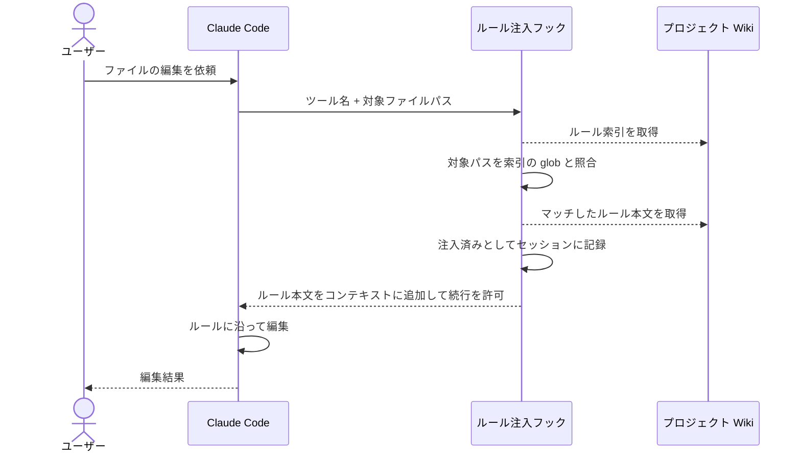
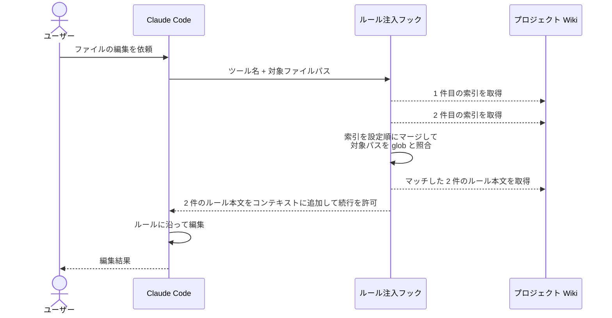
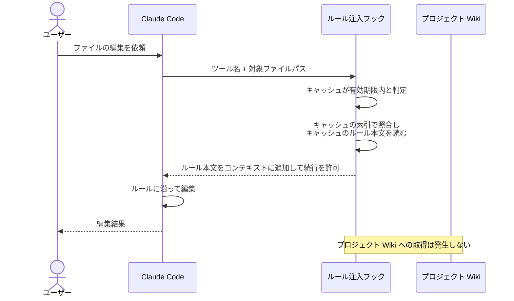
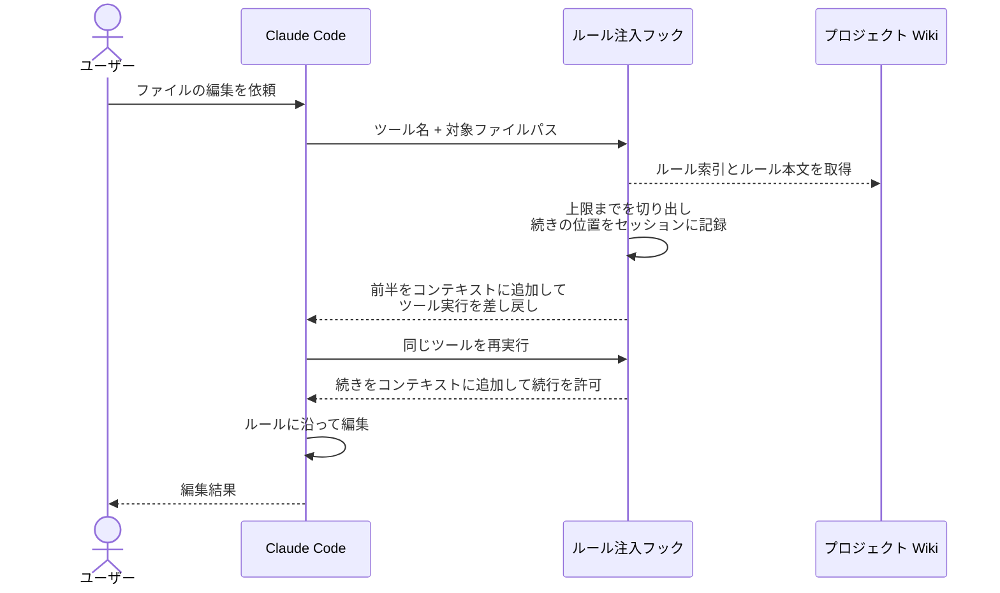
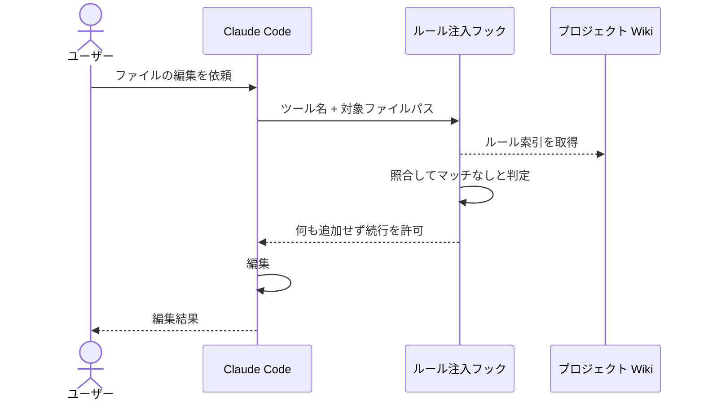
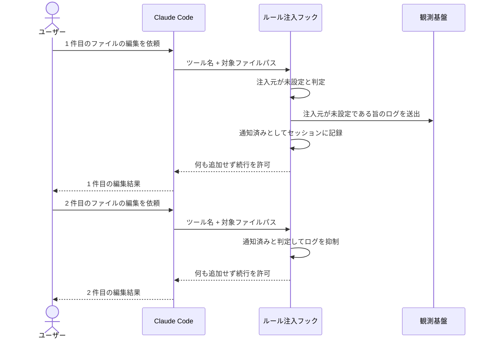
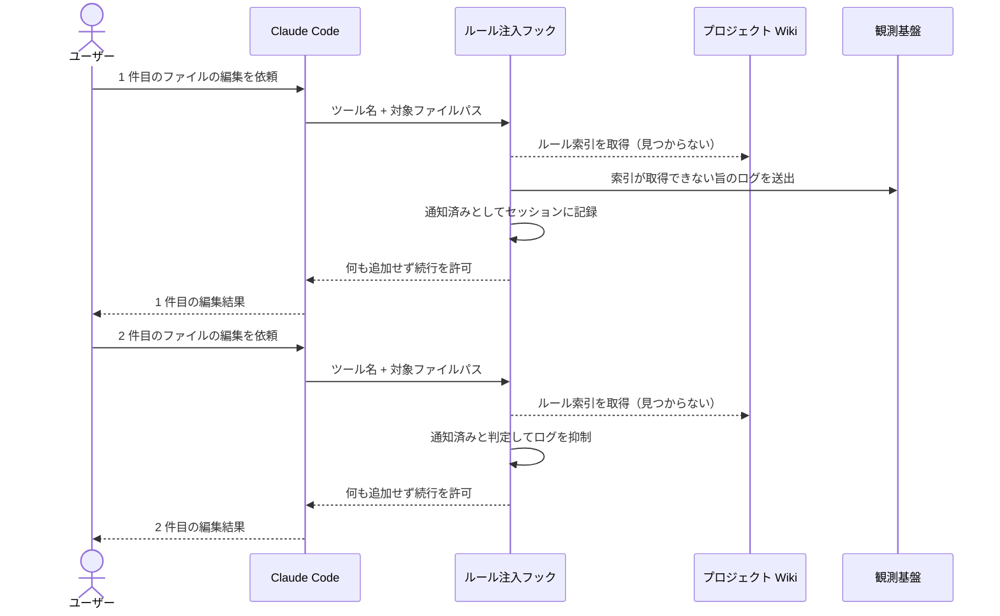
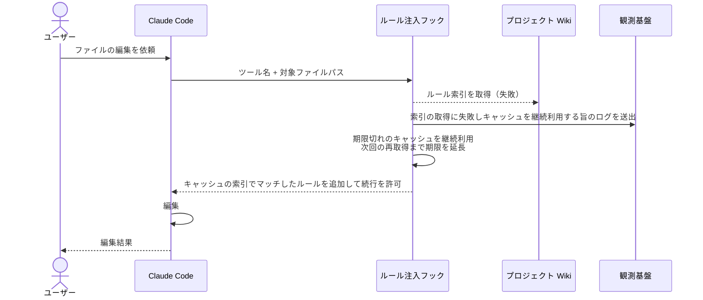
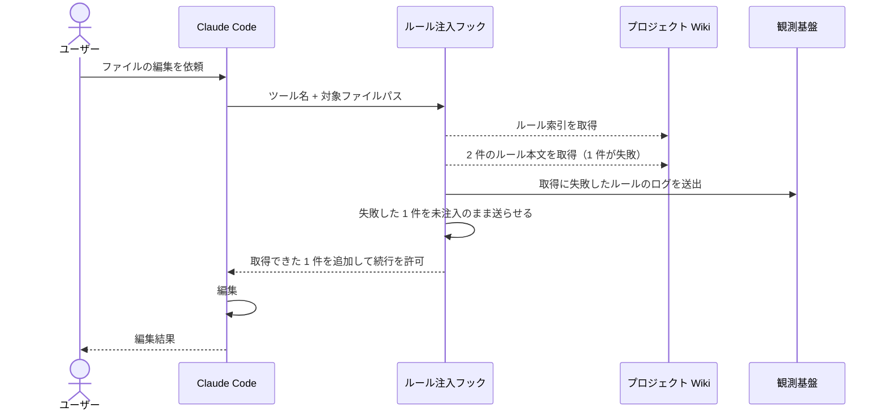

# ルール注入

Claude がファイルを編集・作成・閲覧しようとしたとき、対象ファイルにマッチする規約ドキュメントを自動でコンテキストに取り込む単一ユースケース。

- 対応テストファイル: `tests/e2e/単一ユースケース/test_ルール注入.py`

## 正常シナリオ

### セットアップ

| セットアップ | 説明 | 補足 |
| --- | --- | --- |
| Mock | なし（実環境で実行） | - |
| 注入元 | 環境変数に `rules.yaml` の URL を 1 件設定 | 索引の取得先 |
| ルール索引 | 指定 URL に索引を配置 | 編集対象にマッチする glob を持つエントリを 1 件含む |
| ルール本文 | 索引の各エントリが指す URL にルール md を配置 | 注入上限に収まるサイズ |
| セッション | 当該ルールが未注入の状態 | 注入済み記録を持たない |

### フロー

### 期待値

- マッチしたルールの本文がコンテキストに取り込まれている
- 対象ファイルが編集されている
- 同一セッションで同じファイルを再度編集しても、同じルールは再注入されない

## 正常シナリオ（注入元が複数）

### セットアップ

| セットアップ | 説明 | 補足 |
| --- | --- | --- |
| Mock | なし（実環境で実行） | - |
| 注入元 | 環境変数に `rules.yaml` の URL を 2 件設定 | 共通規約とプロジェクト固有規約を想定 |
| ルール索引 | 2 件の URL それぞれに索引を配置 | どちらも編集対象にマッチするエントリを 1 件ずつ含む |
| ルール本文 | 各索引の各エントリが指す URL にルール md を配置 | 合計が注入上限に収まるサイズ |
| セッション | どちらのルールも未注入の状態 | - |

### フロー

### 期待値

- 2 件の索引それぞれのルール本文がコンテキストに取り込まれている
- ルールの並び順が環境変数の設定順になっている
- 対象ファイルが編集されている

## 正常シナリオ（キャッシュ有効）

### セットアップ

| セットアップ | 説明 | 補足 |
| --- | --- | --- |
| Mock | なし（実環境で実行） | - |
| 注入元 | 環境変数に到達できない索引 URL を設定 | キャッシュだけで動くことを決定的に確かめる |
| キャッシュ | 索引とルール本文が有効期限内で存在する | 前回の取得結果 |
| セッション | 当該ルールが未注入の状態 | - |

### フロー

### 期待値

- キャッシュのルール本文がコンテキストに取り込まれている
- 対象ファイルが編集されている
- 注入元が到達できない状態でも注入が成立している（Wiki を参照していない証跡）

## 正常シナリオ（注入上限を超える）

### セットアップ

| セットアップ | 説明 | 補足 |
| --- | --- | --- |
| Mock | なし（実環境で実行） | - |
| 注入元 | 環境変数に `rules.yaml` の URL を 1 件設定 | - |
| ルール索引 | 指定 URL に索引を配置 | 編集対象にマッチする glob を持つエントリを 1 件含む |
| ルール本文 | 索引の各エントリが指す URL にルール md を配置 | 1 回の注入上限を超えるサイズ |
| セッション | 当該ルールが未注入の状態 | - |

### フロー

### 期待値

- ルール本文が分割されて全量コンテキストに取り込まれている
- 対象ファイルが編集されている

## 正常シナリオ（マッチするルールがない）

### セットアップ

| セットアップ | 説明 | 補足 |
| --- | --- | --- |
| Mock | なし（実環境で実行） | - |
| 注入元 | 環境変数に `rules.yaml` の URL を 1 件設定 | - |
| ルール索引 | 指定 URL に索引を配置 | 編集対象にマッチする glob を持つエントリを含まない |

### フロー

### 期待値

- コンテキストにルール本文が取り込まれていない
- 対象ファイルが編集されている

## 異常シナリオ（注入元が未設定）

### セットアップ

| セットアップ | 説明 | 補足 |
| --- | --- | --- |
| Mock | なし（実環境で実行） | - |
| 注入元 | 環境変数を未設定にする | 異常を決定的に誘発 |
| セッション | 通知済み記録を持たない状態 | 初回の判定を再現 |

### フロー

### 期待値

- コンテキストにルール本文が取り込まれていない
- 2 件とも対象ファイルが編集されている（フックが編集を妨げない）
- 観測基盤に、注入元が未設定である旨のログがセッション内で 1 件だけ記録されている

## 異常シナリオ（索引が存在しない）

### セットアップ

| セットアップ | 説明 | 補足 |
| --- | --- | --- |
| Mock | なし（実環境で実行） | - |
| 注入元 | 環境変数に `rules.yaml` の URL を 1 件設定 | - |
| ルール索引 | 指定 URL に索引を配置しない | 異常を決定的に誘発 |
| キャッシュ | 索引キャッシュを持たない状態 | 導入直後を再現 |
| セッション | 通知済み記録を持たない状態 | 初回の判定を再現 |

### フロー

### 期待値

- コンテキストにルール本文が取り込まれていない
- 2 件とも対象ファイルが編集されている（Wiki 未整備でも編集を妨げない）
- 観測基盤に、索引が取得できない旨のログ（取得先 URL 付き）がセッション内で 1 件だけ記録されている

## 異常シナリオ（索引の取得に失敗・キャッシュあり）

### セットアップ

| セットアップ | 説明 | 補足 |
| --- | --- | --- |
| Mock | なし（実環境で実行） | - |
| 注入元 | 環境変数に到達できない索引 URL を設定 | 異常を決定的に誘発 |
| キャッシュ | 前回取得した索引が期限切れで残っている状態 | 継続利用の対象 |

### フロー

### 期待値

- キャッシュ済みの索引でマッチしたルールが取り込まれている
- 対象ファイルが編集されている
- 観測基盤に、索引の取得に失敗しキャッシュを継続利用した旨のログが記録されている

## 異常シナリオ（ルール本文の取得に失敗）

### セットアップ

| セットアップ | 説明 | 補足 |
| --- | --- | --- |
| Mock | なし（実環境で実行） | - |
| 注入元 | 環境変数に `rules.yaml` の URL を 1 件設定 | - |
| ルール索引 | 指定 URL に索引を配置 | 実在するルールと実在しないルールの 2 エントリを含み、どちらも編集対象にマッチする |

### フロー

### 期待値

- 取得できたルールの本文だけが取り込まれている
- 対象ファイルが編集されている
- 失敗したルールは注入済みとして記録されていない（次のツール呼び出しで再試行される）
- 観測基盤に、取得に失敗したルールのログ（取得先 URL 付き）が記録されている
