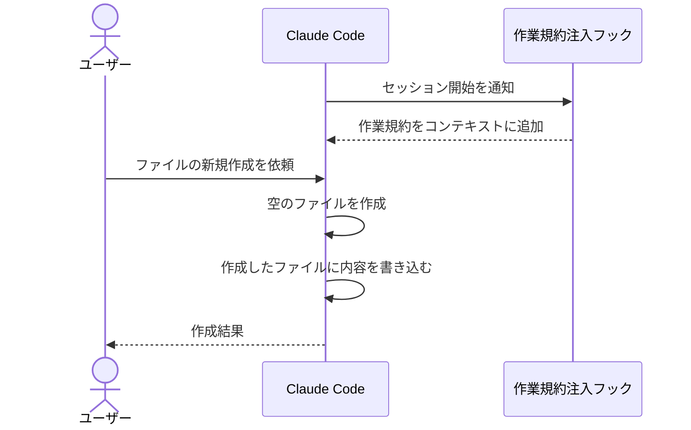

# 作業規約注入

セッションの開始時に、ファイル操作の作業規約を Claude のコンテキストへ取り込む単一ユースケース。
規約が守られることで、新規ファイルにも [ルール注入](./ルール注入.md) が効くようになる。

- 対応テストファイル: `tests/e2e/単一ユースケース/test_作業規約注入.py`

## 正常シナリオ

### セットアップ

| セットアップ | 説明 | 補足 |
| --- | --- | --- |
| Mock | なし（実環境で実行） | - |
| フック | プラグインの作業規約注入フックを登録した状態でセッションを開始する | - |
| 作業対象 | 未作成のファイルパスを 1 件用意する | 新規作成の依頼先 |

### フロー

### 期待値

- 作業規約がコンテキストに取り込まれている
- 空のファイルの作成が、内容の書き込みより先に行われている
- 依頼した内容がファイルに書かれている
