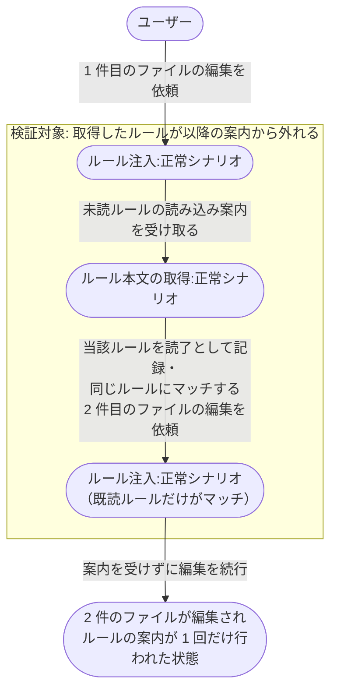
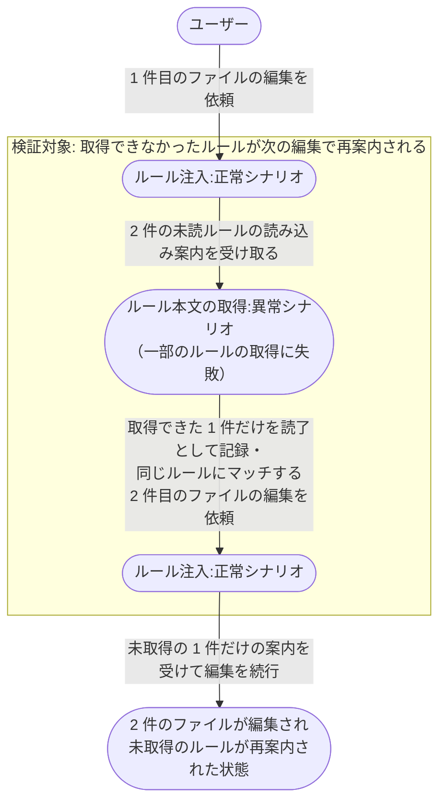

# ルールの案内から本文取得と既読抑止まで

編集対象にマッチしたルールの読み込み案内を受けて本文を取得し、同一セッションの以降の編集では同じルールが案内対象から外れるまでの業務シナリオ。

- 対応テストファイル: `tests/e2e/複合ユースケース/test_ルールの案内から本文取得と既読抑止まで.py`

## 正常シナリオ

### セットアップ

| セットアップ | 説明 | 補足 |
| --- | --- | --- |
| Mock | なし（実環境で実行） | - |
| 注入元 | 環境変数に `rules.yaml` の場所を 1 件設定 | - |
| ルール索引 | 指定の場所に索引を配置 | 2 件の作業対象の双方にマッチする glob を持つエントリを 1 件含む |
| ルール本文 | 索引からの相対パスが指す位置にルール md を配置 | - |
| セッション | 当該ルールが未読の状態 | 読了の記録を持たない |
| 作業対象 | 索引の glob にマッチするファイルを 2 件用意する | 1 件目・2 件目の編集先 |

### フロー

### 期待値

- 1 件目の編集ではルールの読み込み案内がコンテキストに取り込まれ、そのルールの本文が取得されている
- 2 件目の編集では同じルールの案内がコンテキストに取り込まれていない
- 2 件のファイルがどちらもルールに沿って編集されている

## 異常シナリオ（案内されたルールの一部が取得できない）

### セットアップ

| セットアップ | 説明 | 補足 |
| --- | --- | --- |
| Mock | なし（実環境で実行） | - |
| 注入元 | 環境変数に `rules.yaml` の場所を 1 件設定 | - |
| ルール索引 | 指定の場所に索引を配置 | 2 件の作業対象の双方にマッチするエントリを 2 件含む |
| ルール本文 | 一方のエントリが指す位置にだけルール md を配置 | 他方は配置せず、取得失敗を決定的に誘発 |
| セッション | どちらのルールも未読の状態 | 読了の記録を持たない |
| 作業対象 | 索引の glob にマッチするファイルを 2 件用意する | 1 件目・2 件目の編集先 |

### フロー

### 期待値

- 取得できたルールの本文だけがコンテキストに取り込まれている
- 2 件目の編集では、取得に失敗したルールだけが案内されている
- 2 件のファイルがどちらも編集されている
