# ルール注入

フック: PreToolUse（`Read` / `Write`）

Claude Code がファイルを読む直前と新規作成する直前に呼ばれ、対象ファイルにマッチする規約ドキュメントを取得してコンテキストへ追加する。
既存ファイルの編集前には必ず読み取りが、新規作成では空ファイルの書き出しが入るため、この 2 つを注入点にする。
注入量が 1 回の上限を超える場合はツール実行を差し戻し、次の呼び出しで続きを送る。

- 対応テストファイル: `tests/integration/inject_rules/test_ルール注入.py`

## インターフェース

### リクエスト

標準入力から Claude Code のフックペイロードを受け取る。

| パラメータ | 型 | 必須 | デフォルト | 説明 | 制限 | 補足 |
| --- | --- | --- | --- | --- | --- | --- |
| `session_id` | string | - | `"default"` | セッション識別子 | - | 注入済み記録の保存キー |
| `tool_name` | string | ✅ | - | 実行しようとしているツール名 | - | `Read` / `Write` 以外なら何もせず終了 |
| `tool_input.file_path` | string | - | なし（何もせず終了） | 操作対象のファイルパス | - | glob 照合の対象 |
| `cwd` | string | - | フックの実行ディレクトリ | フック実行時の作業ディレクトリ | - | 操作対象のファイルパスを相対表現でも glob 照合するための基準 |

取得先と送信先は環境変数で受け取る。

| 環境変数 | 型 | 必須 | デフォルト | 説明 | 制限 | 補足 |
| --- | --- | --- | --- | --- | --- | --- |
| `INJECT_RULES_INDEXES` | string | - | なし（何もせず終了） | ルール索引ファイルの場所のカンマ区切りリスト | raw URL またはローカル絶対パス | 先頭の索引が優先。ここに書いた場所がルール本文のベースになる |
| `INJECT_RULES_OTLP_ENDPOINT` | string | - | `http://localhost:4317` | ログ送信先の OTLP gRPC 受付 URL | - | `OTEL_` で始まる変数は Claude Code がサブプロセスから削除するため別名にする |
| `INJECT_RULES_CACHE_DIR` | string | - | `~/.cache/inject-rules` | 取得済み本文のキャッシュ置き場 | - | - |
| `INJECT_RULES_SESSION_DIR` | string | - | `~/.claude/tokens/inject-rules` | セッション状態の保存先 | - | - |

ルール索引は以下の書式の YAML とする。

| フィールド | 型 | 必須 | デフォルト | 説明 | 制限 | 補足 |
| --- | --- | --- | --- | --- | --- | --- |
| `rules` | object[] | ✅ | - | ルールの一覧 | - | - |
| `rules[].rule` | string | ✅ | - | ルール本文の場所（索引ファイルからの相対パス） | 相対パスのみ | 索引の場所と結合して実際の取得先になる |
| `rules[].paths` | string[] | ✅ | - | 注入トリガーの glob | クォート必須 | 編集対象がいずれかにマッチしたら注入する |

索引例:

```yaml
rules:
  - rule: wiki/規約/Wiki管理.md
    paths:
      - "**/docs/wiki/**"
  - rule: rules/python/core/命名規則.md
    paths:
      - "**/*.py"
```

ルール本文の取得先は、索引の場所の親ディレクトリと `rules[].rule` を結合して決める。

| 索引の場所（`INJECT_RULES_INDEXES`） | `rules[].rule` | 取得先 |
| --- | --- | --- |
| `https://raw.githubusercontent.com/shuhei1101/my-plugins/master/docs/rules.yaml` | `rules/python/core/命名規則.md` | `https://raw.githubusercontent.com/shuhei1101/my-plugins/master/docs/rules/python/core/命名規則.md` |
| `/home/user/repo/my-plugins/docs/rules.yaml` | `rules/python/core/命名規則.md` | `/home/user/repo/my-plugins/docs/rules/python/core/命名規則.md` |

索引ごとに独立してベースを決めるため、リモートの索引とローカルの索引を同時に設定してよい。

リクエスト例:

```json
{
  "session_id": "9f2c1b...",
  "tool_name": "Edit",
  "tool_input": { "file_path": "/home/user/repo/ai-monitor/docs/wiki/テンプレート/結合.md" },
  "cwd": "/home/user/repo/ai-monitor"
}
```

### レスポンス

標準出力に JSON を返す。
注入するものが無い場合は何も出力しない（空応答）。

| フィールド | 型 | 説明 | 制限 | 補足 |
| --- | --- | --- | --- | --- |
| `hookSpecificOutput.hookEventName` | string | フックイベント名 | `"PreToolUse"` 固定 | - |
| `hookSpecificOutput.permissionDecision` | `"allow"` \| `"deny"` | ツール実行の可否 | - | 未送信のルールが残る場合のみ `deny` |
| `hookSpecificOutput.additionalContext` | string | コンテキストへ追加するルール本文 | 10,000 文字以内 | 適用ルールの URL と適用パターンを添える |
| `systemMessage` | string | ユーザーの端末に出す進捗表示 | - | 読み込み済み件数 / 文字数 / 残り件数 |

レスポンス例:

```json
{
  "hookSpecificOutput": {
    "hookEventName": "PreToolUse",
    "permissionDecision": "deny",
    "additionalContext": "> 適用ルール: https://.../テンプレート/テンプレート.md\n> 適用パターン: `**/docs/wiki/**/テンプレート/*.md`\n\n# ai-monitor テンプレート: テンプレート\n..."
  },
  "systemMessage": "[rules-injection]\n  Loading: 1/2 ファイル / 9,800/24,300 文字 — 残り 1 未完了\n  · テンプレート/テンプレート.md\n"
}
```

補足:

- `deny` を返してもエラーにはならない。Claude Code はツールを実行せずに再試行するため、次の呼び出しで続きを受け取れる
- 空応答は「注入するものが無い」を意味し、ツールはそのまま実行される

### 終了コード

| 終了コード | 発生条件 | 補足 |
| --- | --- | --- |
| `0` | 常に | 取得失敗・設定不備を含め、フックが編集を止めることはない |

## 制約

| 項目 | 制約 | 補足 |
| --- | --- | --- |
| 対象ツール | `Read` / `Write` のみ | 他のツール名は即座に終了する。編集の前には読み取りか新規作成のどちらかが必ず入る |
| 1 回の注入量 | 10,000 文字以内 | 超える分は次の呼び出しへ繰り越す。1 件目が上限に収まらず何も送れなくなる場合だけ上限分を強制的に切り出す |
| 分割の最小単位 | 200 文字 | これ未満しか確保できない場合は次のブロックを送らない |
| 索引キャッシュの寿命 | 30 分 | 期限切れで索引を再取得する。取得に失敗した場合は期限切れのキャッシュを延長して継続利用する |
| キャッシュの対象 | リモート（`http://` / `https://`）から取得したものだけ | ローカルの場所は毎回ファイルを読む（編集をすぐ反映させるため） |
| 取得のタイムアウト | 10 秒 | リモートの索引・ルール本文とも同じ。ローカルはタイムアウトなし |
| glob の記法 | 索引の `paths` はクォート必須 | クォートなしの値は無視する |
| ルール本文の指定 | 索引の `rule` は索引ファイルからの相対パスで書く | 索引の場所を差し替えるだけで参照先がリモートとローカルで切り替わる |
| 索引の場所の記法 | raw URL またはローカル絶対パス | 相対パスは受け付けない（フックの起動ディレクトリに依存させない） |
| 取得元の公開範囲 | リモートは認証なしで取得できる URL であること | raw 配信は private リポジトリだと 404 になる |
| 環境変数の命名 | `OTEL_` で始まる名前を使わない | Claude Code が全サブプロセスから `OTEL_*` を削除するため届かない |
| 依存パッケージ | 標準ライブラリのみで動作すること | どの Python で起動されるか制御できないため |
| ログ送出の可否 | OpenTelemetry SDK が導入されている環境でのみ送出し、無い環境では何も出さない | 標準エラーにも出さない |
| フロントマターの除去 | raw 配信から取得した本文の先頭にある `---` ブロックを除去する | 索引とルール本文で共通。索引 YAML は `rules:` から書き始める |
| 編集の妨げ | 制限なし（どの異常でもツール実行は許可する） | ルール注入は補助機構のため |
| 同一事象のログ | セッションにつき 1 回 | 設定不備の通知が毎回出るのを防ぐ。同時に起動したフック同士は互いの記録を読めないため重複しうる |

## フロー一覧

| 分類 | フロー名 | 概要 | 補足 |
| --- | --- | --- | --- |
| 正常 | 正常系 | マッチしたルールを取得してコンテキストに追加し、実行を許可する | - |
| 正常 | 正常系（注入元が複数） | 複数の索引を設定順にマージしてから照合する | - |
| 正常 | 正常系（注入元がローカル） | 索引もルール本文もローカルのファイルから読む | push 前の変更をそのまま反映する |
| 正常 | 正常系（キャッシュ有効） | キャッシュだけで完結し、取得を発生させない | 毎ツール呼び出しの通信を防ぐ |
| 正常 | 正常系（注入上限を超える） | 収まる分だけ送り、続きの位置を記録して差し戻す | - |
| 正常 | 正常系（部分注入の続き） | 記録した位置から残りを送って実行を許可する | - |
| 正常 | 正常系（マッチなし） | 何も出力せず終了する | - |
| 正常 | 正常系（注入済み） | 全ルールが注入済みのため何も出力せず終了する | 再注入の抑止 |
| 異常 | 異常系（注入元が未設定） | ログを 1 回出して何も注入しない | - |
| 異常 | 異常系（索引が存在しない） | ログを 1 回出して何も注入しない | - |
| 異常 | 異常系（索引の取得に失敗・キャッシュあり） | 期限切れキャッシュを継続利用する | - |
| 異常 | 異常系（ルール本文の取得に失敗） | 該当ルールだけ送らず、次回に持ち越す | - |

## 正常系

### セットアップ

| セットアップ | 説明 | 補足 |
| --- | --- | --- |
| Mock | プロジェクト Wiki への HTTP 取得を stub に差し替え | 索引とルール本文を返す |
| 環境変数 | `INJECT_RULES_INDEXES` に索引 URL を 1 件設定 | - |
| ルール索引 | 編集対象にマッチする glob のエントリを 1 件返す | - |
| ルール本文 | 上限に収まるサイズのルール md を返す | - |
| セッション | 注入済み記録を持たない | - |

### フロー

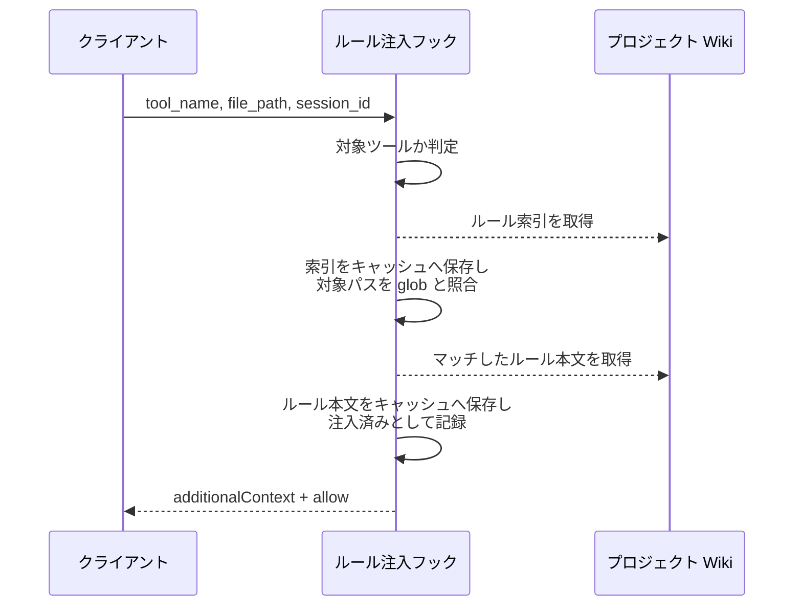

### 期待値

- `permissionDecision` が `allow`
- `additionalContext` にルール本文・取得元 URL・適用パターンが含まれる
- 注入済み記録に当該ルールが追加されている

## 正常系（注入元が複数）

### セットアップ

| セットアップ | 説明 | 補足 |
| --- | --- | --- |
| Mock | プロジェクト Wiki への HTTP 取得を stub に差し替え | ベースごとに別の索引を返す |
| 環境変数 | `INJECT_RULES_INDEXES` に索引 URL を 2 件設定 | カンマ区切り |
| ルール索引 | 2 件とも編集対象にマッチするエントリを 1 件ずつ返す | - |
| ルール本文 | 合計が上限に収まるサイズ | - |

### フロー

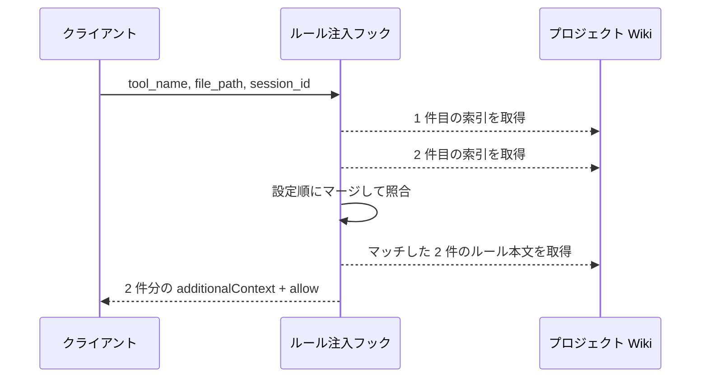

### 期待値

- `additionalContext` に 2 件のルール本文が設定順で含まれる
- 各ブロックの取得元がそれぞれの索引の場所から解決された値になっている
- `permissionDecision` が `allow`

## 正常系（注入元がローカル）

### セットアップ

| セットアップ | 説明 | 補足 |
| --- | --- | --- |
| Mock | HTTP 取得を stub に差し替え（呼ばれないことの確認用） | - |
| 環境変数 | `INJECT_RULES_INDEXES` に索引ファイルのローカル絶対パスを 1 件設定 | 分岐を決定的に誘発 |
| ルール索引 | 一時ディレクトリに `rules.yaml` を配置 | 編集対象にマッチするエントリを 1 件含む |
| ルール本文 | 索引と同じディレクトリからの相対パスにルール md を配置 | - |
| セッション | 注入済み記録を持たない | - |

### フロー

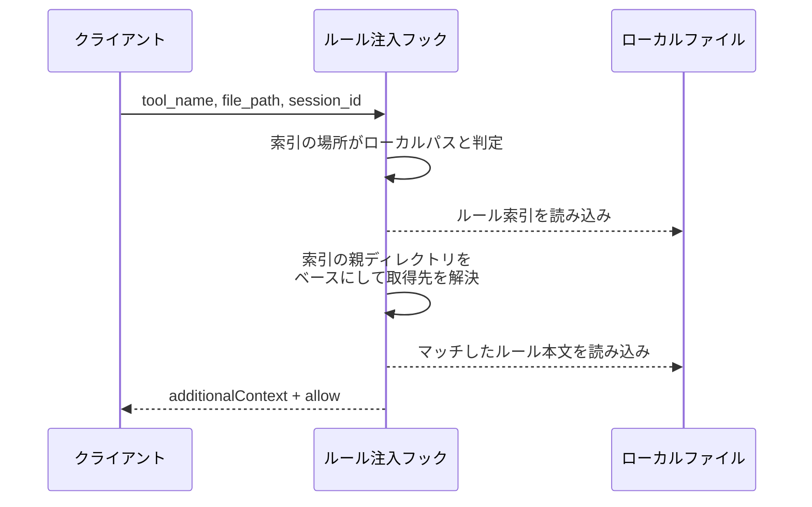

### 期待値

- `additionalContext` にローカルのルール本文が含まれる
- 各ブロックの取得元がローカルの絶対パスになっている
- HTTP 取得が一度も呼ばれていない
- キャッシュにファイルが書かれていない

## 正常系（キャッシュ有効）

### セットアップ

| セットアップ | 説明 | 補足 |
| --- | --- | --- |
| Mock | プロジェクト Wiki への HTTP 取得を stub に差し替え | 呼ばれないことを検証する |
| 環境変数 | `INJECT_RULES_INDEXES` に索引 URL を 1 件設定 | - |
| キャッシュ | 索引とルール本文が有効期限内で存在する | 前回の取得結果 |
| セッション | 注入済み記録を持たない | - |

### フロー

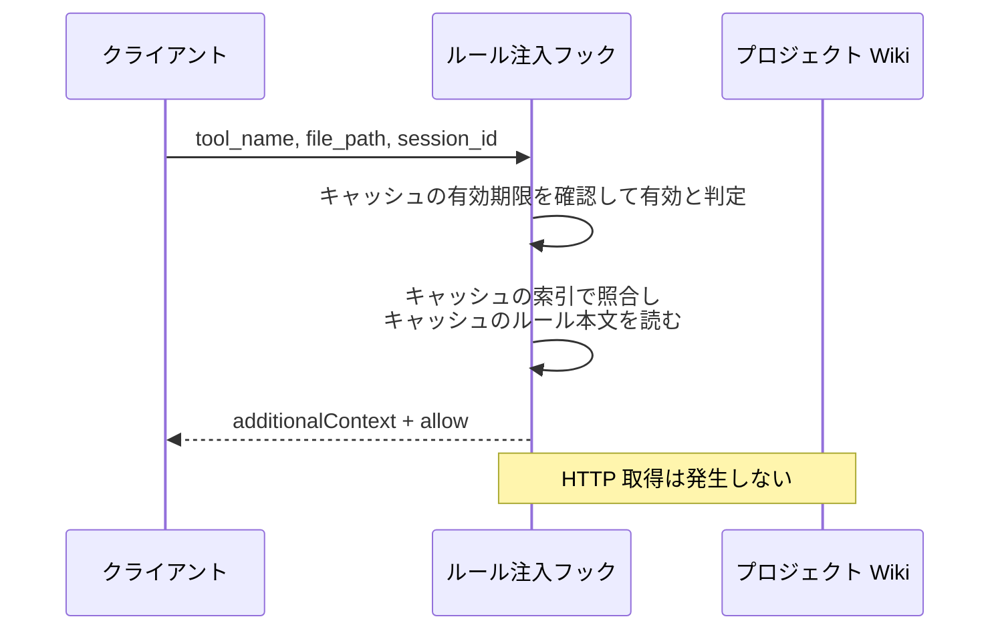

### 期待値

- `permissionDecision` が `allow`
- `additionalContext` にキャッシュのルール本文が含まれる
- HTTP 取得が 1 度も発生していない

## 正常系（注入上限を超える）

### セットアップ

| セットアップ | 説明 | 補足 |
| --- | --- | --- |
| Mock | プロジェクト Wiki への HTTP 取得を stub に差し替え | - |
| 環境変数 | `INJECT_RULES_INDEXES` に索引 URL を 1 件設定 | - |
| ルール本文 | 上限を超えるサイズのルール md を返す | 分割を決定的に誘発 |
| セッション | 注入済み記録を持たない | - |

### フロー

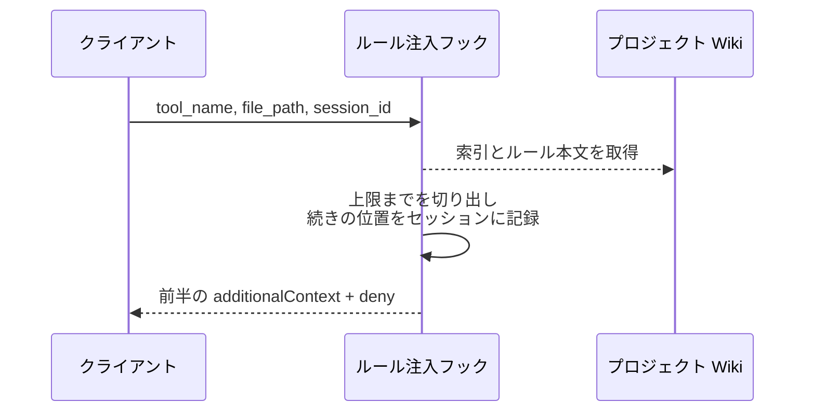

### 期待値

- `permissionDecision` が `deny`
- `additionalContext` の長さが上限以内
- セッションに続きの位置が記録され、当該ルールは注入済みになっていない
- `systemMessage` に残り件数が含まれる
- 次回の呼び出しで持ち越し分の HTTP 取得が発生しない（1 回目でキャッシュ済み）

## 正常系（部分注入の続き）

### セットアップ

| セットアップ | 説明 | 補足 |
| --- | --- | --- |
| Mock | プロジェクト Wiki への HTTP 取得を stub に差し替え | - |
| 環境変数 | `INJECT_RULES_INDEXES` に索引 URL を 1 件設定 | - |
| セッション | 当該ルールの続きの位置が記録済み | 前回の分割注入を再現 |

### フロー

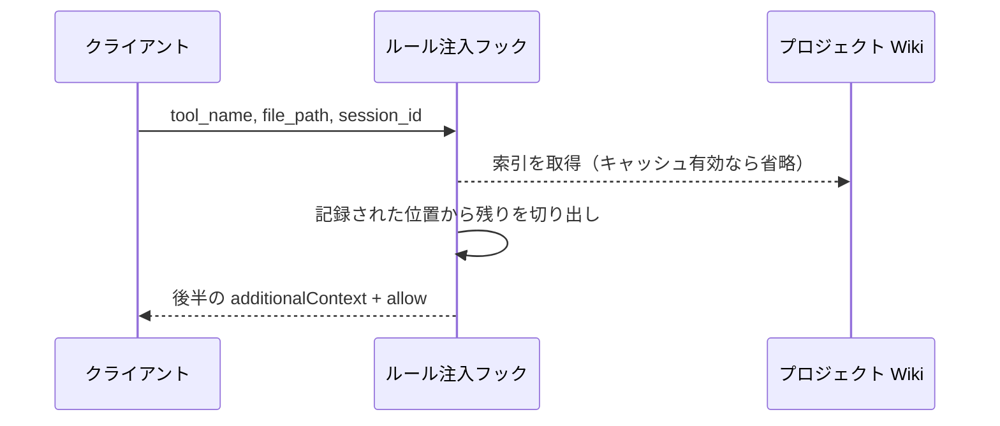

### 期待値

- `permissionDecision` が `allow`
- `additionalContext` が前回の続きから始まっている
- 注入済み記録に当該ルールが追加され、続きの位置が消えている

## 正常系（マッチなし）

### セットアップ

| セットアップ | 説明 | 補足 |
| --- | --- | --- |
| Mock | プロジェクト Wiki への HTTP 取得を stub に差し替え | - |
| 環境変数 | `INJECT_RULES_INDEXES` に索引 URL を 1 件設定 | - |
| ルール索引 | 編集対象にマッチしない glob だけを返す | - |

### フロー

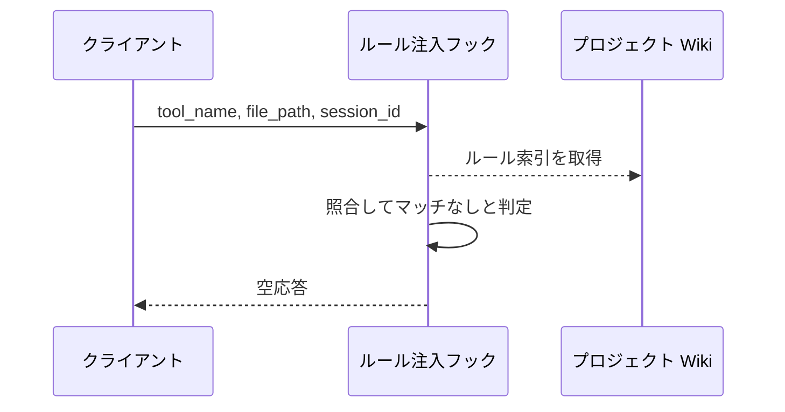

### 期待値

- 標準出力が空
- ルール本文の取得が発生していない

## 正常系（注入済み）

### セットアップ

| セットアップ | 説明 | 補足 |
| --- | --- | --- |
| Mock | プロジェクト Wiki への HTTP 取得を stub に差し替え | - |
| 環境変数 | `INJECT_RULES_INDEXES` に索引 URL を 1 件設定 | - |
| ルール索引 | 編集対象にマッチするエントリを 1 件返す | - |
| セッション | 当該ルールが注入済みとして記録済み | 2 回目の呼び出しを再現 |

### フロー

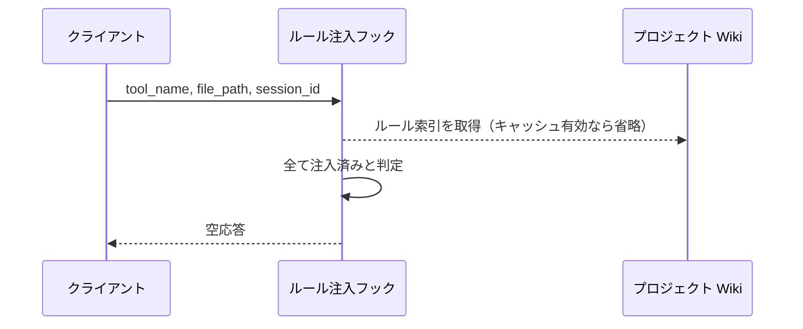

### 期待値

- 標準出力が空
- ルール本文の取得が発生していない

## 異常系（注入元が未設定）

### セットアップ

| セットアップ | 説明 | 補足 |
| --- | --- | --- |
| Mock | 観測基盤への送信を stub に差し替え | 送出ログの検証用 |
| 環境変数 | `INJECT_RULES_INDEXES` を未設定にする | 異常を決定的に誘発 |
| セッション | 通知済み記録を持たない | 初回の判定を再現 |

### フロー

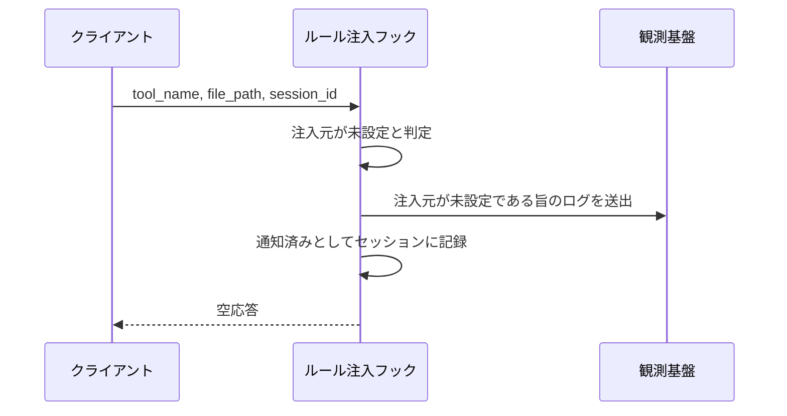

### 期待値

- 標準出力が空
- 観測基盤にログが 1 件送出される
- セッションに通知済みが記録され、同一セッションの 2 回目では送出されない

## 異常系（索引が存在しない）

### セットアップ

| セットアップ | 説明 | 補足 |
| --- | --- | --- |
| Mock | プロジェクト Wiki への HTTP 取得を stub に差し替え + 観測基盤への送信を stub に差し替え | 索引の取得を 404 で返す |
| 環境変数 | `INJECT_RULES_INDEXES` に索引 URL を 1 件設定 | - |
| キャッシュ | 索引キャッシュを持たない | 導入直後を再現 |
| セッション | 通知済み記録を持たない | 初回の判定を再現 |

### フロー

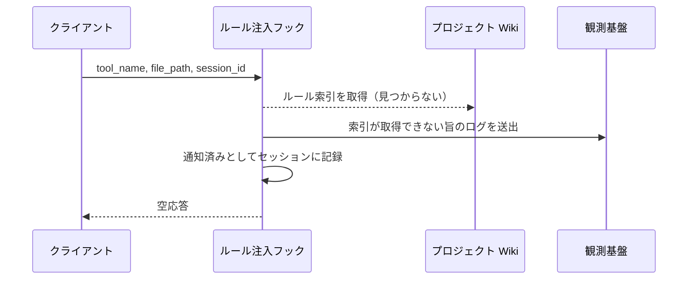

### 期待値

- 標準出力が空
- 観測基盤に取得先 URL を含むログが 1 件送出される
- セッションに通知済みが記録され、同一セッションの 2 回目では送出されない

## 異常系（索引の取得に失敗・キャッシュあり）

### セットアップ

| セットアップ | 説明 | 補足 |
| --- | --- | --- |
| Mock | プロジェクト Wiki への HTTP 取得を stub に差し替え + 観測基盤への送信を stub に差し替え | 索引の取得を接続エラーで返す |
| 環境変数 | `INJECT_RULES_INDEXES` に索引 URL を 1 件設定 | - |
| キャッシュ | 期限切れの索引キャッシュを持つ | 継続利用の対象 |

### フロー

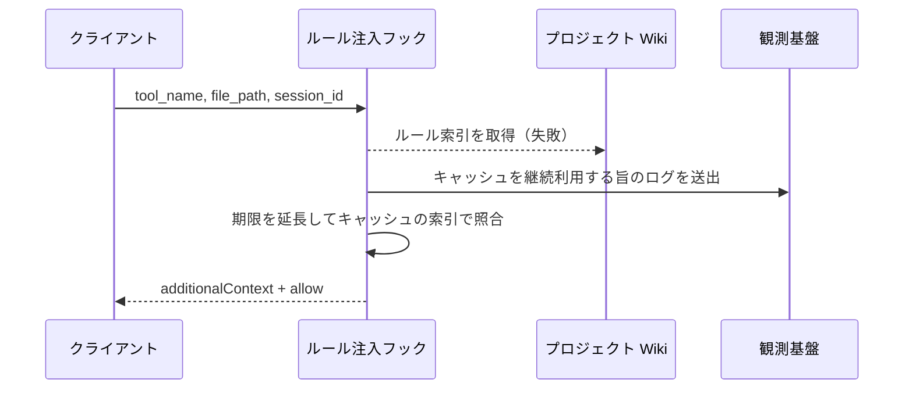

### 期待値

- キャッシュの索引でマッチしたルールが `additionalContext` に含まれる
- `permissionDecision` が `allow`
- 観測基盤にログが送出される
- 索引キャッシュが破棄されていない

## 異常系（ルール本文の取得に失敗）

### セットアップ

| セットアップ | 説明 | 補足 |
| --- | --- | --- |
| Mock | プロジェクト Wiki への HTTP 取得を stub に差し替え + 観測基盤への送信を stub に差し替え | 2 件のうち 1 件を 404 で返す |
| 環境変数 | `INJECT_RULES_INDEXES` に索引 URL を 1 件設定 | - |
| ルール索引 | 編集対象にマッチするエントリを 2 件返す | 片方の本文が存在しない |

### フロー

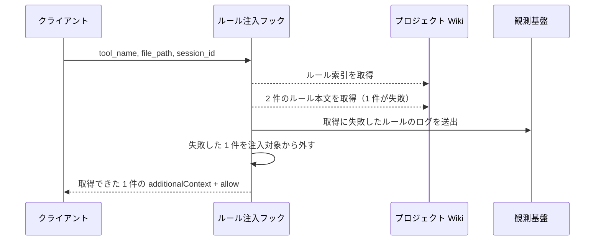

### 期待値

- `additionalContext` に取得できた 1 件だけが含まれる
- `permissionDecision` が `allow`
- 失敗したルールが注入済みとして記録されていない
- 観測基盤に取得先 URL を含むログが送出される
