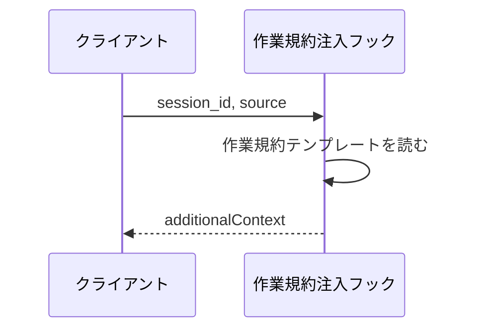

# 作業規約注入

フック: SessionStart

セッションの開始時に呼ばれ、ファイル操作の作業規約をコンテキストへ追加する。
新規ファイルを空で作ってから内容を書く手順を守らせることで、[ルール注入](./ルール注入.py.md) が新規ファイルにも効くようにする。

- 対応テストファイル: `tests/integration/inject_rules/test_作業規約注入.py`

## インターフェース

### リクエスト

標準入力から Claude Code のフックペイロードを受け取る。
本フックは内容を参照しない。

| パラメータ | 型 | 必須 | デフォルト | 説明 | 制限 | 補足 |
| --- | --- | --- | --- | --- | --- | --- |
| `session_id` | string | - | - | セッション識別子 | - | 参照しない |
| `source` | string | - | - | セッションの開始方法 | - | 参照しない |

リクエスト例:

```json
{
  "session_id": "9f2c1b...",
  "hook_event_name": "SessionStart",
  "source": "startup"
}
```

### レスポンス

標準出力に JSON を返す。

| フィールド | 型 | 説明 | 制限 | 補足 |
| --- | --- | --- | --- | --- |
| `hookSpecificOutput.hookEventName` | string | フックイベント名 | `"SessionStart"` 固定 | - |
| `hookSpecificOutput.additionalContext` | string | コンテキストへ追加する作業規約 | - | テンプレートファイルの内容そのまま |

レスポンス例:

```json
{
  "hookSpecificOutput": {
    "hookEventName": "SessionStart",
    "additionalContext": "## 新規ファイルの作成手順\n\n1. Write ツールで空ファイル..."
  }
}
```

### 終了コード

| 終了コード | 発生条件 | 補足 |
| --- | --- | --- |
| `0` | 常に | フックがセッション開始を止めることはない |

## 制約

| 項目 | 制約 | 補足 |
| --- | --- | --- |
| 規約の内容 | テンプレートファイルに置く | 文面の変更で実装を触らない |
| 依存パッケージ | 標準ライブラリのみで動作すること | どの Python で起動されるか制御できないため |
| 取得 | 外部への通信を行わない | 配布物のテンプレートだけを読む |

## フロー一覧

| 分類 | フロー名 | 概要 | 補足 |
| --- | --- | --- | --- |
| 正常 | 正常系 | 作業規約をコンテキストへ追加する | - |

## 正常系

### セットアップ

| セットアップ | 説明 | 補足 |
| --- | --- | --- |
| Mock | なし | 外部依存を持たない |
| テンプレート | 配布物の作業規約テンプレートを使う | - |

### フロー



### 期待値

- `hookEventName` が `SessionStart`
- `additionalContext` にテンプレートの内容が含まれる
