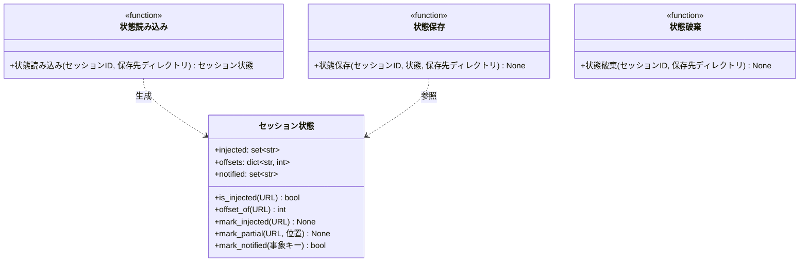

# モジュール構成: セッション / セッション状態

`セッション` ドメインに属する構成要素詳細。
Claude Code のセッション単位で持ち越す状態（注入済みルール・部分注入の続き位置・ログ通知済みの事象）の保持を扱う。

フックはツール呼び出しごとに起動して終了する短命プロセスのため、ターンをまたぐ状態はファイルに置く。
保存先は `~/.claude/tokens/inject-rules/{session_id}.json`。

## 一覧

| ユースケース | 役割 | コンテナ | 種別 | 名前 | 概要 | 補足 |
| --- | --- | --- | --- | --- | --- | --- |
| ルール注入 | 状態モデル | `features/session/types.py` | データモデル | [`セッション状態`](#セッション状態) | 注入済み URL・続き位置・通知済み事象 | 可変 |
| ルール注入 | 読み込み | `features/session/store.py` | 関数 | [`状態読み込み`](#状態読み込み) | セッション ID から[セッション状態](#セッション状態)を復元する | 無い / 壊れている場合は空の状態 |
| ルール注入 | 保存 | `features/session/store.py` | 関数 | [`状態保存`](#状態保存) | [セッション状態](#セッション状態)をファイルへ書き出す | - |
| ルール注入 | 破棄 | `features/session/store.py` | 関数 | [`状態破棄`](#状態破棄) | セッションの保存ファイルを削除する | コンテキスト圧縮時に呼ぶ |

## ディレクトリ構成

```
src/inject_rules/features/session/
├── types.py    # SessionState
└── store.py    # load_state / save_state / clear_state
```

## 構成図



## セッション状態
> 物理名: `SessionState`<br>
> 種別: データモデル<br>
> コンテナ: `features/session/types.py`

セッション単位で持ち越す状態（`@dataclass(slots=True, kw_only=True)`）。
判定と更新のメソッドを持たせ、呼び出し側が集合や辞書を直接触らないようにする。

### プロパティ

| 論理名 | プロパティ名 | 型 | 可視性 | デフォルト | 説明 | 例 | 補足 |
| --- | --- | --- | --- | --- | --- | --- | --- |
| 注入済み | `injected` | `set[str]` | 公開 | `set()` | 全量を注入し終えたルールの URL | `{"https://example.com/a.md"}` | 再注入の抑止に使う |
| 続き位置 | `offsets` | `dict[str, int]` | 公開 | `{}` | 部分注入したルールの次の開始位置 | `{"https://example.com/a.md": 9800}` | 本文先頭からの文字数 |
| 通知済み | `notified` | `set[str]` | 公開 | `set()` | ログを送出済みの事象キー | `{"index_missing"}` | 同一事象の再送出を抑える |

### 注入済み判定
> 物理名: `is_injected`<br>
> 種別: メソッド

当該ルールを全量注入し終えているかを返す。

#### 引数

| 論理名 | 引数名 | 型 | 必須 | デフォルト | 説明 | 補足 |
| --- | --- | --- | --- | --- | --- | --- |
| ルール URL | `url` | `str` | ✅ | - | 判定するルールの URL | - |

引数例:

```python
state.is_injected("https://example.com/a.md")
```

#### 戻り値

| 型 | 説明 | 補足 |
| --- | --- | --- |
| `bool` | 注入し終えているか | 部分注入の途中は `False` |

#### 処理

1. `injected` に `url` が含まれるかを返す

#### 例外

なし

#### 単体テスト

| テスト名 | 正常/異常 | 概要 | 条件 | Mock | 期待値 | 補足 |
| --- | --- | --- | --- | --- | --- | --- |
| `test_is_injected` | 正常 | 注入済みの判定 | `mark_injected` 済みの URL | なし | `True` | - |
| `test_is_injected_when_not_injected` | 正常 | 未注入の判定 | 未記録の URL | なし | `False` | - |
| `test_is_injected_when_partial` | 正常 | 部分注入中の判定 | `mark_partial` だけ済みの URL | なし | `False` | 途中を完了と誤認しない |

---

### 続き位置取得
> 物理名: `offset_of`<br>
> 種別: メソッド

部分注入の次の開始位置を返す。

#### 引数

| 論理名 | 引数名 | 型 | 必須 | デフォルト | 説明 | 補足 |
| --- | --- | --- | --- | --- | --- | --- |
| ルール URL | `url` | `str` | ✅ | - | 対象ルールの URL | - |

引数例:

```python
state.offset_of("https://example.com/a.md")
```

#### 戻り値

| 型 | 説明 | 補足 |
| --- | --- | --- |
| `int` | 本文先頭からの開始位置 | 未記録は `0`（先頭から） |

#### 処理

1. `offsets` から `url` の値を返す（未記録の場合は `0`）

#### 例外

なし

#### 単体テスト

| テスト名 | 正常/異常 | 概要 | 条件 | Mock | 期待値 | 補足 |
| --- | --- | --- | --- | --- | --- | --- |
| `test_offset_of` | 正常 | 記録済み位置の取得 | `mark_partial` で 100 を記録 | なし | `100` | - |
| `test_offset_of_when_unset` | 正常 | 未記録の既定値 | 未記録の URL | なし | `0` | 先頭から送る |

---

### 注入済み記録
> 物理名: `mark_injected`<br>
> 種別: メソッド

当該ルールを注入済みにし、続き位置を消す。

#### 引数

| 論理名 | 引数名 | 型 | 必須 | デフォルト | 説明 | 補足 |
| --- | --- | --- | --- | --- | --- | --- |
| ルール URL | `url` | `str` | ✅ | - | 記録するルールの URL | - |

引数例:

```python
state.mark_injected("https://example.com/a.md")
```

#### 戻り値

| 型 | 説明 | 補足 |
| --- | --- | --- |
| `None` | なし | 副作用: `injected` への追加と `offsets` からの削除 |

#### 処理

1. `injected` に `url` を加える
2. `offsets` から `url` を取り除く（未記録の場合は何もしない）

#### 例外

なし

#### 単体テスト

| テスト名 | 正常/異常 | 概要 | 条件 | Mock | 期待値 | 補足 |
| --- | --- | --- | --- | --- | --- | --- |
| `test_mark_injected` | 正常 | 注入済みの記録 | 未記録の URL | なし | `is_injected` が `True` になる | - |
| `test_mark_injected_when_partial_exists` | 正常 | 続き位置の消去 | `mark_partial` 後に呼ぶ | なし | `offset_of` が `0` に戻る | 完了後に続きが残らない |

---

### 部分注入記録
> 物理名: `mark_partial`<br>
> 種別: メソッド

続き位置を記録する。
注入済みにはしないため、次のツール呼び出しで続きが送られる。

#### 引数

| 論理名 | 引数名 | 型 | 必須 | デフォルト | 説明 | 補足 |
| --- | --- | --- | --- | --- | --- | --- |
| ルール URL | `url` | `str` | ✅ | - | 対象ルールの URL | - |
| 続き位置 | `offset` | `int` | ✅ | - | 次回の開始位置 | 本文先頭からの文字数 |

引数例:

```python
state.mark_partial("https://example.com/a.md", 9800)
```

#### 戻り値

| 型 | 説明 | 補足 |
| --- | --- | --- |
| `None` | なし | 副作用: `offsets` への記録 |

#### 処理

1. `offsets` に `url` と `offset` を記録する

#### 例外

なし

#### 単体テスト

| テスト名 | 正常/異常 | 概要 | 条件 | Mock | 期待値 | 補足 |
| --- | --- | --- | --- | --- | --- | --- |
| `test_mark_partial` | 正常 | 続き位置の記録 | 位置 100 を記録 | なし | `offset_of` が `100`・`is_injected` は `False` | 完了扱いにしない |
| `test_mark_partial_when_overwrite` | 正常 | 位置の更新 | 同じ URL に 100 → 200 | なし | `offset_of` が `200` | 分割が 3 回以上続く場合 |

---

### 通知済み記録
> 物理名: `mark_notified`<br>
> 種別: メソッド

事象が未通知なら記録して `True` を返し、通知済みなら `False` を返す。
戻り値をそのままログ送出の要否に使う。

#### 引数

| 論理名 | 引数名 | 型 | 必須 | デフォルト | 説明 | 補足 |
| --- | --- | --- | --- | --- | --- | --- |
| 事象キー | `key` | `str` | ✅ | - | 通知を区別する識別子 | `"indexes_unset"` / `"index_missing"` |

引数例:

```python
if state.mark_notified("indexes_unset"):
    emit_log("WARNING", "注入元が未設定です", endpoint=settings.otlp_endpoint)
```

#### 戻り値

| 型 | 説明 | 補足 |
| --- | --- | --- |
| `bool` | ログを送出すべきか | 初回のみ `True` |

#### 処理

1. `notified` に `key` が含まれる場合、`False` を返す
2. `notified` に `key` を加えて `True` を返す

#### 例外

なし

#### 単体テスト

| テスト名 | 正常/異常 | 概要 | 条件 | Mock | 期待値 | 補足 |
| --- | --- | --- | --- | --- | --- | --- |
| `test_mark_notified` | 正常 | 初回は送出要 | 未通知のキー | なし | `True` を返し `notified` に入る | - |
| `test_mark_notified_when_already_notified` | 正常 | 2 回目は送出不要 | 同じキーで 2 回呼ぶ | なし | 2 回目は `False` | 抑制の要 |
| `test_mark_notified_when_other_key` | 正常 | 別事象は独立 | 異なるキーで 2 回呼ぶ | なし | どちらも `True` | 事象ごとに 1 回ずつ出る |

## `features/session/store.py`
> 種別: ファイル

セッション状態の永続化を担うファイル。

---

### 状態読み込み
> 物理名: `load_state`<br>
> 種別: 関数

セッション ID に対応するファイルから[セッション状態](#セッション状態)を復元する。

#### 引数

| 論理名 | 引数名 | 型 | 必須 | デフォルト | 説明 | 補足 |
| --- | --- | --- | --- | --- | --- | --- |
| セッション ID | `session_id` | `str` | ✅ | - | Claude Code のセッション識別子 | ファイル名になる |
| 保存先ディレクトリ | `base_dir` | `Path` | ✅ | - | 保存先の親ディレクトリ | キーワード引数 |

引数例:

```python
load_state("9f2c1b", base_dir=Path.home() / ".claude" / "tokens" / "inject-rules")
```

#### 戻り値

| 型 | 説明 | 補足 |
| --- | --- | --- |
| [`SessionState`](#セッション状態) | 復元した状態 | ファイルが無い / 壊れている場合は空の状態 |

#### 処理

1. `{base_dir}/{session_id}.json` が存在しなければ空の[セッション状態](#セッション状態)を返す
2. ファイルを読んで JSON として解釈する
   - 解釈に失敗した場合、空の[セッション状態](#セッション状態)を返す
     - `[WARNING]` セッション状態を復元できなかった（`session_id`）
3. 各キーを[セッション状態](#セッション状態)に詰めて返す（型が合わないキーは既定値にする）

#### 例外

なし（読み込み失敗は空の状態として扱う）

#### 単体テスト

セットアップ:

| セットアップ | 説明 | 補足 |
| --- | --- | --- |
| 一時フォルダ | 保存先ディレクトリに一時フォルダを渡す | fixture 名 `tmp_path` |

| テスト名 | 正常/異常 | 概要 | 条件 | Mock | 期待値 | 補足 |
| --- | --- | --- | --- | --- | --- | --- |
| `test_load_state` | 正常 | 保存済み状態の復元 | 3 キーが揃った JSON | なし | 各プロパティが復元される | - |
| `test_load_state_when_file_missing` | 正常 | ファイルなし | 未作成のセッション ID | なし | 空の状態 | 初回起動 |
| `test_load_state_when_broken_json` | 正常 | 壊れた JSON | 不正な内容のファイル | なし | 空の状態（例外を投げない） | - |
| `test_load_state_when_unexpected_type` | 正常 | 型不一致キーの無視 | `injected` が文字列 | なし | `injected` が空集合になる | - |

---

### 状態保存
> 物理名: `save_state`<br>
> 種別: 関数

[セッション状態](#セッション状態)をファイルへ書き出す。

#### 引数

| 論理名 | 引数名 | 型 | 必須 | デフォルト | 説明 | 補足 |
| --- | --- | --- | --- | --- | --- | --- |
| セッション ID | `session_id` | `str` | ✅ | - | Claude Code のセッション識別子 | - |
| 状態 | `state` | [`SessionState`](#セッション状態) | ✅ | - | 保存する状態 | - |
| 保存先ディレクトリ | `base_dir` | `Path` | ✅ | - | 保存先の親ディレクトリ | キーワード引数 |

引数例:

```python
save_state("9f2c1b", state, base_dir=Path.home() / ".claude" / "tokens" / "inject-rules")
```

#### 戻り値

| 型 | 説明 | 補足 |
| --- | --- | --- |
| `None` | なし | 副作用: 保存ファイルの作成・更新 |

#### 処理

1. 保存先ディレクトリを作成する（既にあれば何もしない）
2. [セッション状態](#セッション状態)を JSON に変換する（集合は配列にする）
3. `{base_dir}/{session_id}.json` へ書き出す
   - 書き出しに失敗した場合、次回の注入で再送出になるだけなので握りつぶす
     - `[WARNING]` セッション状態を保存できなかった（`session_id`）

#### 例外

なし

#### 単体テスト

セットアップ:

| セットアップ | 説明 | 補足 |
| --- | --- | --- |
| 一時フォルダ | 保存先ディレクトリに一時フォルダを渡す | fixture 名 `tmp_path` |

| テスト名 | 正常/異常 | 概要 | 条件 | Mock | 期待値 | 補足 |
| --- | --- | --- | --- | --- | --- | --- |
| `test_save_state` | 正常 | 保存と読み込みの往復 | 3 キーを持つ状態 | なし | [状態読み込み](#状態読み込み) で同一内容が復元される | 集合と配列の変換を検証 |
| `test_save_state_when_dir_missing` | 正常 | ディレクトリの自動作成 | 存在しない保存先 | なし | ディレクトリが作られて保存される | - |

---

### 状態破棄
> 物理名: `clear_state`<br>
> 種別: 関数

セッションの保存ファイルを削除する。
コンテキスト圧縮でルールがコンテキストから消えたときに呼び、次の注入で再送出させる。

#### 引数

| 論理名 | 引数名 | 型 | 必須 | デフォルト | 説明 | 補足 |
| --- | --- | --- | --- | --- | --- | --- |
| セッション ID | `session_id` | `str` | ✅ | - | Claude Code のセッション識別子 | - |
| 保存先ディレクトリ | `base_dir` | `Path` | ✅ | - | 保存先の親ディレクトリ | キーワード引数 |

引数例:

```python
clear_state("9f2c1b", base_dir=Path.home() / ".claude" / "tokens" / "inject-rules")
```

#### 戻り値

| 型 | 説明 | 補足 |
| --- | --- | --- |
| `None` | なし | 副作用: 保存ファイルの削除 |

#### 処理

1. `{base_dir}/{session_id}.json` を削除する（存在しない場合は何もしない冪等操作）

#### 例外

なし

#### 単体テスト

セットアップ:

| セットアップ | 説明 | 補足 |
| --- | --- | --- |
| 一時フォルダ | 保存先ディレクトリに一時フォルダを渡す | fixture 名 `tmp_path` |

| テスト名 | 正常/異常 | 概要 | 条件 | Mock | 期待値 | 補足 |
| --- | --- | --- | --- | --- | --- | --- |
| `test_clear_state` | 正常 | ファイルの削除 | 保存済みのセッション | なし | ファイルが消え、[状態読み込み](#状態読み込み) が空の状態を返す | - |
| `test_clear_state_when_file_missing` | 正常 | 未作成の無視 | 未保存のセッション ID | なし | 例外を投げない | 冪等操作 |
