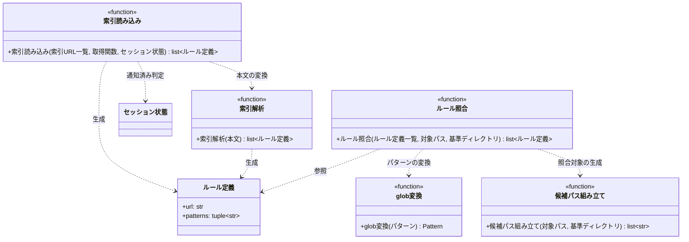

# モジュール構成: ルール / 索引

`ルール` ドメインに属する構成要素詳細。
ルール索引（`rules.yaml`）の取得・解析と、編集対象パスとの glob 照合を扱う。

索引の YAML は行ベースで解析する。
`paths` に書く glob は `**/*.py` のようにクォートなしで書くと標準の YAML パーサがエイリアス参照と解釈して壊れるため、クォート付きの値だけを受け付ける独自解析にする。

## 一覧

| ユースケース | 役割 | コンテナ | 種別 | 名前 | 概要 | 補足 |
| --- | --- | --- | --- | --- | --- | --- |
| ルール注入 | ルール定義 | `features/rules/types.py` | データモデル | [`ルール定義`](#ルール定義) | 索引 1 行分（ルール本文の URL + 適用 glob） | 不変 |
| ルール注入 | 索引取得 | `features/rules/index.py` | 関数 | [`索引読み込み`](#索引読み込み) | 索引 URL 群から[ルール定義](#ルール定義)の一覧を得る | キャッシュ優先 |
| ルール注入 | 索引解析 | `features/rules/index.py` | 関数 | [`索引解析`](#索引解析) | 索引 YAML の本文を[ルール定義](#ルール定義)の一覧に変換する | 行ベース解析 |
| ルール注入 | 照合 | `features/rules/matcher.py` | 関数 | [`ルール照合`](#ルール照合) | 編集対象パスにマッチする[ルール定義](#ルール定義)を順序保持で抽出する | - |
| ルール注入 | 内部処理 | `features/rules/matcher.py` | 関数 | [`glob変換`](#glob変換) | glob パターンを正規表現に変換する | `**` は区切りをまたぐ |
| ルール注入 | 内部処理 | `features/rules/matcher.py` | 関数 | [`候補パス組み立て`](#候補パス組み立て) | 照合対象の絶対パスと相対パスを組み立てる | 索引側がどちらで書いても当たるようにする |

## ディレクトリ構成

```
src/inject_rules/features/rules/
├── types.py      # RuleDefinition
├── index.py      # load_rules / parse_index
└── matcher.py    # match_rules / _glob_to_regex / _build_candidates
```

索引の取得そのものは [連携](../連携/取得とキャッシュ.py.md) の責務で、本ドメインは「取得済みの本文をどう解釈し、どう照合するか」に閉じる。

## 構成図



## ルール定義
> 物理名: `RuleDefinition`<br>
> 種別: データモデル<br>
> コンテナ: `features/rules/types.py`

索引 1 行分を表す不変のデータモデル（`@dataclass(frozen=True, slots=True, kw_only=True)`）。

### プロパティ

| 論理名 | プロパティ名 | 型 | 可視性 | デフォルト | 説明 | 例 | 補足 |
| --- | --- | --- | --- | --- | --- | --- | --- |
| ルール URL | `url` | `str` | 公開 | - | ルール本文の絶対 URL | `"https://raw.githubusercontent.com/.../Wiki管理.md"` | 注入済み記録のキーにも使う |
| 適用パターン | `patterns` | `tuple[str, ...]` | 公開 | - | 注入トリガーの glob | `("**/docs/wiki/**",)` | いずれか 1 つにマッチすれば対象 |

### メソッド

なし

### 単体テスト

なし

## `features/rules/index.py`
> 種別: ファイル

ルール索引の取得と解析を担うファイル。

---

### 索引読み込み
> 物理名: `load_rules`<br>
> 種別: 関数

索引 URL の一覧から[ルール定義](#ルール定義)の一覧を組み立てる。
取得手段は引数で受け取り、本関数は組み立てとマージにだけ責任を持つ。

#### 引数

| 論理名 | 引数名 | 型 | 必須 | デフォルト | 説明 | 補足 |
| --- | --- | --- | --- | --- | --- | --- |
| 索引 URL 一覧 | `index_urls` | `list[str]` | ✅ | - | 索引ファイルの URL | 設定順が優先順位になる |
| 取得関数 | `fetch` | [`FetchText`](../連携/取得とキャッシュ.py.md#テキスト取得関数) | ✅ | - | URL から本文を得る関数 | キーワード引数 |
| セッション状態 | `state` | [`SessionState`](../セッション/セッション状態.py.md#セッション状態) | ✅ | - | 取得失敗ログの抑制に使う | キーワード引数 |

引数例:

```python
load_rules(["https://example.com/rules.yaml"], fetch=fetch_text, state=state)
```

#### 戻り値

| 型 | 説明 | 補足 |
| --- | --- | --- |
| [`list[RuleDefinition]`](#ルール定義) | 索引順に並んだルール定義 | 同じ `url` が複数索引にある場合は先勝ちで 1 件に畳む |

戻り値例:

```python
[RuleDefinition(url="https://example.com/規約/Wiki管理.md", patterns=("**/docs/wiki/**",))]
```

#### 処理

1. 空の戻り値配列と、既出 URL の集合を用意する
2. `index_urls` を先頭から順にループする
   1. `fetch` で索引本文を取得する（取得できなければその索引を飛ばす）
      - 当該索引がセッション内で未通知の場合のみ送出する（ツール呼び出しごとに出るのを防ぐ）
        - `[WARNING]` 索引を取得できなかった（索引 URL / 例外）
   2. [索引解析](#索引解析) で[ルール定義](#ルール定義)の一覧に変換する
   3. 既出でない `url` のものだけ戻り値配列に追加し、`url` を既出集合に加える
3. 戻り値配列を返す

#### 例外

なし（取得失敗は当該索引のスキップとして扱う）

#### 単体テスト

| テスト名 | 正常/異常 | 概要 | 条件 | Mock | 期待値 | 補足 |
| --- | --- | --- | --- | --- | --- | --- |
| `test_load_rules` | 正常 | 単一索引の読み込み | 索引 1 件・エントリ 2 件 | 取得関数 | 索引順の 2 件が返る | - |
| `test_load_rules_when_multiple_indexes` | 正常 | 複数索引のマージ | 索引 2 件・それぞれ別エントリ | 取得関数 | 設定順に連結された 4 件が返る | - |
| `test_load_rules_when_duplicated_url` | 正常 | 重複 URL の先勝ち | 2 索引に同じ `url` | 取得関数 | 1 件に畳まれ、先頭索引の `patterns` が残る | - |
| `test_load_rules_when_fetch_failed` | 正常 | 取得失敗索引のスキップ | 1 件目が例外・2 件目は成功 | 取得関数 | 2 件目のエントリだけが返る | - |
| `test_load_rules_when_fetch_failed_twice` | 正常 | 取得失敗ログの抑制 | 同じ状態で 2 回呼ぶ | 取得関数 / ログ送出 | ログ送出が 1 回だけ | ツール呼び出しごとに出さない |

---

### 索引解析
> 物理名: `parse_index`<br>
> 種別: 関数

索引 YAML の本文を[ルール定義](#ルール定義)の一覧に変換する。

#### 引数

| 論理名 | 引数名 | 型 | 必須 | デフォルト | 説明 | 補足 |
| --- | --- | --- | --- | --- | --- | --- |
| 本文 | `text` | `str` | ✅ | - | 索引 YAML の本文 | - |

引数例:

```python
parse_index('rules:\n  - url: https://example.com/a.md\n    paths:\n      - "**/*.py"\n')
```

#### 戻り値

| 型 | 説明 | 補足 |
| --- | --- | --- |
| [`list[RuleDefinition]`](#ルール定義) | 登場順のルール定義 | `url` と `patterns` の両方が揃った行だけ返す |

#### 処理

1. 空の戻り値配列と、解析中のエントリを保持する変数を用意する
2. 本文を行単位でループする
   - 空行・コメント行・`rules:` はスキップする
   - `- url:` で始まる行の場合、値を取り出して新しいエントリを開始する（前後のクォートがあれば外す）
   - `paths:` の行の場合、以降を適用パターンの収集対象にする
   - 収集対象中の `- ` で始まる行の場合、クォートで囲まれた値だけを適用パターンに加える
3. `url` と `patterns` が揃ったエントリだけを[ルール定義](#ルール定義)にして返す

#### 例外

なし（書式に合わない行は無視する）

#### 単体テスト

| テスト名 | 正常/異常 | 概要 | 条件 | Mock | 期待値 | 補足 |
| --- | --- | --- | --- | --- | --- | --- |
| `test_parse_index` | 正常 | 標準的な索引の解析 | `url` + `paths` 2 件のエントリ | なし | 1 件の[ルール定義](#ルール定義)が返る | - |
| `test_parse_index_when_unquoted_pattern` | 正常 | クォートなし glob の無視 | `paths` にクォートなしの値 | なし | その値が `patterns` に入らない | 標準 YAML パーサが壊す書き方を弾く |
| `test_parse_index_when_comment_and_blank` | 正常 | コメント・空行の無視 | 先頭にコメント + 空行 | なし | エントリが正しく取れる | - |
| `test_parse_index_when_patterns_missing` | 正常 | `paths` 欠落エントリの除外 | `url` だけのエントリ | なし | 戻り値に含まれない | - |
| `test_parse_index_when_empty` | 正常 | 空本文 | 空文字列 | なし | 空配列 | - |

## `features/rules/matcher.py`
> 種別: ファイル

編集対象パスと glob の照合を担うファイル。

---

### ルール照合
> 物理名: `match_rules`<br>
> 種別: 関数

編集対象パスにマッチする[ルール定義](#ルール定義)を、索引順を保ったまま抽出する。

#### 引数

| 論理名 | 引数名 | 型 | 必須 | デフォルト | 説明 | 補足 |
| --- | --- | --- | --- | --- | --- | --- |
| ルール定義一覧 | `rules` | [`list[RuleDefinition]`](#ルール定義) | ✅ | - | 照合対象のルール | [索引読み込み](#索引読み込み) の戻り値 |
| 対象パス | `file_path` | `str` | ✅ | - | 編集対象のファイルパス | フックの `tool_input.file_path` |
| 基準ディレクトリ | `base_dir` | `Path` | ✅ | - | 相対パスを求める基準 | キーワード引数。フックの `cwd` |

引数例:

```python
match_rules(rules, "/repo/docs/wiki/規約/コメント.md", base_dir=Path("/repo"))
```

#### 戻り値

| 型 | 説明 | 補足 |
| --- | --- | --- |
| [`list[RuleDefinition]`](#ルール定義) | マッチしたルール（索引順） | 重複なし |

#### 処理

1. [候補パス組み立て](#候補パス組み立て) で照合対象のパス一覧を得る
2. `rules` を先頭から順にループし、`patterns` のいずれかが候補パスのいずれかにマッチするものを戻り値配列に追加する（[glob変換](#glob変換)）
3. 戻り値配列を返す

#### 例外

なし

#### 単体テスト

| テスト名 | 正常/異常 | 概要 | 条件 | Mock | 期待値 | 補足 |
| --- | --- | --- | --- | --- | --- | --- |
| `test_match_rules` | 正常 | 索引順の抽出 | 3 件中 2 件がマッチ | なし | マッチした 2 件が索引順で返る | - |
| `test_match_rules_when_no_match` | 正常 | マッチなし | どのパターンにも当たらないパス | なし | 空配列 | - |
| `test_match_rules_when_multiple_patterns` | 正常 | 複数パターンの片方が一致 | 2 パターンのうち 1 つが一致 | なし | 当該ルールが 1 件だけ返る | 重複しない |

---

### glob変換
> 物理名: `_glob_to_regex`<br>
> 種別: 関数

glob パターンを正規表現に変換する内部ヘルパー。

#### 引数

| 論理名 | 引数名 | 型 | 必須 | デフォルト | 説明 | 補足 |
| --- | --- | --- | --- | --- | --- | --- |
| パターン | `pattern` | `str` | ✅ | - | glob パターン | - |

引数例:

```python
_glob_to_regex("**/*.py")
```

#### 戻り値

| 型 | 説明 | 補足 |
| --- | --- | --- |
| `re.Pattern[str]` | 全体一致用にコンパイル済みの正規表現 | 先頭 `^` と末尾 `$` を付ける |

#### 処理

1. パターンを先頭から 1 文字ずつ走査して正規表現の断片に変換する
   - `**` の場合、区切りをまたぐ任意文字列に変換し、直後の `/` があれば読み飛ばす
   - `*` の場合、区切りを含まない任意文字列に変換する
   - `?` の場合、区切りを含まない任意 1 文字に変換する
   - `{` / `}` / `,` の場合、非キャプチャグループと選択に変換する
   - それ以外の場合、正規表現としてエスケープする
2. 断片を連結し、前後を `^` と `$` で囲んでコンパイルして返す

#### 例外

なし

#### 単体テスト

| テスト名 | 正常/異常 | 概要 | 条件 | Mock | 期待値 | 補足 |
| --- | --- | --- | --- | --- | --- | --- |
| `test_glob_to_regex_when_double_star` | 正常 | 区切りをまたぐ | `**/foo.py` | なし | `a/b/foo.py` と `foo.py` の両方にマッチ | - |
| `test_glob_to_regex_when_single_star` | 正常 | 区切りをまたがない | `src/*.py` | なし | `src/main.py` はマッチ・`src/sub/main.py` は非マッチ | - |
| `test_glob_to_regex_when_brace` | 正常 | 選択の展開 | `{a,b}.py` | なし | `a.py` と `b.py` にマッチ | - |
| `test_glob_to_regex_when_dot` | 正常 | メタ文字のエスケープ | `a.py` | なし | `axpy` に非マッチ | - |

---

### 候補パス組み立て
> 物理名: `_build_candidates`<br>
> 種別: 関数

照合対象のパス表現を組み立てる内部ヘルパー。
索引側が絶対パスの glob で書いても、リポジトリ相対の glob で書いても当たるようにする。

#### 引数

| 論理名 | 引数名 | 型 | 必須 | デフォルト | 説明 | 補足 |
| --- | --- | --- | --- | --- | --- | --- |
| 対象パス | `file_path` | `str` | ✅ | - | 編集対象のファイルパス | - |
| 基準ディレクトリ | `base_dir` | `Path` | ✅ | - | 相対パスを求める基準 | - |

引数例:

```python
_build_candidates("/repo/docs/wiki/規約/コメント.md", Path("/repo"))
```

#### 戻り値

| 型 | 説明 | 補足 |
| --- | --- | --- |
| `list[str]` | 照合に使うパス表現 | 区切りは `/` に正規化する |

戻り値例:

```python
["/repo/docs/wiki/規約/コメント.md", "docs/wiki/規約/コメント.md"]
```

#### 処理

1. 対象パスの区切りを `/` に正規化して戻り値配列に入れる
2. 基準ディレクトリからの相対パスを求められる場合は、同じく正規化して戻り値配列に加える（求められない場合は加えない）
3. 戻り値配列を返す

#### 例外

なし

#### 単体テスト

| テスト名 | 正常/異常 | 概要 | 条件 | Mock | 期待値 | 補足 |
| --- | --- | --- | --- | --- | --- | --- |
| `test_build_candidates` | 正常 | 絶対と相対の 2 件 | 基準配下のパス | なし | 絶対パスと相対パスが返る | - |
| `test_build_candidates_when_outside_base` | 正常 | 基準外のパス | 基準配下にないパス | なし | 絶対パスだけが返る | - |
