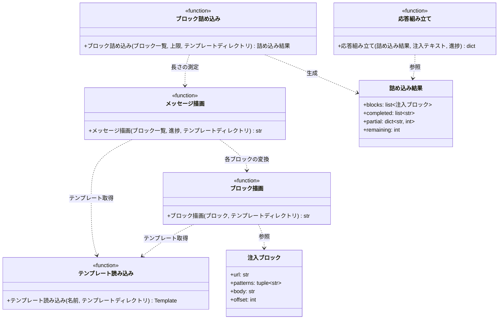

# モジュール構成: 注入 / 注入メッセージ

`注入` ドメインに属する構成要素詳細。
ルール本文から注入メッセージを組み立て、1 回の上限に収まるよう詰め込み、フックの応答 JSON にするまでを扱う。

テンプレートは外部ファイルに置き、標準ライブラリの `string.Template` で `$変数` を差し替える。
テンプレートエンジンを依存に加えると、フックを起動する Python によっては読み込めず注入が黙って止まるため。
繰り返しと分岐はテンプレート側に持たせず、用途ごとにファイルを分けて Python 側で連結する。

## 一覧

| ユースケース | 役割 | コンテナ | 種別 | 名前 | 概要 | 補足 |
| --- | --- | --- | --- | --- | --- | --- |
| ルール注入 | ブロック | `features/injection/types.py` | データモデル | [`注入ブロック`](#注入ブロック) | 1 ルール分の注入内容 | 続き位置を持つ |
| ルール注入 | 詰め込み結果 | `features/injection/types.py` | データモデル | [`詰め込み結果`](#詰め込み結果) | 今回送る分と次回への持ち越し | - |
| ルール注入 | 組み立て | `features/injection/builder.py` | 関数 | [`ブロック描画`](#ブロック描画) | [注入ブロック](#注入ブロック)をテキストにする | テンプレート適用 |
| ルール注入 | 組み立て | `features/injection/builder.py` | 関数 | [`メッセージ描画`](#メッセージ描画) | ブロック群と進捗から注入テキスト全体を作る | - |
| ルール注入 | 内部処理 | `features/injection/builder.py` | 関数 | [`テンプレート読み込み`](#テンプレート読み込み) | テンプレートファイルを読む | 起動ごとに 1 回 |
| ルール注入 | 分割 | `features/injection/packer.py` | 関数 | [`ブロック詰め込み`](#ブロック詰め込み) | 上限に収まるようブロックを詰める | 超過分は分割して持ち越す |
| ルール注入 | 応答 | `features/injection/response.py` | 関数 | [`応答組み立て`](#応答組み立て) | フックの応答 JSON を作る | - |

## ディレクトリ構成

```
src/inject_rules/features/injection/
├── types.py       # InjectionBlock / PackResult
├── builder.py     # render_block / render_message / _load_template
├── packer.py      # pack_blocks
└── response.py    # build_response
```

テンプレートはプラグインルート直下に置く。

```
plugins/inject-rules/templates/
├── ヘッダー.txt      # 注入メッセージの冒頭
├── ブロック.txt      # ルール 1 件分
├── 読み込み中.txt    # 未完了のときの末尾
└── 完了.txt          # 完了したときの末尾
```

## 構成図



## 注入ブロック
> 物理名: `InjectionBlock`<br>
> 種別: データモデル<br>
> コンテナ: `features/injection/types.py`

1 ルール分の注入内容（`@dataclass(frozen=True, slots=True, kw_only=True)`）。

### プロパティ

| 論理名 | プロパティ名 | 型 | 可視性 | デフォルト | 説明 | 例 | 補足 |
| --- | --- | --- | --- | --- | --- | --- | --- |
| ルール URL | `url` | `str` | 公開 | - | ルール本文の URL | `"https://example.com/a.md"` | 注入済み記録のキー |
| 適用パターン | `patterns` | `tuple[str, ...]` | 公開 | - | 適用トリガーの glob | `("**/*.py",)` | 注入テキストに載せる |
| 本文 | `body` | `str` | 公開 | - | 今回送る本文 | - | 続き位置以降を切り出したもの |
| 続き位置 | `offset` | `int` | 公開 | `0` | `body` が元の本文のどこから始まっているか | `9800` | 分割の続きを表す |

### メソッド

なし

### 単体テスト

なし

## 詰め込み結果
> 物理名: `PackResult`<br>
> 種別: データモデル<br>
> コンテナ: `features/injection/types.py`

上限に収める処理の結果（`@dataclass(frozen=True, slots=True, kw_only=True)`）。

### プロパティ

| 論理名 | プロパティ名 | 型 | 可視性 | デフォルト | 説明 | 例 | 補足 |
| --- | --- | --- | --- | --- | --- | --- | --- |
| 送るブロック | `blocks` | `list[InjectionBlock]` | 公開 | - | 今回の注入に含めるブロック | - | 分割済みの本文を持つ |
| 完了 URL | `completed` | `list[str]` | 公開 | - | 今回で全量を送り終えた URL | - | 注入済みに記録する |
| 持ち越し | `partial` | `dict[str, int]` | 公開 | - | 続き位置を持ち越す URL と位置 | `{"https://...": 9800}` | 次回の開始位置 |
| 残り件数 | `remaining` | `int` | 公開 | - | 次回に持ち越す件数 | `1` | `0` なら `allow`、`1` 以上なら `deny` |

### メソッド

なし

### 単体テスト

なし

## `features/injection/builder.py`
> 種別: ファイル

テンプレートを使って注入テキストを組み立てるファイル。

---

### テンプレート読み込み
> 物理名: `_load_template`<br>
> 種別: 関数

テンプレートファイルを読んで `string.Template` にする内部ヘルパー。

#### 引数

| 論理名 | 引数名 | 型 | 必須 | デフォルト | 説明 | 補足 |
| --- | --- | --- | --- | --- | --- | --- |
| 名前 | `name` | `str` | ✅ | - | テンプレートのファイル名 | `"ブロック.txt"` |
| テンプレートディレクトリ | `template_dir` | `Path` | ✅ | - | テンプレートの置き場所 | キーワード引数 |

引数例:

```python
_load_template("ブロック.txt", template_dir=TEMPLATE_DIR)
```

#### 戻り値

| 型 | 説明 | 補足 |
| --- | --- | --- |
| `string.Template` | 読み込んだテンプレート | 同一プロセス内では結果を再利用する |

#### 処理

1. 同一プロセス内で読み込み済みならその結果を返す（`functools.cache`）
2. `{template_dir}/{name}` を読み、`string.Template` にして返す

#### 例外

| 例外名 | 発生条件 | メッセージ | 補足 |
| --- | --- | --- | --- |
| `FileNotFoundError` | テンプレートファイルが無い | 標準ライブラリのメッセージ | 配布物の欠損。呼び出し元では捕捉しない |

#### 単体テスト

セットアップ:

| セットアップ | 説明 | 補足 |
| --- | --- | --- |
| 一時テンプレート | 一時フォルダにテンプレートファイルを作る | fixture 名 `tmp_template_dir` |

| テスト名 | 正常/異常 | 概要 | 条件 | Mock | 期待値 | 補足 |
| --- | --- | --- | --- | --- | --- | --- |
| `test_load_template` | 正常 | テンプレートの読み込み | 存在するファイル | なし | 中身が `Template` になる | - |
| `test_load_template_when_missing` | 異常 | ファイルなし | 存在しない名前 | なし | `FileNotFoundError` | 例外表に対応 |

---

### ブロック描画
> 物理名: `render_block`<br>
> 種別: 関数

[注入ブロック](#注入ブロック) 1 件をテキストにする。

#### 引数

| 論理名 | 引数名 | 型 | 必須 | デフォルト | 説明 | 補足 |
| --- | --- | --- | --- | --- | --- | --- |
| ブロック | `block` | [`InjectionBlock`](#注入ブロック) | ✅ | - | 描画対象 | - |
| テンプレートディレクトリ | `template_dir` | `Path` | ✅ | - | テンプレートの置き場所 | キーワード引数 |

引数例:

```python
render_block(block, template_dir=TEMPLATE_DIR)
```

#### 戻り値

| 型 | 説明 | 補足 |
| --- | --- | --- |
| `str` | 1 ブロック分のテキスト | ルール URL・適用パターン・本文を含む |

戻り値例:

```text
---

> 適用ルール: https://example.com/a.md
> 適用パターン: `**/*.py`

# 命名規約
...
```

#### 処理

1. [テンプレート読み込み](#テンプレート読み込み) で `ブロック.txt` を得る
2. 適用パターンをバッククォートで囲んで読点区切りの 1 文字列にする
3. ルール URL・適用パターン・本文を差し替えて返す

#### 例外

なし

#### 単体テスト

セットアップ:

| セットアップ | 説明 | 補足 |
| --- | --- | --- |
| 一時テンプレート | 一時フォルダにテンプレートファイルを作る | fixture 名 `tmp_template_dir` |

| テスト名 | 正常/異常 | 概要 | 条件 | Mock | 期待値 | 補足 |
| --- | --- | --- | --- | --- | --- | --- |
| `test_render_block` | 正常 | 1 ブロックの描画 | パターン 1 件のブロック | なし | URL・パターン・本文が含まれる | - |
| `test_render_block_when_multiple_patterns` | 正常 | 複数パターンの連結 | パターン 2 件 | なし | 読点区切りで並ぶ | - |

---

### メッセージ描画
> 物理名: `render_message`<br>
> 種別: 関数

ブロック群と進捗から注入テキスト全体を組み立てる。

#### 引数

| 論理名 | 引数名 | 型 | 必須 | デフォルト | 説明 | 補足 |
| --- | --- | --- | --- | --- | --- | --- |
| ブロック一覧 | `blocks` | [`list[InjectionBlock]`](#注入ブロック) | ✅ | - | 今回送るブロック | - |
| 残り件数 | `remaining` | `int` | ✅ | - | 次回に持ち越す件数 | キーワード引数。`0` なら完了表示 |
| 読み込み済み件数 | `loaded` | `int` | ✅ | - | 進捗表示の分子 | キーワード引数 |
| 全件数 | `total` | `int` | ✅ | - | 進捗表示の分母 | キーワード引数 |
| テンプレートディレクトリ | `template_dir` | `Path` | ✅ | - | テンプレートの置き場所 | キーワード引数 |

引数例:

```python
render_message(blocks, remaining=1, loaded=1, total=2, template_dir=TEMPLATE_DIR)
```

#### 戻り値

| 型 | 説明 | 補足 |
| --- | --- | --- |
| `str` | 注入テキスト全体 | `additionalContext` に載せる |

#### 処理

1. [テンプレート読み込み](#テンプレート読み込み) で `ヘッダー.txt` を得て先頭に置く
2. 各ブロックを [ブロック描画](#ブロック描画) で変換して順に連ねる
3. 末尾のテンプレートを選んで進捗を差し替え、連結して返す
   - `remaining` が 1 以上の場合、`読み込み中.txt` を使う
   - `0` の場合、`完了.txt` を使う

#### 例外

なし

#### 単体テスト

セットアップ:

| セットアップ | 説明 | 補足 |
| --- | --- | --- |
| 一時テンプレート | 一時フォルダにテンプレートファイルを作る | fixture 名 `tmp_template_dir` |

| テスト名 | 正常/異常 | 概要 | 条件 | Mock | 期待値 | 補足 |
| --- | --- | --- | --- | --- | --- | --- |
| `test_render_message` | 正常 | 完了時の描画 | `remaining=0` | なし | ヘッダー + ブロック + 完了表示 | - |
| `test_render_message_when_remaining` | 正常 | 未完了時の描画 | `remaining=1` | なし | 末尾が読み込み中表示になる | 再実行を促す文言 |
| `test_render_message_when_multiple_blocks` | 正常 | 複数ブロックの連結 | ブロック 2 件 | なし | 2 件が順に並ぶ | - |

## `features/injection/packer.py`
> 種別: ファイル

上限に収める詰め込みを担うファイル。

---

### ブロック詰め込み
> 物理名: `pack_blocks`<br>
> 種別: 関数

ブロック群を注入上限に収まるよう詰め、超過分を次回へ持ち越す。

#### 引数

| 論理名 | 引数名 | 型 | 必須 | デフォルト | 説明 | 補足 |
| --- | --- | --- | --- | --- | --- | --- |
| ブロック一覧 | `blocks` | [`list[InjectionBlock]`](#注入ブロック) | ✅ | - | 送る候補 | 未注入のルールのみ |
| 上限 | `char_limit` | `int` | ✅ | - | 1 回の注入の最大文字数 | キーワード引数 |
| 最小分割量 | `min_partial` | `int` | ✅ | - | 分割時に最低限確保する本文の文字数 | キーワード引数 |
| テンプレートディレクトリ | `template_dir` | `Path` | ✅ | - | 長さ測定に使う | キーワード引数 |

引数例:

```python
pack_blocks(blocks, char_limit=10000, min_partial=200, template_dir=TEMPLATE_DIR)
```

#### 戻り値

| 型 | 説明 | 補足 |
| --- | --- | --- |
| [`PackResult`](#詰め込み結果) | 今回送る分と持ち越し | - |

#### 処理

1. 空の送信ブロック配列・完了 URL 配列・持ち越し辞書を用意する
2. `blocks` を先頭から順にループする
   1. 現在の送信ブロックに当該ブロックを加えた場合の描画長を[メッセージ描画](#メッセージ描画)で測る（進捗はその並びを送り切った前提の値にする）
   2. 上限に収まる場合、そのまま送信ブロックに加えて完了 URL に記録する
   3. 収まらない場合、当該ブロックの本文を空にした状態の描画長を測り、上限との差を本文に使える残り文字数とする
      - 進捗は完了 URL の件数で測る（この分岐では必ず持ち越しが出るため、末尾は未完了時のテンプレートになる）
      - 残り文字数が `min_partial` 以上の場合、そこまでを切り出して送信ブロックに加え、続き位置を持ち越し辞書に記録してループを抜ける
      - 残り文字数が足りず、かつ送信ブロックが空の場合、上限分を強制的に切り出して持ち越しに記録し、ループを抜ける（進まなくなるのを防ぐ）
      - どちらでもない場合、当該ブロックを送らずループを抜ける
3. 送信ブロック・完了 URL・持ち越し・残り件数（`blocks` の件数から完了件数を引いた数）を[詰め込み結果](#詰め込み結果)にして返す

#### 例外

なし

#### 単体テスト

セットアップ:

| セットアップ | 説明 | 補足 |
| --- | --- | --- |
| 一時テンプレート | 一時フォルダにテンプレートファイルを作る | fixture 名 `tmp_template_dir` |

| テスト名 | 正常/異常 | 概要 | 条件 | Mock | 期待値 | 補足 |
| --- | --- | --- | --- | --- | --- | --- |
| `test_pack_blocks` | 正常 | 全件が収まる | 上限内のブロック 2 件 | なし | 2 件とも完了・持ち越しなし・残り 0 | - |
| `test_pack_blocks_when_over_limit` | 正常 | 分割して持ち越す | 上限を超えるブロック 1 件 | なし | 本文が切り出され、続き位置が記録され、残り 1 | - |
| `test_pack_blocks_when_second_over_limit` | 正常 | 2 件目で打ち切る | 1 件目は収まり 2 件目が超過 | なし | 1 件目が完了・2 件目が持ち越し | - |
| `test_pack_blocks_when_min_partial_not_met` | 正常 | 最小量を確保できない | 残りが `min_partial` 未満 | なし | 当該ブロックを送らず残りに数える | - |
| `test_pack_blocks_when_first_block_too_large` | 正常 | 1 件目から超過 | 空の状態で上限を超える | なし | 上限分を強制注入して持ち越す | 進まなくなるのを防ぐ |
| `test_pack_blocks_when_offset` | 正常 | 続きからの詰め込み | `offset` を持つブロック | なし | 続き位置からの本文が送られる | - |
| `test_pack_blocks_when_remaining` | 正常 | 残り件数の算出 | 3 件中 1 件だけ収まる | なし | `remaining` が 2 | 送らなかった分が次回に回る |

## `features/injection/response.py`
> 種別: ファイル

フックの応答 JSON を組み立てるファイル。

---

### 応答組み立て
> 物理名: `build_response`<br>
> 種別: 関数

[詰め込み結果](#詰め込み結果) と注入テキストから、フックが標準出力へ返す JSON を作る。

#### 引数

| 論理名 | 引数名 | 型 | 必須 | デフォルト | 説明 | 補足 |
| --- | --- | --- | --- | --- | --- | --- |
| 詰め込み結果 | `result` | [`PackResult`](#詰め込み結果) | ✅ | - | 送る内容と持ち越し | - |
| 注入テキスト | `message` | `str` | ✅ | - | `additionalContext` の中身 | [メッセージ描画](#メッセージ描画) の戻り値 |
| 読み込み済み件数 | `loaded` | `int` | ✅ | - | 進捗表示の分子 | キーワード引数 |
| 全件数 | `total` | `int` | ✅ | - | 進捗表示の分母 | キーワード引数 |

引数例:

```python
build_response(result, message, loaded=1, total=2)
```

#### 戻り値

| フィールド | 型 | 説明 | 補足 |
| --- | --- | --- | --- |
| `hookSpecificOutput.hookEventName` | `str` | フックイベント名 | `"PreToolUse"` 固定 |
| `hookSpecificOutput.permissionDecision` | `str` | ツール実行の可否 | 残り件数が 1 以上なら `deny`、0 なら `allow` |
| `hookSpecificOutput.additionalContext` | `str` | 注入テキスト | 引数の `message` |
| `systemMessage` | `str` | 端末に出す進捗 | 読み込み件数と対象ルール名 |

戻り値例:

```python
{
    "hookSpecificOutput": {
        "hookEventName": "PreToolUse",
        "permissionDecision": "deny",
        "additionalContext": "...",
    },
    "systemMessage": "[rules-injection]\n  Loading: 1/2 ファイル — 残り 1 未完了\n  · https://example.com/a.md\n",
}
```

#### 処理

1. 残り件数から判定を決める（1 以上なら `deny`、0 なら `allow`）
2. 進捗行と対象ルールの一覧から `systemMessage` を組み立てる
   - 残り件数が 1 以上の場合、読み込み中である旨と残り件数を出す
   - `0` の場合、読み込み済みの件数だけを出す
3. フックの応答形式の辞書にして返す

#### 例外

なし

#### 単体テスト

| テスト名 | 正常/異常 | 概要 | 条件 | Mock | 期待値 | 補足 |
| --- | --- | --- | --- | --- | --- | --- |
| `test_build_response` | 正常 | 完了時の応答 | `remaining=0` | なし | `permissionDecision` が `allow` | - |
| `test_build_response_when_remaining` | 正常 | 未完了時の応答 | `remaining=1` | なし | `permissionDecision` が `deny`・`systemMessage` に残り件数 | - |
