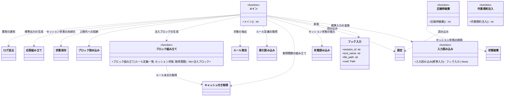

# モジュール構成: 起動 / エントリポイント

`起動` ドメインに属する構成要素詳細。
Claude Code のフックとして呼ばれたときの入口と、各ドメインの関数を束ねる配線を扱う。

標準入力でフックのペイロードを受け取り、標準出力に応答 JSON を返す。
どの異常でも終了コードは `0` にする。
フックが非 0 で終わると Claude Code が編集を妨げるため、ルール注入の失敗が開発の停止につながらないようにする。

## 一覧

| ユースケース | 役割 | コンテナ | 種別 | 名前 | 概要 | 補足 |
| --- | --- | --- | --- | --- | --- | --- |
| ルール注入 | 入力 | `main.py` | データモデル | [`フック入力`](#フック入力) | 標準入力から受け取るペイロード | 必要なフィールドだけ保持する |
| ルール注入 | 配線 | `main.py` | 関数 | [`メイン`](#メイン) | 入力の受け取りから応答の書き出しまでを配線する | PreToolUse のエントリポイント |
| ルール注入 | 配線 | `main.py` | 関数 | [`圧縮時破棄`](#圧縮時破棄) | セッション状態を破棄して再注入させる | PreCompact のエントリポイント |
| 作業規約注入 | 配線 | `main.py` | 関数 | [`作業規約注入`](#作業規約注入) | 作業規約をコンテキストへ追加する | SessionStart のエントリポイント |
| ルール注入 | 内部処理 | `main.py` | 関数 | [`入力読み込み`](#入力読み込み) | 標準入力を[フック入力](#フック入力)に変換する | 解釈できない場合は `None` |
| ルール注入 | 内部処理 | `main.py` | 関数 | [`ブロック組み立て`](#ブロック組み立て) | ルール定義から[注入ブロック](../注入/注入メッセージ.py.md#注入ブロック)を作る | 取得失敗分は除外する |

## ディレクトリ構成

```
src/inject_rules/
└── main.py    # HookInput / main / clear / inject_conventions / _read_input / _build_blocks
```

```
plugins/inject-rules/hooks/
├── pre_tool_use.py     # main を呼ぶ
├── pre_compact.py      # clear を呼ぶ
└── session_start.py    # inject_conventions を呼ぶ
```

`hooks.json` は `hooks/` 配下のスクリプトを直接起動し、スクリプト側が `src` を `sys.path` に通してから本モジュールの関数を呼ぶ。
フックの起動コマンドへ `PYTHONPATH` を渡す手段がないため、モジュール起動ではなくスクリプト経由にする。

## 構成図



## フック入力
> 物理名: `HookInput`<br>
> 種別: データモデル<br>
> コンテナ: `main.py`

標準入力のペイロードから、本フックが使うフィールドだけを取り出した不変のデータモデル（`@dataclass(frozen=True, slots=True, kw_only=True)`）。

### プロパティ

| 論理名 | プロパティ名 | 型 | 可視性 | デフォルト | 説明 | 例 | 補足 |
| --- | --- | --- | --- | --- | --- | --- | --- |
| セッション ID | `session_id` | `str` | 公開 | `"default"` | セッション識別子 | `"9f2c1b"` | セッション状態の保存キー |
| ツール名 | `tool_name` | `str` | 公開 | - | 実行しようとしているツール名 | `"Edit"` | 対象外なら何もしない |
| 対象パス | `file_path` | `str` | 公開 | - | 操作対象のファイルパス | `"/repo/docs/wiki/規約/コメント.md"` | glob 照合の対象 |
| 作業ディレクトリ | `cwd` | `Path` | 公開 | - | フック実行時の作業ディレクトリ | `Path("/repo")` | 相対パスの基準 |

### メソッド

なし

### 単体テスト

なし

## `main.py`
> 種別: ファイル

composition root。
標準入出力の取り回しと、各ドメインの関数の配線だけを行う。

---

### 入力読み込み
> 物理名: `_read_input`<br>
> 種別: 関数

標準入力の JSON を[フック入力](#フック入力)に変換する内部ヘルパー。

#### 引数

| 論理名 | 引数名 | 型 | 必須 | デフォルト | 説明 | 補足 |
| --- | --- | --- | --- | --- | --- | --- |
| 本文 | `text` | `str` | ✅ | - | 標準入力から読んだ文字列 | - |

引数例:

```python
_read_input('{"session_id": "abc", "tool_name": "Edit", "tool_input": {"file_path": "/repo/a.md"}, "cwd": "/repo"}')
```

#### 戻り値

| 型 | 説明 | 補足 |
| --- | --- | --- |
| [`HookInput \| None`](#フック入力) | 変換した入力 | JSON として解釈できない場合と対象パスが無い場合は `None` |

#### 処理

1. 本文を JSON として解釈する（失敗した場合は `None` を返す）
2. `tool_input.file_path` が空の場合は `None` を返す
3. 各フィールドを取り出して[フック入力](#フック入力)にして返す（`cwd` が無い場合はカレントディレクトリを使う）

#### 例外

なし

#### 単体テスト

| テスト名 | 正常/異常 | 概要 | 条件 | Mock | 期待値 | 補足 |
| --- | --- | --- | --- | --- | --- | --- |
| `test_read_input` | 正常 | 全フィールドの変換 | 4 フィールドが揃った JSON | なし | 各プロパティに値が入る | - |
| `test_read_input_when_session_id_missing` | 正常 | セッション ID 既定値 | `session_id` なし | なし | `"default"` になる | - |
| `test_read_input_when_file_path_missing` | 正常 | 対象パスなし | `tool_input` が空 | なし | `None` | - |
| `test_read_input_when_broken_json` | 正常 | 壊れた JSON | 不正な文字列 | なし | `None`（例外を投げない） | - |

---

### ブロック組み立て
> 物理名: `_build_blocks`<br>
> 種別: 関数

マッチしたルール定義から[注入ブロック](../注入/注入メッセージ.py.md#注入ブロック)を組み立てる内部ヘルパー。

本文の取得はスレッドで並列に行う。
マッチしたルールは分割注入を繰り返して最終的に全件送られるうえ、取得結果は[キャッシュ付き取得](../連携/取得とキャッシュ.py.md#キャッシュ付き取得)がローカルへ書くため、今回送らない分を先に取っても通信の総量は変わらない。
直列に取ると件数分の待ち時間がそのままフックの待ち時間になる。

#### 引数

| 論理名 | 引数名 | 型 | 必須 | デフォルト | 説明 | 補足 |
| --- | --- | --- | --- | --- | --- | --- |
| ルール定義一覧 | `rules` | [`list[RuleDefinition]`](../ルール/索引.py.md#ルール定義) | ✅ | - | 未注入のルール | [ルール照合](../ルール/索引.py.md#ルール照合) の結果を絞ったもの |
| セッション状態 | `state` | [`SessionState`](../セッション/セッション状態.py.md#セッション状態) | ✅ | - | 続き位置の取得元 | キーワード引数 |
| 取得関数 | `fetch` | [`FetchText`](../連携/取得とキャッシュ.py.md#テキスト取得関数) | ✅ | - | ルール本文の取得手段 | キーワード引数 |

引数例:

```python
_build_blocks(rules, state=state, fetch=cached_fetch)
```

#### 戻り値

| 型 | 説明 | 補足 |
| --- | --- | --- |
| [`list[InjectionBlock]`](../注入/注入メッセージ.py.md#注入ブロック) | 組み立てたブロック（`rules` の順序を保つ） | 取得に失敗したルールは含まない |

#### 処理

1. スレッドプールで `rules` の各 URL を取得関数（[キャッシュ付き取得](../連携/取得とキャッシュ.py.md#キャッシュ付き取得)）に渡し、本文を並列に取得する（同時実行数は上限を設ける）
2. `rules` の順に結果を取り出して[注入ブロック](../注入/注入メッセージ.py.md#注入ブロック)を組み立てる
   - 取得に失敗したルールは飛ばす（注入済みにしないため次回のツール呼び出しで再試行される）
     - `[WARNING]` ルール本文を取得できなかった（ルール URL / 例外）
   - 成功したルールは、セッション状態の続き位置以降を本文にしたブロックにする
3. 組み立てたブロックの配列を返す

#### 例外

なし

#### 単体テスト

| テスト名 | 正常/異常 | 概要 | 条件 | Mock | 期待値 | 補足 |
| --- | --- | --- | --- | --- | --- | --- |
| `test_build_blocks` | 正常 | 全件の組み立て | ルール 2 件 | 取得関数 | 2 件のブロックが `rules` の順で返る | 並列取得でも順序が入れ替わらない |
| `test_build_blocks_when_offset` | 正常 | 続き位置の反映 | 続き位置 100 のルール | 取得関数 | 本文が 100 文字目以降になる | - |
| `test_build_blocks_when_fetch_failed` | 正常 | 取得失敗の除外 | 2 件中 1 件が例外 | 取得関数 | 成功した 1 件だけ返る | 次回再試行のため注入済みにしない |
| `test_build_blocks_when_parallel` | 正常 | 並列取得 | 待機する取得関数を 3 件分 | 取得関数（呼び出し時刻を記録） | 3 件の取得が重なって実行される | 直列だと件数分の待ち時間になる |

---

### メイン
> 物理名: `main`<br>
> 種別: 関数

ファイル操作フックのエントリポイント。

#### 引数

なし

引数例:

```python
main()
```

#### 戻り値

| 型 | 説明 | 補足 |
| --- | --- | --- |
| `int` | 終了コード | 常に `0`（フックが編集を止めない） |

#### 処理

1. 標準入力を[入力読み込み](#入力読み込み)で変換する（`None` の場合は `0` を返して終わる）
2. ツール名が `Read` / `Write` のいずれでもない場合は `0` を返して終わる
3. [設定](../連携/取得とキャッシュ.py.md#設定) を環境変数から組み立てる
4. [状態読み込み](../セッション/セッション状態.py.md#状態読み込み) でセッション状態を復元する
   - 以降はどの経路で終わる場合も[状態保存](../セッション/セッション状態.py.md#状態保存)で書き出してから戻る（通知済みの記録を落とさないため）
5. 索引の場所が空の場合、未通知なら[ログ送出](../連携/取得とキャッシュ.py.md#ログ送出)して `0` を返して終わる
   - `[WARNING]` 注入元が未設定のため注入しない
6. [キャッシュ付き取得](../連携/取得とキャッシュ.py.md#キャッシュ付き取得) に[テキスト取得](../連携/取得とキャッシュ.py.md#テキスト取得)・キャッシュディレクトリ・寿命を束ねた取得関数を作る（以降の索引取得とルール本文取得の両方がこの関数を通る）
7. 作った取得関数とセッション状態を渡して [索引読み込み](../ルール/索引.py.md#索引読み込み) でルール定義の一覧を得る
   - 一覧が空の場合、未通知なら[ログ送出](../連携/取得とキャッシュ.py.md#ログ送出)して `0` を返して終わる
     - `[WARNING]` 索引が取得できないため注入しない
8. [ルール照合](../ルール/索引.py.md#ルール照合) で対象パスにマッチするルールを抽出し、セッション状態で未注入のものだけに絞る（0 件なら `0` を返して終わる）
9. 同じ取得関数を渡して [ブロック組み立て](#ブロック組み立て) で注入ブロックを作る（本文は並列に取得される。0 件なら `0` を返して終わる）
10. [ブロック詰め込み](../注入/注入メッセージ.py.md#ブロック詰め込み) で上限内に収める
11. 詰め込み結果をセッション状態に反映する
12. [メッセージ描画](../注入/注入メッセージ.py.md#メッセージ描画)と[応答組み立て](../注入/注入メッセージ.py.md#応答組み立て)の結果を標準出力へ書き、`0` を返す

#### 例外

なし

#### 単体テスト

セットアップ:

| セットアップ | 説明 | 補足 |
| --- | --- | --- |
| 一時フォルダ | キャッシュ・セッション状態・テンプレートの置き場所に一時フォルダを渡す | fixture 名 `tmp_dirs` |
| 環境変数 | `INJECT_RULES_*` を monkeypatch で投入する | テスト終了時に自動 unset |

| テスト名 | 正常/異常 | 概要 | 条件 | Mock | 期待値 | 補足 |
| --- | --- | --- | --- | --- | --- | --- |
| `test_main` | 正常 | 1 回で収まる注入 | マッチするルール 1 件 | 取得関数 | 標準出力の `permissionDecision` が `allow` | - |
| `test_main_when_not_target_tool` | 正常 | 対象外ツールの無処理 | `tool_name` が `Edit` | 取得関数 | 標準出力が空・取得が発生しない | 読み取り以外では注入しない |
| `test_main_when_indexes_unset` | 正常 | 注入元未設定 | 環境変数を削除 | ログ送出 | 標準出力が空・ログが 1 件送出される | - |
| `test_main_when_indexes_unset_twice` | 正常 | 通知の抑制 | 同一セッション ID で 2 回実行 | ログ送出 | ログ送出が 1 回だけ | - |
| `test_main_when_index_missing` | 正常 | 索引が取得できない | 取得関数が `URLError` | ログ送出 | 標準出力が空・ログが 1 件送出される | - |
| `test_main_when_no_match` | 正常 | マッチなし | マッチしない対象パス | 取得関数 | 標準出力が空 | - |
| `test_main_when_already_injected` | 正常 | 注入済みの無処理 | セッションに注入済み記録 | 取得関数 | 標準出力が空 | 再注入の抑止 |
| `test_main_when_over_limit` | 正常 | 上限超過の差し戻し | 上限を超える本文 | 取得関数 | `permissionDecision` が `deny`・続き位置が保存される | - |
| `test_main_when_broken_stdin` | 正常 | 壊れた入力 | JSON でない標準入力 | なし | 標準出力が空・終了コード `0` | - |

---

### 圧縮時破棄
> 物理名: `clear`<br>
> 種別: 関数

コンテキスト圧縮フックのエントリポイント。
圧縮でルールがコンテキストから消えるため、注入済み記録を破棄して次のツール呼び出しで再注入させる。

#### 引数

なし

引数例:

```python
clear()
```

#### 戻り値

| 型 | 説明 | 補足 |
| --- | --- | --- |
| `int` | 終了コード | 常に `0`（フックが圧縮を止めない） |

#### 処理

1. 標準入力を JSON として解釈して `session_id` を取り出す（解釈できない場合は `0` を返して終わる）
2. [設定](../連携/取得とキャッシュ.py.md#設定) を環境変数から組み立てる
3. [状態破棄](../セッション/セッション状態.py.md#状態破棄) で保存ファイルを削除し、`0` を返す

#### 例外

なし

#### 単体テスト

セットアップ:

| セットアップ | 説明 | 補足 |
| --- | --- | --- |
| 一時フォルダ | キャッシュ・セッション状態・テンプレートの置き場所に一時フォルダを渡す | fixture 名 `tmp_dirs` |

| テスト名 | 正常/異常 | 概要 | 条件 | Mock | 期待値 | 補足 |
| --- | --- | --- | --- | --- | --- | --- |
| `test_clear` | 正常 | 注入済み記録の破棄 | 保存済みのセッション | なし | [状態読み込み](../セッション/セッション状態.py.md#状態読み込み) が空の状態を返す | - |
| `test_clear_when_broken_stdin` | 正常 | 壊れた入力 | JSON でない標準入力 | なし | 例外を投げず終了コード `0` | - |

---

### 作業規約注入
> 物理名: `inject_conventions`<br>
> 種別: 関数

セッション開始フックのエントリポイント。
ファイル操作の作業規約をコンテキストへ追加し、新規ファイルにもルール注入が効くようにする。

規約の文面は `作業規約.txt` に置き、実装は読み出して返すだけにする。

#### 引数

なし

引数例:

```python
inject_conventions()
```

#### 戻り値

| 型 | 説明 | 補足 |
| --- | --- | --- |
| `int` | 終了コード | 常に `0`（フックがセッション開始を止めない） |

#### 処理

1. テンプレートディレクトリの `作業規約.txt` を読む
2. フックイベント名と読んだ本文を詰めた応答を標準出力へ書き、`0` を返す

#### 例外

なし

#### 単体テスト

| テスト名 | 正常/異常 | 概要 | 条件 | Mock | 期待値 | 補足 |
| --- | --- | --- | --- | --- | --- | --- |
| `test_inject_conventions` | 正常 | 作業規約の出力 | 配布物のテンプレート | なし | `hookEventName` が `SessionStart`・`additionalContext` にテンプレートの内容が入る | - |
