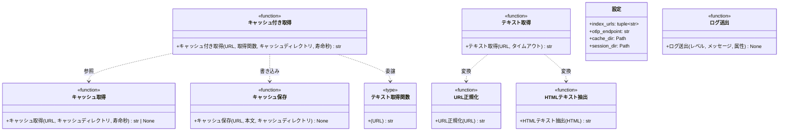

# モジュール構成: 連携 / 取得とキャッシュ

`連携` ドメインに属する構成要素詳細。
外部への出入り（URL からのテキスト取得、ローカルキャッシュ、観測基盤へのログ送出）と、その設定を扱う。
これらを束ねる配線は [起動](../起動/エントリポイント.py.md) の責務。

依存は標準ライブラリのみとする。
フックがどの Python で起動されるか制御できないため、追加パッケージを前提にすると環境によって黙って動かなくなる。
観測基盤への送出だけは例外で、OpenTelemetry SDK が導入されている環境でのみ有効になり、無ければ何もしない。

## 一覧

| ユースケース | 役割 | コンテナ | 種別 | 名前 | 概要 | 補足 |
| --- | --- | --- | --- | --- | --- | --- |
| ルール注入 | 設定 | `shared/settings.py` | データモデル | [`設定`](#設定) | 索引 URL 一覧・送信先・保存先 | 環境変数から読む |
| ルール注入 | 型 | `shared/types.py` | 関数型 | [`テキスト取得関数`](#テキスト取得関数) | URL から本文を得る関数の型 | 差し替え点 |
| ルール注入 | ログ | `shared/logger.py` | 関数 | [`ログ送出`](#ログ送出) | 観測基盤へ 1 件送る | SDK 未導入なら何もしない |
| ルール注入 | 取得 | `integrations/http/fetcher.py` | 関数 | [`テキスト取得`](#テキスト取得) | URL から本文を取得する | HTML はテキスト抽出 |
| ルール注入 | 内部処理 | `integrations/http/fetcher.py` | 関数 | [`URL正規化`](#url正規化) | GitHub の閲覧 URL を raw URL に変換する | - |
| ルール注入 | 内部処理 | `integrations/http/fetcher.py` | 関数 | [`HTMLテキスト抽出`](#htmlテキスト抽出) | HTML からテキストだけを取り出す | `html.parser` を使う |
| ルール注入 | キャッシュ | `integrations/cache/store.py` | 関数 | [`キャッシュ取得`](#キャッシュ取得) | 有効期限内のキャッシュを読む | 期限切れ / 未取得は `None` |
| ルール注入 | キャッシュ | `integrations/cache/store.py` | 関数 | [`キャッシュ保存`](#キャッシュ保存) | 本文をキャッシュへ書く | URL 単位 |
| ルール注入 | キャッシュ | `integrations/cache/store.py` | 関数 | [`キャッシュ付き取得`](#キャッシュ付き取得) | キャッシュ優先で本文を得る | [テキスト取得関数](#テキスト取得関数)を注入する |

## ディレクトリ構成

```
src/inject_rules/
├── shared/
│   ├── settings.py             # Settings
│   ├── types.py                # FetchText
│   └── logger.py               # emit_log
└── integrations/
    ├── http/
    │   └── fetcher.py          # fetch_text / _normalize_url / _html_to_text
    └── cache/
        └── store.py            # read_cache / write_cache / fetch_with_cache
```

キャッシュは URL を鍵にしたフラットな構造にする。
索引ごとにディレクトリを分ける必要はなく、URL が絶対なので衝突しない。

## 構成図



## 設定
> 物理名: `Settings`<br>
> 種別: データモデル<br>
> コンテナ: `shared/settings.py`

環境変数から読む設定（`@dataclass(frozen=True, slots=True, kw_only=True)`）。
pydantic-settings は追加依存になるため使わず、`from_env` クラスメソッドで組み立てる。

### プロパティ

| 論理名 | プロパティ名 | 型 | 可視性 | デフォルト | 説明 | 例 | 補足 |
| --- | --- | --- | --- | --- | --- | --- | --- |
| 索引 URL 一覧 | `index_urls` | `tuple[str, ...]` | 公開 | `()` | ルール索引の URL | `("https://example.com/rules.yaml",)` | 環境変数 `INJECT_RULES_INDEXES` をカンマで分割 |
| OTLP エンドポイント | `otlp_endpoint` | `str` | 公開 | `"http://localhost:4317"` | ログ送信先 | `"http://localhost:4317"` | 環境変数 `INJECT_RULES_OTLP_ENDPOINT` |
| キャッシュディレクトリ | `cache_dir` | `Path` | 公開 | `~/.cache/inject-rules` | 取得済み本文の保存先 | - | 環境変数 `INJECT_RULES_CACHE_DIR` |
| セッションディレクトリ | `session_dir` | `Path` | 公開 | `~/.claude/tokens/inject-rules` | セッション状態の保存先 | - | 環境変数 `INJECT_RULES_SESSION_DIR` |

環境変数名は `OTEL_` で始めない。
Claude Code は全サブプロセスから `OTEL_*` を削除するため、フックには届かない。

### 環境変数から生成
> 物理名: `from_env`<br>
> 種別: メソッド

環境変数を読んで[設定](#設定)を組み立てるクラスメソッド。

#### 引数

なし

引数例:

```python
Settings.from_env()
```

#### 戻り値

| 型 | 説明 | 補足 |
| --- | --- | --- |
| [`Settings`](#設定) | 組み立てた設定 | 未設定の変数は既定値になる |

戻り値例:

```python
Settings(
    index_urls=("https://example.com/rules.yaml",),
    otlp_endpoint="http://localhost:4317",
    cache_dir=Path.home() / ".cache" / "inject-rules",
    session_dir=Path.home() / ".claude" / "tokens" / "inject-rules",
)
```

#### 処理

1. `INJECT_RULES_INDEXES` をカンマで分割し、前後の空白を落として空要素を除いたタプルにする（未設定なら空タプル）
2. `INJECT_RULES_OTLP_ENDPOINT` を読む（未設定なら既定値）
3. `INJECT_RULES_CACHE_DIR` / `INJECT_RULES_SESSION_DIR` を `Path` にする（未設定なら既定値）
4. 各値を詰めた[設定](#設定)を返す

#### 例外

なし

#### 単体テスト

| テスト名 | 正常/異常 | 概要 | 条件 | Mock | 期待値 | 補足 |
| --- | --- | --- | --- | --- | --- | --- |
| `test_from_env` | 正常 | 環境変数の反映 | 4 変数を設定 | monkeypatch.setenv | 各プロパティに値が入る | - |
| `test_from_env_when_unset` | 正常 | 未設定時の既定値 | 全変数を削除 | monkeypatch.delenv | `index_urls` が空・他は既定値 | - |
| `test_from_env_when_multiple_indexes` | 正常 | カンマ区切りの分割 | `a.yaml,b.yaml` を設定 | monkeypatch.setenv | 2 要素のタプル | - |
| `test_from_env_when_spaces` | 正常 | 空白と空要素の除去 | `a.yaml, ,b.yaml` を設定 | monkeypatch.setenv | 2 要素のタプル（空要素なし） | - |

## `shared/types.py`
> 種別: ファイル

ドメインをまたぐ型エイリアスを置くファイル。

---

### テキスト取得関数
> 物理名: `FetchText`<br>
> 種別: 関数型

URL から本文を得る関数の型（`type FetchText = Callable[[str], str]`）。

取得の実体（HTTP・キャッシュ）を呼び出し側から隠し、単体テストでは通信しない関数を差し込めるようにする。

#### 単体テスト

なし

## `shared/logger.py`
> 種別: ファイル

観測基盤へのログ送出を担うファイル。

---

### ログ送出
> 物理名: `emit_log`<br>
> 種別: 関数

観測基盤へログを 1 件送る。
OpenTelemetry SDK が導入されていない環境では何もしない。

短命プロセスのためバッチ送信は使わず、その場で送って終わる方式にする。
[設定](#設定)を引数で受け取らない関数から呼ぶ場合は、呼び出し側がその場で[設定](#設定)を環境変数から組み立てて送信先を渡す。

#### 引数

| 論理名 | 引数名 | 型 | 必須 | デフォルト | 説明 | 補足 |
| --- | --- | --- | --- | --- | --- | --- |
| レベル | `level` | `Literal["WARNING", "ERROR"]` | ✅ | - | ログレベル | 正常系では送出しない |
| メッセージ | `message` | `str` | ✅ | - | ログ本文 | - |
| 属性 | `attributes` | `dict[str, str]` | - | `{}` | 付随情報 | 索引 URL など |
| 送信先 | `endpoint` | `str` | ✅ | - | OTLP gRPC の受付 URL | キーワード引数 |

引数例:

```python
emit_log("WARNING", "索引を取得できませんでした", {"index_url": url}, endpoint=settings.otlp_endpoint)
```

#### 戻り値

| 型 | 説明 | 補足 |
| --- | --- | --- |
| `None` | なし | 副作用: 観測基盤への送信 |

#### 処理

1. OpenTelemetry SDK の読み込みを試みる
   - 読み込めない場合、何もせず戻る（標準エラーにも出さない）
2. SDK 自身のログを標準エラーへ出さないよう抑止する
3. `service.name` を `inject-rules` にした共通属性を組み立てる
4. 同期送信の Provider を組み立て、`level` / `message` / `attributes` を 1 件送る
   - 送信先が落ちていても編集を待たせないよう、送信の待ち時間は短く抑える
5. Provider を停止して送信を確定させる
   - 送信に失敗した場合、握りつぶして戻る（フックの処理を止めない）

#### 例外

なし

#### 単体テスト

| テスト名 | 正常/異常 | 概要 | 条件 | Mock | 期待値 | 補足 |
| --- | --- | --- | --- | --- | --- | --- |
| `test_emit_log` | 正常 | 1 件の送出 | SDK 導入済み | Exporter をスタブに差し替え | `body` / `severity_text` / 属性がスタブに届く | - |
| `test_emit_log_when_sdk_missing` | 正常 | SDK 未導入時の無処理 | SDK の読み込みを失敗させる | import をスタブに差し替え | 例外を投げず、何も出力しない | - |
| `test_emit_log_when_send_failed` | 正常 | 送信失敗の握りつぶし | Exporter が例外を投げる | Exporter をスタブに差し替え | 例外が呼び出し元へ伝播せず、標準エラーにも出ない | - |

## `integrations/http/fetcher.py`
> 種別: ファイル

URL からのテキスト取得を担うファイル。

---

### テキスト取得
> 物理名: `fetch_text`<br>
> 種別: 関数

URL から本文テキストを取得する。
[テキスト取得関数](#テキスト取得関数) の既定の実体。

#### 引数

| 論理名 | 引数名 | 型 | 必須 | デフォルト | 説明 | 補足 |
| --- | --- | --- | --- | --- | --- | --- |
| URL | `url` | `str` | ✅ | - | 取得先 | - |
| タイムアウト | `timeout` | `int` | - | `10` | 取得のタイムアウト秒数 | キーワード引数 |

引数例:

```python
fetch_text("https://raw.githubusercontent.com/owner/repo/master/docs/wiki/rules.yaml")
```

#### 戻り値

| 型 | 説明 | 補足 |
| --- | --- | --- |
| `str` | 取得した本文 | HTML の場合はテキスト抽出済み |

#### 処理

1. [URL正規化](#url正規化) で取得先を決める
2. URL の非 ASCII 文字をパーセントエンコードする
3. HTTP GET で本文を取得し、応答の文字コードで復号する
4. 応答の種類に応じて本文を整形して返す
   - `raw.githubusercontent.com` の場合、先頭の YAML フロントマターを取り除いて返す
   - HTML の場合、[HTMLテキスト抽出](#htmlテキスト抽出) を通して返す
   - それ以外の場合、前後の空白を落として返す

#### 例外

| 例外名 | 発生条件 | メッセージ | 補足 |
| --- | --- | --- | --- |
| `URLError` | 接続失敗 / タイムアウト / 404 | 標準ライブラリのメッセージ | 呼び出し元が捕捉してスキップする |

#### 単体テスト

| テスト名 | 正常/異常 | 概要 | 条件 | Mock | 期待値 | 補足 |
| --- | --- | --- | --- | --- | --- | --- |
| `test_fetch_text` | 正常 | プレーンテキストの取得 | `text/plain` を返す | urlopen | 本文がそのまま返る | - |
| `test_fetch_text_when_raw_github` | 正常 | フロントマターの除去 | raw URL + 先頭にフロントマター | urlopen | フロントマターが落ちる | 索引とルール本文で共通 |
| `test_fetch_text_when_html` | 正常 | HTML のテキスト抽出 | `text/html` を返す | urlopen | タグが除かれる | - |
| `test_fetch_text_when_non_ascii_url` | 正常 | 日本語 URL の取得 | パスに日本語を含む URL | urlopen | エンコード済み URL で要求される | - |
| `test_fetch_text_when_unreachable` | 異常 | 取得失敗 | urlopen が `URLError` | urlopen | `URLError` が伝播する | - |

---

### URL正規化
> 物理名: `_normalize_url`<br>
> 種別: 関数

GitHub の閲覧 URL を raw URL に変換する内部ヘルパー。
ブラウザからコピーした URL をそのまま索引に書けるようにする。

#### 引数

| 論理名 | 引数名 | 型 | 必須 | デフォルト | 説明 | 補足 |
| --- | --- | --- | --- | --- | --- | --- |
| URL | `url` | `str` | ✅ | - | 変換前の URL | - |

引数例:

```python
_normalize_url("https://github.com/owner/repo/blob/master/docs/a.md")
```

#### 戻り値

| 型 | 説明 | 補足 |
| --- | --- | --- |
| `str` | 変換後の URL | どのパターンにも当たらなければ入力をそのまま返す |

戻り値例:

```python
"https://raw.githubusercontent.com/owner/repo/master/docs/a.md"
```

#### 処理

1. `github.com/{owner}/{repo}/blob/{以降}` に一致する場合、`raw.githubusercontent.com/{owner}/{repo}/{以降}` に変換して返す
2. `github.com/{owner}/{repo}/wiki/{ページ}` に一致する場合、`raw.githubusercontent.com/wiki/{owner}/{repo}/{ページ}.md` に変換して返す
3. どちらにも一致しない場合、入力をそのまま返す

#### 例外

なし

#### 単体テスト

| テスト名 | 正常/異常 | 概要 | 条件 | Mock | 期待値 | 補足 |
| --- | --- | --- | --- | --- | --- | --- |
| `test_normalize_url_when_blob` | 正常 | blob URL の変換 | `github.com/.../blob/...` | なし | raw URL になる | - |
| `test_normalize_url_when_wiki` | 正常 | Wiki URL の変換 | `github.com/.../wiki/Page` | なし | raw URL に `.md` が補完される | - |
| `test_normalize_url_when_raw` | 正常 | raw URL の素通し | 既に raw URL | なし | 入力と同じ | - |
| `test_normalize_url_when_other_host` | 正常 | 他ホストの素通し | GitHub 以外の URL | なし | 入力と同じ | - |

---

### HTMLテキスト抽出
> 物理名: `_html_to_text`<br>
> 種別: 関数

HTML からテキストノードだけを取り出す内部ヘルパー。
標準ライブラリの `html.parser` を使い、`script` / `style` / `head` の中身は捨てる。

#### 引数

| 論理名 | 引数名 | 型 | 必須 | デフォルト | 説明 | 補足 |
| --- | --- | --- | --- | --- | --- | --- |
| HTML | `html` | `str` | ✅ | - | 変換前の HTML | - |

引数例:

```python
_html_to_text("<html><body><p>本文</p></body></html>")
```

#### 戻り値

| 型 | 説明 | 補足 |
| --- | --- | --- |
| `str` | 抽出したテキスト | 連続する空行は 1 行に畳む |

#### 処理

1. HTML を解析してテキストノードを集める（`script` / `style` / `noscript` / `head` の中身は集めない）
   - 解析に失敗した場合、タグを単純に除去した結果を返す
2. 各行の前後の空白を落とし、連続する空行を 1 行に畳んで返す

#### 例外

なし

#### 単体テスト

| テスト名 | 正常/異常 | 概要 | 条件 | Mock | 期待値 | 補足 |
| --- | --- | --- | --- | --- | --- | --- |
| `test_html_to_text` | 正常 | テキストの抽出 | 段落を含む HTML | なし | タグが除かれた本文が返る | - |
| `test_html_to_text_when_script` | 正常 | script の除外 | `<script>` を含む HTML | なし | スクリプト本文が含まれない | - |
| `test_html_to_text_when_broken` | 正常 | 壊れた HTML | 閉じタグ欠落 | なし | 例外を投げずテキストが返る | - |

## `integrations/cache/store.py`
> 種別: ファイル

取得済み本文のローカルキャッシュを担うファイル。

---

### キャッシュ取得
> 物理名: `read_cache`<br>
> 種別: 関数

有効期限内のキャッシュを読む。

#### 引数

| 論理名 | 引数名 | 型 | 必須 | デフォルト | 説明 | 補足 |
| --- | --- | --- | --- | --- | --- | --- |
| URL | `url` | `str` | ✅ | - | キャッシュの鍵 | - |
| キャッシュディレクトリ | `cache_dir` | `Path` | ✅ | - | 保存先 | キーワード引数 |
| 寿命秒 | `ttl_sec` | `int` | ✅ | - | 有効期限 | キーワード引数 |

引数例:

```python
read_cache(url, cache_dir=settings.cache_dir, ttl_sec=1800)
```

#### 戻り値

| 型 | 説明 | 補足 |
| --- | --- | --- |
| `str \| None` | キャッシュの本文 | 未取得 / 期限切れ / 読み込み失敗は `None` |

#### 処理

1. URL のハッシュからキャッシュファイルのパスを求める
2. ファイルが存在しなければ `None` を返す
3. 最終更新時刻からの経過が `ttl_sec` を超えていれば `None` を返す
4. ファイルを読んで本文を返す（読み込みに失敗した場合は `None`）

#### 例外

なし

#### 単体テスト

セットアップ:

| セットアップ | 説明 | 補足 |
| --- | --- | --- |
| 一時フォルダ | キャッシュディレクトリに一時フォルダを渡す | fixture 名 `tmp_path` |

| テスト名 | 正常/異常 | 概要 | 条件 | Mock | 期待値 | 補足 |
| --- | --- | --- | --- | --- | --- | --- |
| `test_read_cache` | 正常 | 期限内の読み込み | 保存直後 | なし | 本文が返る | - |
| `test_read_cache_when_missing` | 正常 | 未取得 | 未保存の URL | なし | `None` | - |
| `test_read_cache_when_expired` | 正常 | 期限切れ | 最終更新時刻を過去にする | なし | `None` | - |

---

### キャッシュ保存
> 物理名: `write_cache`<br>
> 種別: 関数

取得した本文をキャッシュへ書く。

#### 引数

| 論理名 | 引数名 | 型 | 必須 | デフォルト | 説明 | 補足 |
| --- | --- | --- | --- | --- | --- | --- |
| URL | `url` | `str` | ✅ | - | キャッシュの鍵 | - |
| 本文 | `text` | `str` | ✅ | - | 保存する内容 | - |
| キャッシュディレクトリ | `cache_dir` | `Path` | ✅ | - | 保存先 | キーワード引数 |

引数例:

```python
write_cache(url, text, cache_dir=settings.cache_dir)
```

#### 戻り値

| 型 | 説明 | 補足 |
| --- | --- | --- |
| `None` | なし | 副作用: キャッシュファイルの作成・更新 |

#### 処理

1. キャッシュディレクトリを作成する（既にあれば何もしない）
2. URL のハッシュから求めたパスへ本文を書き出す（書き出しに失敗した場合は握りつぶす）

#### 例外

なし

#### 単体テスト

セットアップ:

| セットアップ | 説明 | 補足 |
| --- | --- | --- |
| 一時フォルダ | キャッシュディレクトリに一時フォルダを渡す | fixture 名 `tmp_path` |

| テスト名 | 正常/異常 | 概要 | 条件 | Mock | 期待値 | 補足 |
| --- | --- | --- | --- | --- | --- | --- |
| `test_write_cache` | 正常 | 保存と読み込みの往復 | 任意の本文 | なし | [キャッシュ取得](#キャッシュ取得) で同一内容が返る | - |
| `test_write_cache_when_dir_missing` | 正常 | ディレクトリの自動作成 | 存在しない保存先 | なし | ディレクトリが作られて保存される | - |

---

### キャッシュ付き取得
> 物理名: `fetch_with_cache`<br>
> 種別: 関数

キャッシュを優先し、無ければ取得して保存する。
索引もルール本文も本関数を通す。

#### 引数

| 論理名 | 引数名 | 型 | 必須 | デフォルト | 説明 | 補足 |
| --- | --- | --- | --- | --- | --- | --- |
| URL | `url` | `str` | ✅ | - | 取得先 | - |
| 取得関数 | `fetch` | [`FetchText`](#テキスト取得関数) | ✅ | - | キャッシュが無いときに使う取得手段 | キーワード引数 |
| キャッシュディレクトリ | `cache_dir` | `Path` | ✅ | - | 保存先 | キーワード引数 |
| 寿命秒 | `ttl_sec` | `int` | ✅ | - | 有効期限 | キーワード引数 |

引数例:

```python
fetch_with_cache(url, fetch=fetch_text, cache_dir=settings.cache_dir, ttl_sec=1800)
```

#### 戻り値

| 型 | 説明 | 補足 |
| --- | --- | --- |
| `str` | 本文 | - |

#### 処理

1. [キャッシュ取得](#キャッシュ取得) で有効期限内のキャッシュを探す
   - 見つかった場合、そのまま返す（取得関数は呼ばない）
2. 取得関数で本文を取得する
   - 失敗した場合、期限を問わずキャッシュを探す
     - 見つかった場合、期限を延ばして継続利用し、その本文を返す
       - `[WARNING]` 取得に失敗したのでキャッシュを継続利用する（URL / 例外）
     - 見つからない場合、例外をそのまま伝播させる
3. [キャッシュ保存](#キャッシュ保存) で保存してから本文を返す

#### 例外

| 例外名 | 発生条件 | メッセージ | 補足 |
| --- | --- | --- | --- |
| `URLError` | 取得関数が失敗し、期限切れのキャッシュも無い | 取得関数のメッセージ | 呼び出し元が捕捉する |

#### 単体テスト

セットアップ:

| セットアップ | 説明 | 補足 |
| --- | --- | --- |
| 一時フォルダ | キャッシュディレクトリに一時フォルダを渡す | fixture 名 `tmp_path` |

| テスト名 | 正常/異常 | 概要 | 条件 | Mock | 期待値 | 補足 |
| --- | --- | --- | --- | --- | --- | --- |
| `test_fetch_with_cache` | 正常 | 初回の取得と保存 | キャッシュなし | 取得関数 | 取得関数が 1 回呼ばれ、キャッシュが作られる | - |
| `test_fetch_with_cache_when_cached` | 正常 | キャッシュ優先 | 期限内のキャッシュあり | 取得関数 | 取得関数が呼ばれず、キャッシュの本文が返る | 通信を発生させない要件 |
| `test_fetch_with_cache_when_expired` | 正常 | 期限切れの再取得 | 期限切れのキャッシュあり | 取得関数 | 取得関数が呼ばれ、キャッシュが更新される | - |
| `test_fetch_with_cache_when_fetch_failed_with_cache` | 正常 | 期限切れキャッシュの継続利用 | 期限切れのキャッシュあり + 取得関数が `URLError` | 取得関数 | キャッシュの本文が返り、有効期限が延びる | 取得元が落ちても注入を止めない |
| `test_fetch_with_cache_when_fetch_failed` | 異常 | 取得失敗の伝播 | 取得関数が `URLError`・キャッシュなし | 取得関数 | `URLError` が伝播する | - |
