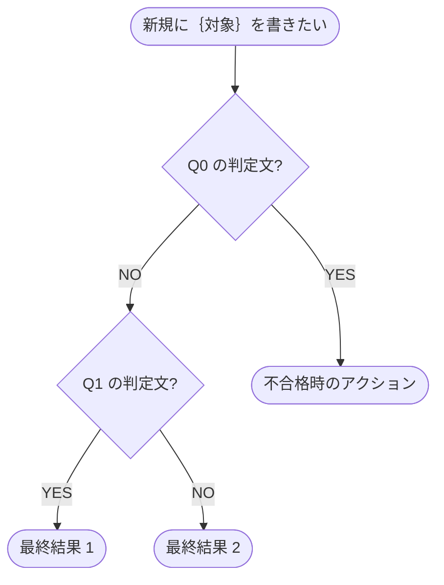

---
paths:
  - "**/*.md"
---

# 判定フローチャート

決めたい内容が複数の判定軸で決まる時の判定フローチャートの書き方。

## 記述例

````md


- **※1 用語名**: 定義（1 行）
- **※2 用語名**: 定義（1 行）
````

**ノード種類:**

- 判定ノード `Q{N}{判定文?}`: 菱形。YES / NO で分岐する
- アクションノード `A{N}([アクション文])`: 角丸。不合格時の対応
- 終端ノード `R{N}([結果文])`: 角丸。判定通過時の最終結果
- 開始ノード `START([...])`: 1 個だけ

**エッジ順序（一本道の時のみ）:**

- YES / NO の一方だけが次質問に進み、もう一方が終端 / アクションに離脱する **一本道** の判定が連続する場合、**離脱エッジ（終端 / アクション側）の宣言順が前の判定と逆になる** ようにエッジ順を調整する
  - 単純に「YES / NO の宣言順を毎回交互にする」ではない。**前の判定で離脱側を第 1 エッジに書いたら、今の判定では第 2 エッジに書く**（また次で第 1 に戻す）
  - 前後の判定で「どちらが離脱か（YES / NO）」は入れ替わり得るので、YES / NO のラベルではなく **「離脱側の宣言位置」を基準に反転** する
  - 理由: Mermaid は先に宣言したエッジを軸線側、後を枝側に描く。離脱エッジを毎回同じ位置（第 1 or 第 2）に書くと軸線が同じ方向にずれ続けて図が横に広がる
- YES / NO 両方が次質問に分岐する場合、両方が終端 / アクションの場合は本ルール適用不要（一本道ではないので自然と左右バランスが取れる）

**ラベル:**

- エッジラベルは `|YES|` / `|NO|` の 1 単語だけを推奨（補足は判定ノード本文に含める）
- 判定文は疑問形（`〜か`）で統一

**用語:**

- 図中で `※N` 印を付けて、**図の直下** に `- **※N 用語名**: 定義` の 1 行を並べる
- 番号は 図中の登場順で採番、初出だけに ※N を付ける

**注意:**
- ノード内で半角括弧を使うと Mermaid が誤解して描画が崩れる場合がある。全角括弧を使う。
