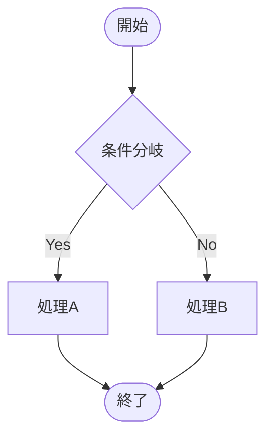
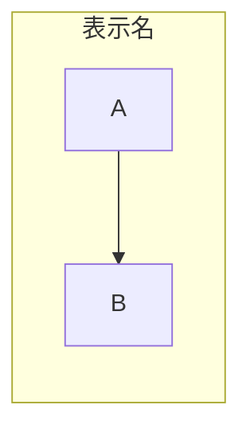
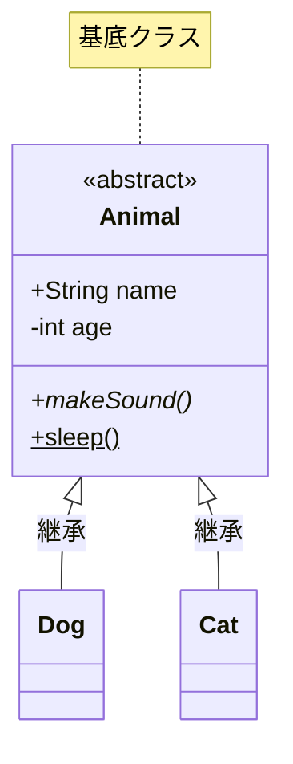
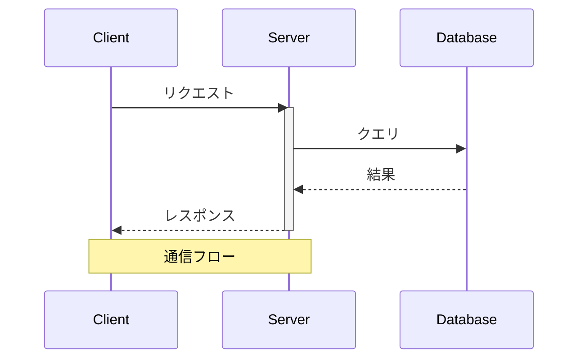
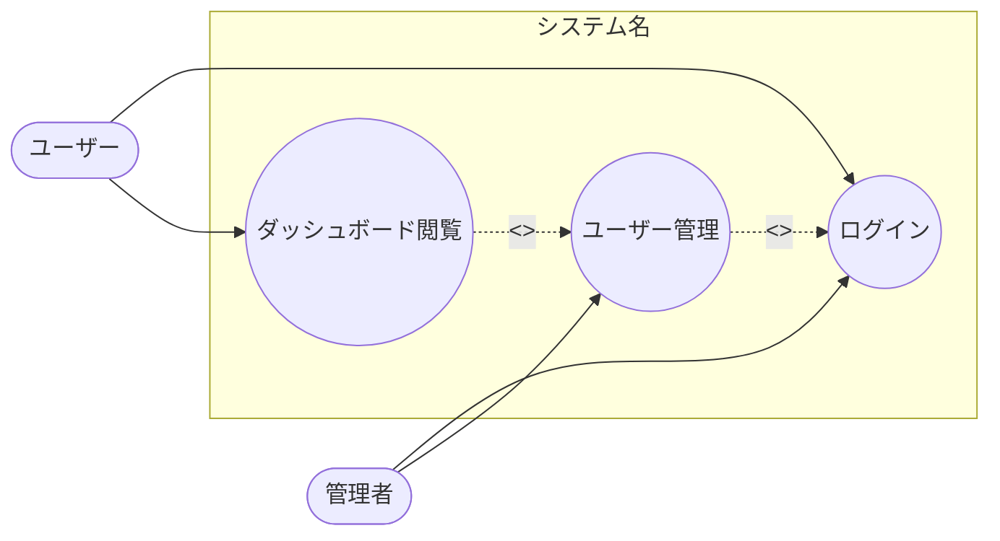
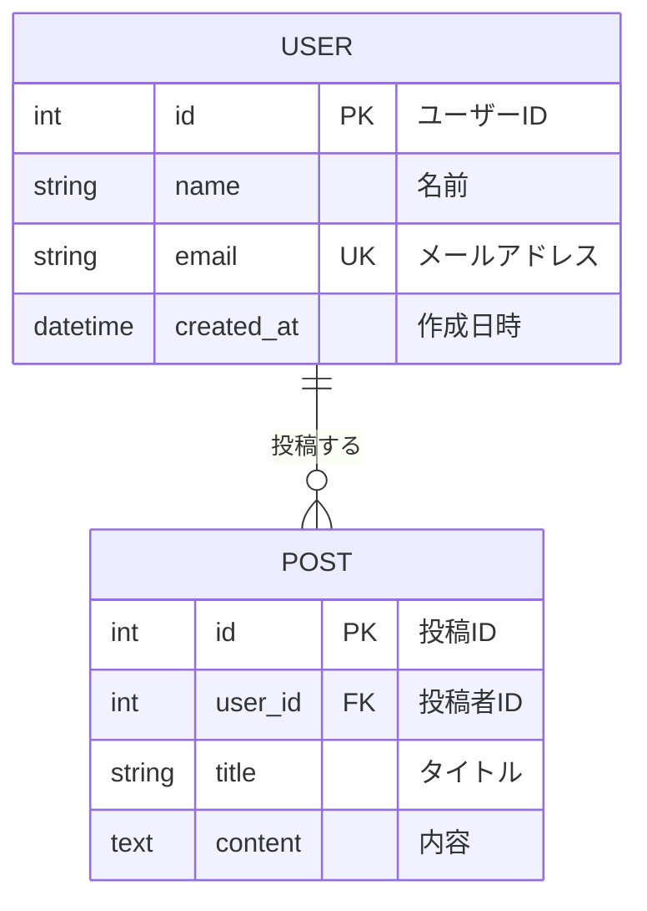

# Mermaid リファレンス（v11.14.0）

図の作成時に参照する Mermaid 構文リファレンス。

---

## 目次

1. [共通ルール](#共通ルール)
2. [フローチャート](#フローチャート)
3. [クラス図](#クラス図)
4. [シーケンス図](#シーケンス図)
5. [ユースケース図（flowchartで代替）](#ユースケース図)
6. [ER図](#er図)

---

## 共通ルール

### コメント
```
%% これはコメント（全図種共通）
A --> B  %% インラインコメントも可能
```

### 方向指定
- `TD` / `TB`: 上から下（Top-Down）— フロー図・クラス図のデフォルト
- `LR`: 左から右 — ユースケース図・横長の図
- `BT`: 下から上
- `RL`: 右から左

### ノート（図種により構文が異なる）
- クラス図: `note "テキスト"` / `note for ClassName "テキスト"`
- シーケンス図: `Note right of Actor: テキスト` / `Note over A,B: テキスト`

---

## フローチャート

### 基本構文


### ノード形状
```
A[四角形]         B(角丸)           C([スタジアム型])
D[[サブルーチン]]  E[(データベース)]   F((円形))
G{ひし形}         H{{六角形}}        I[/平行四辺形/]
```

### リンク種類
```
A --> B          %% 矢印
A --- B          %% 線のみ
A -.-> B         %% 点線矢印
A ==> B          %% 太線矢印
A ~~~ B          %% 不可視リンク
A -->|テキスト| B %% ラベル付き矢印
```

### サブグラフ


### スタイル
```
classDef highlight fill:#f9f,stroke:#333,stroke-width:2px;
class nodeA highlight;
A:::highlight --> B   %% インラインでクラス適用
```

---

## クラス図

### 基本構文


### アクセス修飾子
- `+` Public
- `-` Private
- `#` Protected
- `~` Package/Internal

### メソッド修飾子
- `*` 抽象メソッド（例: `draw()*`）
- `$` 静的メソッド（例: `getInstance()$`）

### 関係の種類
```
A <|-- B    %% 継承（Inheritance）
A *-- B     %% コンポジション（Composition）
A o-- B     %% 集約（Aggregation）
A --> B     %% 関連（Association）
A ..> B     %% 依存（Dependency）
A ..|> B    %% 実現（Realization）
```

### 多重度
```
ClassA "1" --> "0..*" ClassB : has
```

### アノテーション
```
class Shape {
    <<interface>>
}
class Color {
    <<enumeration>>
    RED
    BLUE
}
```

### 名前空間
```
namespace BaseShapes {
    class Triangle
    class Rectangle
}
```

### ジェネリクス
```
class List~T~ {
    +add(T item)
    +get(int index) T
}
```

---

## シーケンス図

### 基本構文


### 矢印の種類
```
A ->> B     %% 実線 + 矢印（同期）
A -->> B    %% 点線 + 矢印（応答）
A -x B      %% 実線 + ×（失敗/ロスト）
A -) B      %% 実線 + 開矢印（非同期）
```

### アクティベーション
```
A ->>+ B: リクエスト    %% + でアクティベート
B -->>- A: レスポンス   %% - でディアクティベート
```

### 制御構造
```
%% ループ
loop 毎分
    A ->> B: ハートビート
end

%% 条件分岐
alt 正常
    A ->> B: 成功
else エラー
    A ->> B: 失敗
end

%% オプション
opt 追加処理
    A ->> B: 処理
end

%% 並列
par アクション1
    A ->> B: Hello
and アクション2
    A ->> C: Hello
end
```

### 背景ハイライト
```
rect rgb(200, 255, 200)
    A ->> B: ハイライト区間
end
```

### 番号付け
```
autonumber
```

### 参加者のグループ化
```
box Aqua "グループ名"
    participant A
    participant B
end
```

---

## ユースケース図

Mermaidはユースケース図をネイティブサポートしていないため、flowchartで代替する。

### 代替構文


### ルール
- アクター: スタジアム型 `([名前])` で表現
- ユースケース: 二重丸 `((名前))` で表現
- システム境界: `subgraph` で表現
- include/extend: 点線矢印 `-.->` + ラベルで表現

---

## ER図

### 基本構文


### リレーションの種類
```
||--||    %% 1対1
||--o{    %% 1対多
}o--o{    %% 多対多
||--o|    %% 1対0or1
```

### リレーション記号の意味
- `||` : ちょうど1つ（必須）
- `o|` : 0または1つ（任意）
- `}o` : 0以上（任意、複数可）
- `}|` : 1以上（必須、複数可）

### 属性のキー表記
- `PK` : 主キー
- `FK` : 外部キー
- `UK` : ユニークキー

---

## フォルダ構成図（プレーンテキスト）

Mermaidではなくプレーンテキストで作成する。

### 書式ルール
```plaintext
/project-name
├── src/                # ソースコード
│   ├── index.ts        # エントリポイント
│   ├── components/     # UIコンポーネント
│   │   ├── Header.tsx  # ヘッダー
│   │   ├── Footer.tsx  # フッター
│   │   └── ...         # その他のコンポーネント
│   └── utils/          # ユーティリティ
│       └── helpers.ts  # ヘルパー関数
├── tests/              # テスト
│   └── ...             # テストファイル
├── package.json        # パッケージ設定
└── README.md           # プロジェクト説明
```

### ルール
- ツリー罫線: `├──`（途中）、`└──`（最後）、`│`（縦線）
- コメント: `#` の後にスペースを入れて記載
- 省略: 重要でないファイルは `...` で省略（# コメントで省略内容を説明）
- ディレクトリ: 末尾に `/` を付ける
- 省略判断基準:
  - **残す**: 設定ファイル、エントリポイント、主要モジュール、README
  - **省略対象**: 生成物（dist/, build/）、キャッシュ（node_modules/, __pycache__/）、ボイラープレート、テストの個別ファイル
