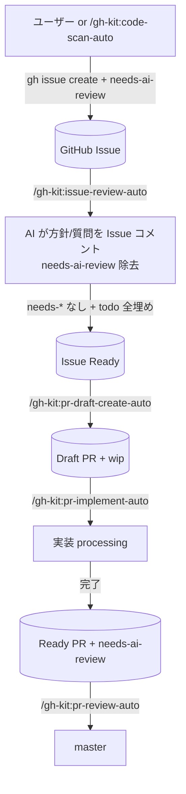

# gh-kit プラグイン

GitHub Issues / Pull Request を真実のソースとして作業フローを回すプラグイン。
GitHub 操作はすべて `gh` CLI に統一。
テンプレ取得は `gh-kit-tools` MCP の `template_get` 経由（ラベル名は `scripts/labels.sh` に一元化）。

## ワークフロー

## セットアップ

| No | 手順 |
|---|---|
| 1 | `gh` CLI をインストール（https://cli.github.com/） |
| 2 | `gh auth login` で認証（or `GH_TOKEN` 環境変数を設定） |
| 3 | `gh auth status` で接続確認 |

## スキル一覧

| No | スキル | 概要 |
|---|---|---|
| 1 | `/gh-kit:code-scan-auto` | コードベース観点別スキャン → `code-scanner` が `gh issue create` で直接起票 |
| 2 | `/gh-kit:issue-review-auto` | `needs-ai-review` 付きの Issue を AI レビュー、コメント投稿 |
| 3 | `/gh-kit:pr-draft-create-auto` | needs-* なしの Issue 全件 → Draft PR を作成 |
| 4 | `/gh-kit:pr-implement-auto` | `wip` Draft PR を N 件並列で実装 → Ready 化 |
| 5 | `/gh-kit:pr-review-auto` | `needs-ai-review` Ready PR を直列でレビュー → 合格 + needs-user-review なしならマージ |
| 6 | `/gh-kit:wiki-create` | GitHub Wiki に 1 対象 = 1 ページの仕様スナップショットを新規作成して push |

## サブエージェント一覧

| No | エージェント | 呼び元 | 役割 |
|---|---|---|---|
| 1 | `code-scanner` | `/gh-kit:code-scan-auto` | 1 観点でスキャンし `gh issue create` で直接起票 |
| 2 | `issue-reviewer` | `/gh-kit:issue-review-auto` | 1 Issue を読みコメント本文と `needs-user-review` 要否を返す |
| 3 | `pr-draft-creator` | `/gh-kit:pr-draft-create-auto` | `/work:start` + 雛形コミット + Draft PR 起票 |
| 4 | `pr-implementer` | `/gh-kit:pr-implement-auto` | 既存 Draft PR に実装コミットを積み Ready 化、`needs-user-review` 要否を返す |
| 5 | `pr-reviewer` | `/gh-kit:pr-review-auto` | レビュー → 合格時は `/work:merge` まで実行 |

## 共通リソース

| パス | 用途 |
|---|---|
| `plugins/gh-kit/scripts/labels.sh` | ラベル名一元定義（SKILL/agent 先頭で `!`cat`` 展開） |
| `plugins/gh-kit/templates/観点メニュー.md` | コード品質観点リスト（code-scan-auto / pr-reviewer が共通参照） |
| `plugins/gh-kit/templates/ファイル解決.md` | code-scanner の観点→ファイル変換ルール |
| `plugins/gh-kit/templates/イシュードキュメント.j2` | code-scanner が起票する Issue 本文（Jinja2） |
| `plugins/gh-kit/templates/ユーザーレビュー要否判定.md` | `needs-user-review` 判定基準（ブラックリスト） |
| `plugins/gh-kit/templates/レビュー結果コメント.j2` | issue-reviewer が投稿するレビュー結果コメント本文（Jinja2） |
| `plugins/gh-kit/templates/PRドキュメント.j2` | pr-draft-creator が `gh pr create --body-file` に渡す PR 本文（Jinja2） |
| `plugins/gh-kit/scripts/wiki-create.sh` | wiki-create スキルの実体（Wiki ローカル clone へ 1 ページ書き込み + push） |
| `plugins/gh-kit/scripts/templates/template_get.py` | templates/ 配下の指定ファイルを stdout に出す CLI |
| `plugins/gh-kit/mcp/server.py` | `gh-kit-tools` MCP サーバー（FastMCP）|
| `plugins/gh-kit/.mcp.json` | MCP サーバー起動設定 |

## MCP ツール

| ツール | サーバー | 用途 |
|---|---|---|
| `template_get` | `gh-kit-tools` | テンプレート 6 種（`.j2` × 3 + `.md` × 3）の本文取得。`template_name` は Literal で制約 |

## 環境変数

| 変数 | 用途 | 使うスキル |
|---|---|---|
| `GH_KIT_WIKI_PATH` | GitHub Wiki のローカル clone パス（例: `/path/to/repo.wiki`） | `wiki-create` |

## ラベル一覧

詳細は `.work/notes/プラグイン/gh-kitラベル設計.md`（状態遷移図含む）。

### 共通

| ラベル | 意味 |
|---|---|
| `processing` | 何らかの作業中（排他マーカー） |
| `needs-ai-review` | AI レビュー必要（必ず付く） |
| `needs-user-review` | ユーザーレビュー必要（AI 判定で付く） |
| `needs-fix` | レビュー結果、修正必要 |

### Issue 専用

| ラベル | 意味 |
|---|---|
| `ai-code-scan` | claude code がスキャンして起票（出自タグ） |
| `type:*` / `priority:*` | 種別・優先度 |

### PR 専用

| ラベル | 意味 |
|---|---|
| `wip` | Draft 雛形 PR |

## 直列マージ原則

`pr-review-auto` は **必ず 1 件ずつ** `pr-reviewer` を呼ぶ。並列起動は禁止（master 取り込みとマージの競合を避けるため）。並列実装（`pr-implement-auto`）は許容、並列マージは禁止。

## 前提

| No | 依存 |
|---|---|
| 1 | GitHub remote（`origin` が github.com）があること |
| 2 | `gh` CLI 認証済み（`gh auth status` が OK） |
| 3 | guard-kit プラグインが有効（保護フック群） |
| 4 | work プラグインが有効（`/work:start` / `/work:merge` + `worktree_create` / `worktree_remove` MCP） |
