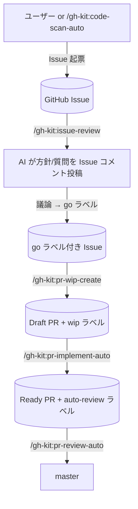
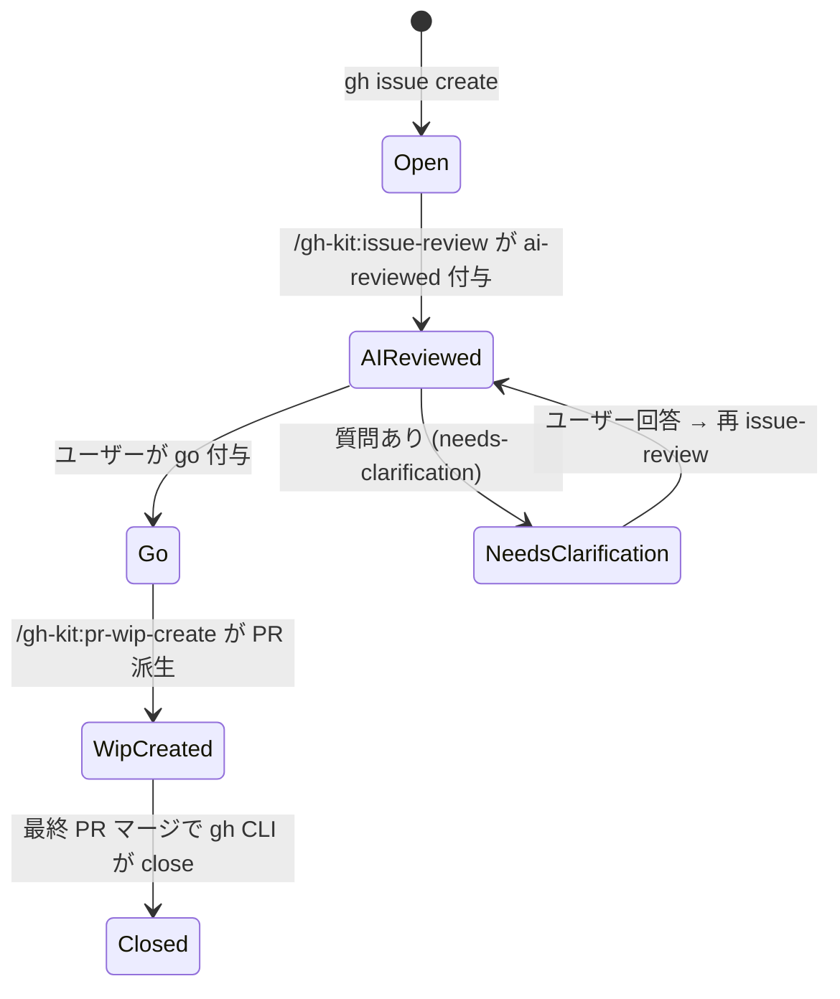
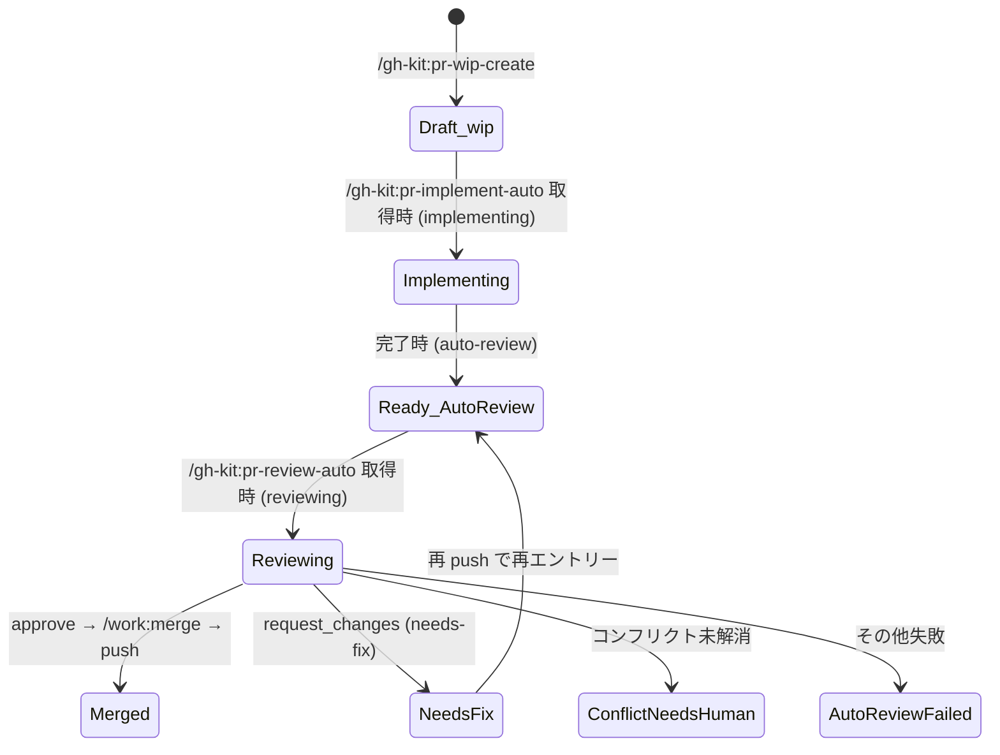

# gh-kit プラグイン

GitHub Issues / Pull Request を真実のソースとして作業フローを回すプラグイン。
GitHub 操作はすべて `gh` CLI に統一（MCP は使わない）。

## ワークフロー

## セットアップ

| No | 手順 |
|---|---|
| 1 | `gh` CLI をインストール（https://cli.github.com/） |
| 2 | `gh auth login` で認証（or `GH_TOKEN` 環境変数を設定） |
| 3 | `gh auth status` で接続確認 |

## スキル一覧

| No | スキル | 概要 |
|---|---|---|
| 1 | `/gh-kit:code-scan-auto` | コードベース観点別スキャン → `code-scanner` が `gh issue create` で直接起票 |
| 2 | `/gh-kit:issue-review` | 未レビュー Issue を読み、AI が方針/質問を Issue コメント投稿 |
| 3 | `/gh-kit:pr-wip-create` | `go` ラベル Issue を全件巡回 → Draft PR を作成（1 Issue 複数派生可） |
| 4 | `/gh-kit:pr-implement-auto` | `wip` Draft PR を N 件並列で実装 → Ready 化 |
| 5 | `/gh-kit:pr-review-auto` | `auto-review` Ready PR を直列でレビュー → 合格ならマージ |

## サブエージェント一覧

| No | エージェント | 呼び元 | 役割 |
|---|---|---|---|
| 1 | `code-scanner` | `/gh-kit:code-scan-auto` | 1 観点でスキャンし `gh issue create` で直接起票して Issue 番号配列を返す |
| 2 | `issue-reviewer` | `/gh-kit:issue-review` | 1 Issue を読みコメント本文を返す（投稿はメイン） |
| 3 | `pr-wip-creator` | `/gh-kit:pr-wip-create` | `/work:start` でブランチ + worktree → 雛形コミット → Draft PR 起票 |
| 4 | `pr-implementer` | `/gh-kit:pr-implement-auto` | 既存 Draft PR に実装コミットを積み Ready 化 |
| 5 | `pr-reviewer` | `/gh-kit:pr-review-auto` | レビュー → 合格時は自身でマージまで実行 |

## 共通リソース（テンプレート）

`plugins/gh-kit/templates/` 配下に置き、SKILL/agent から `!`cat ...`` で直展開する。
パスは環境変数で差し替え可（未設定なら同梱版を使う）。

| テンプレート | 用途 | 差し替え用 env |
|---|---|---|
| `スキャン観点.md` | code-scan-auto が選ぶ観点メニュー | `GH_KIT_SCAN_PERSPECTIVES_PATH` |
| `ファイル解決.md` | code-scanner の観点→実ファイル変換ルール | `GH_KIT_FILE_RESOLUTION_PATH` |
| `イシュー本文テンプレート.md` | code-scanner が起票する Issue 本文 | `GH_KIT_ISSUE_BODY_TEMPLATE_PATH` |

## ラベル・状態一覧

別ノート `.work/notes/プラグイン/gh-kitラベル設計.md` に集約。
（簡易版は本ファイル末尾の Quick Reference に残置）

### Quick Reference — Issue 状態遷移

### Quick Reference — PR 状態遷移

## 直列マージ原則

`pr-review-auto` は **必ず 1 件ずつ** `pr-reviewer` を呼ぶ。並列起動は禁止（master 取り込みとマージの競合を避けるため）。並列実装（`pr-implement-auto`）は許容、並列マージは禁止。

## 前提

| No | 依存 |
|---|---|
| 1 | GitHub remote（`origin` が github.com）があること |
| 2 | `gh` CLI 認証済み（`gh auth status` が OK） |
| 3 | work プラグイン v2.0 以降が有効（`/work:start` / `/work:merge` / `worktree_create` MCP に依存） |
