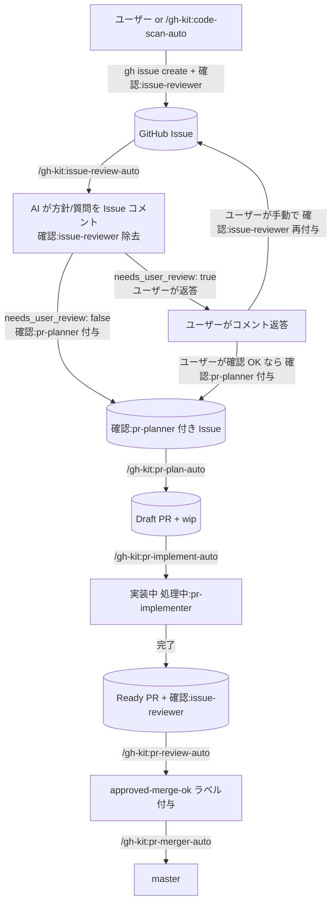

# gh-kit プラグイン

GitHub Issues / Pull Request を真実のソースとして作業フローを回すプラグイン。
GitHub 操作はすべて `gh` CLI に統一。
テンプレ取得は `gh-kit-tools` MCP の `template_get` 経由（ラベル名等の定数は `scripts/constants.sh` に一元化し、Session Start フックで自動展開）。

## ワークフロー



**再レビューループ:** AI がレビューコメントを投稿後、ユーザーが Issue にコメントで返答し、さらに AI に確認してほしい場合は手動で `確認:issue-reviewer` を再付与する。次回 `/gh-kit:issue-review-auto` 実行時に再レビューモードで動作し、追加 QA またはラベル除去を行う。

## セットアップ

| No | 手順 |
|---|---|
| 1 | `gh` CLI をインストール（https://cli.github.com/） |
| 2 | `gh auth login` で認証（or `GH_TOKEN` 環境変数を設定） |
| 3 | `gh auth status` で接続確認 |
| 4 | `.claude/settings.local.json` の `env` に `GH_KIT_REPO_PATH` を設定（自動 pull 対象のメインリポジトリ絶対パス） |
| 5 | `.claude/settings.local.json` の `env` に `GH_KIT_WIKI_PATH` を設定（Wiki 自動 pull も有効にする場合） |

```json
{
  "env": {
    "GH_KIT_REPO_PATH": "/absolute/path/to/repo",
    "GH_KIT_WIKI_PATH": "/absolute/path/to/repo.wiki"
  }
}
```

### ラベル移行（既存リポジトリへの初回適用時）

旧ラベル名が残存しているリポジトリに対しては `migrate-labels.sh` を実行して最新名へリネームする。

```bash
# 方法 1: 引数でリポジトリを指定
bash plugins/gh-kit/scripts/migrate-labels.sh owner/repo

# 方法 2: 環境変数で指定
GH_KIT_REPO=owner/repo bash plugins/gh-kit/scripts/migrate-labels.sh
```

リネーム対象ラベル:

| 旧ラベル | 新ラベル |
|---|---|
| `確認:pr-plan` | `確認:pr-planner` |

スクリプトは冪等。新ラベル名が既に存在する場合はスキップする。

## スキル一覧

| No | スキル | 概要 |
|---|---|---|
| 1 | `/gh-kit:code-scan-auto` | コードベース観点別スキャン → `code-scanner` が `issue-create` スキル経由で起票 |
| 1a | `/gh-kit:issue-create` | Issue を 1 件起票する（`確認:issue-reviewer` 強制付与）。`code-scanner` や手動呼び出しの両方から使える |
| 2 | `/gh-kit:issue-review` | 1 Issue をレビューし、本文補完コメント（必要時のみ）+ レビュー結果コメントを投稿 |
| 3 | `/gh-kit:issue-review-auto` | `確認:issue-reviewer` 付きの Issue を AI レビュー、コメント投稿 |
| 4 | `/gh-kit:pr-plan-auto` | `確認:pr-planner` 付き Issue 全件 → Draft PR を作成 |
| 5 | `/gh-kit:pr-plan` | 1 Issue から Draft PR を 1 件作成（`pr-planner` エージェントの実装本体） |
| 6 | `/gh-kit:pr-implement` | wip Draft PR を 1 件実装し Ready 化（`pr-implementer` エージェントの実装本体） |
| 6a | `/gh-kit:pr-test-create` | PR のテスト計画を立案しテストコードを作成（`pr-test-creator` エージェントの実装本体） |
| 7 | `/gh-kit:pr-implement-auto` | `wip` Draft PR を N 件並列で実装 → `pr-test-creator` 先行起動 → Ready 化 |
| 8 | `/gh-kit:pr-review-auto` | `needs-ai-review` Ready PR を直列でレビュー → 合格 + assignees 未設定なら `approved-merge-ok` ラベル付与 |
| 9 | `/gh-kit:pr-merge` | `approved-merge-ok` ラベル付き PR を 1 件 base へマージし worktree 削除・push まで実行 |
| 10 | `/gh-kit:pr-merger-auto` | `approved-merge-ok` ラベル付き Ready PR を Monitor 方式で直列マージ |
| 11 | `/gh-kit:wiki-create` | GitHub Wiki に 1 対象 = 1 ページの仕様スナップショットを新規作成して push |

## サブエージェント一覧

| No | エージェント | 呼び元 | 役割 |
|---|---|---|---|
| 1 | `code-scanner` | `/gh-kit:code-scan-auto` | 1 観点でスキャンし `gh-kit:issue-create` スキル経由で起票 |
| 1a | `issue-creator` | `/gh-kit:issue-create` | `issue-create` スキルの薄ラッパー（Agent ツール経由での起票に使用） |
| 2 | `issue-reviewer` | `/gh-kit:issue-review-auto` | `gh-kit:issue-review` スキルの薄ラッパー。1 Issue をレビューし戻り値を返す |
| 3 | `pr-planner` | `/gh-kit:pr-plan-auto` | `worktree_create` MCP + 雛形コミット + Draft PR 起票 |
| 4 | `pr-implementer` | `/gh-kit:pr-implement-auto` | 既存 Draft PR に実装コミットを積み Ready 化、ユーザー確認要否を返す |
| 4a | `pr-test-creator` | `/gh-kit:pr-implement-auto` | `pr-test-create` スキルの薄ラッパー。テスト計画立案 → テストコード作成を担当 |
| 5 | `pr-reviewer` | `/gh-kit:pr-review-auto` | レビュー → 合格時は `approved-merge-ok` ラベルを付与して `pr-merger` へ委譲 |
| 6 | `pr-merger` | `/gh-kit:pr-merger-auto` | `approved-merge-ok` PR を base 取り込み・マージ・`worktree_remove`・push まで実行 |

## 共通リソース

| パス / 場所 | 用途 |
|---|---|
| `plugins/gh-kit/scripts/constants.sh` | ラベル名等の定数一元定義（Session Start フックで環境変数として自動展開、`GH_KIT_` プレフィックス付き） |
| Wiki: `観点メニュー` | コード品質観点リスト（code-scan-auto / pr-reviewer が共通参照） |
| Wiki: `ファイル解決` | code-scanner の観点→ファイル変換ルール |
| Wiki: `イシュードキュメント` | code-scanner が起票する Issue 本文テンプレート |
| Wiki: `ユーザー確認要否判定` | ユーザー確認要否の判定基準（ブラックリスト + assignee 操作手順） |
| Wiki: `コンフリクト通知コメント` | コンフリクト自走解消失敗時に PR へ投稿する選択肢付きコメント |
| Wiki: `レビュー結果コメント` | `issue-review` スキルが投稿するレビュー結果コメント本文 |
| Wiki: `PRドキュメント` | pr-planner が `gh pr create --body-file` に渡す PR 本文 |
| Wiki: `Wikiページ` | wiki-create スキルが Wiki ページ本文を生成するときに参照するテンプレート |
| Wiki: `テスト実行結果` | pr-implementer がテスト全成功後に PR コメントとして投稿するエビデンステンプレート |
| `plugins/gh-kit/scripts/wiki-create.sh` | wiki-create スキルの実体（Wiki ローカル clone へ 1 ページ書き込み + push） |
| `plugins/gh-kit/scripts/templates/template_get.py` | `GH_KIT_WIKI_PATH` で指定された Wiki ローカル clone からテンプレートを取得する CLI |
| `plugins/gh-kit/scripts/worktree/worktree-tool.py` | worktree 作成・削除 CLI（`~/.claude/tokens/gh-kit/worktree/` でセッショントークン管理） |
| `plugins/gh-kit/mcp/server.py` | `gh-kit-tools` MCP サーバー（FastMCP）|
| `plugins/gh-kit/.mcp.json` | MCP サーバー起動設定 |
| `plugins/gh-kit/hooks/pre-tool-use/pre-merge-check.py` | AI 自動マージ前に base 取り込み確認 + dry-run コンフリクト検証 |
| `plugins/gh-kit/scripts/session-start-pull.sh` | Session Start 時に `GH_KIT_REPO_PATH` / `GH_KIT_WIKI_PATH` を参照してリポジトリを自動 pull する |

## MCP ツール

| ツール | サーバー | 用途 |
|---|---|---|
| `template_get` | `gh-kit-tools` | GitHub Wiki からテンプレートを取得。`template_name` は Literal で制約（拡張子込み）。内部で Wiki ローカル clone の `{ページ名}.md` を読む |
| `worktree_create` | `gh-kit-tools` | ブランチ `{type}/{title}` + `.claude/worktrees/{type}-{title}` 作成。pr-planner / pr-implementer が呼ぶ |
| `worktree_remove` | `gh-kit-tools` | マージ済みワークツリーとブランチを削除。pr-reviewer がマージ完了後に呼ぶ |

## 環境変数

| 変数 | 用途 | 使うスキル |
|---|---|---|
| `GH_KIT_REPO_PATH` | メインリポジトリの絶対パス（例: `/path/to/repo`）。Session Start フックで自動 pull する | Session Start フック |
| `GH_KIT_WIKI_PATH` | GitHub Wiki のローカル clone パス（例: `/path/to/repo.wiki`）。Session Start フックで自動 pull する | `wiki-create`, `template_get`, Session Start フック |
| `GH_KIT_CHECKLIST_PAGES` | Wiki チェックリストページ名のカンマ区切りリスト（例: `共通チェックリスト,テストチェックリスト`）。デフォルト: `共通チェックリスト`。指定したページが存在する場合のみコンテキストに注入される | `issue-review`, `pr-plan`, `pr-review` |

## ラベル一覧

### gh-kit フロー制御（共通）

| ラベル | 意味 |
|---|---|
| `確認:issue-reviewer` | issue-reviewer スキルがレビュー必要（必ず付く）。初回レビュー後に除去。ユーザーが返答後に再付与で再レビューループ開始 |
| `確認:pr-implementer` | レビュー結果、pr-implementer スキルが修正必要 |
| `確認:pr-planner` | AI レビュー完了・PR 作成 OK（`issue-review` が `needs_user_review: false` 判定時に付与。`pr-plan-auto` の起動契機） |

### gh-kit フロー制御（各エージェント固有の処理中ラベル）

単体 `処理中` ラベルは廃止。各エージェントが固有の `処理中:*` ラベルを付与することで排他制御する。
`startswith("処理中:")` で全種類を一括フィルタできるため、Monitor ポーリングはそのまま動作する。

| ラベル | 付与エージェント | 付与先 | 意味 |
|---|---|---|---|
| `処理中:issue-reviewer` | `issue-review-auto` | Issue | issue-reviewer が AI レビュー中 |
| `処理中:pr-planner` | `pr-plan-auto` | Issue, PR | Draft PR 作成処理中 |
| `処理中:pr-implementer` | `pr-implement-auto` | PR, Issue | 実装エージェントが実装中 |
| `処理中:pr-reviewer` | `pr-review-auto` | PR, Issue | レビューエージェントがレビュー中 |
| `処理中:pr-merger` | `pr-merger-auto` | PR | マージエージェントがマージ中 |

### ユーザー確認待ち（assignees）

`needs-user-review` ラベルは廃止。ユーザー確認が必要な場合は `gh {issue|pr} edit --add-assignee "{GH_LOGIN}"` で自分をアサインする。
判定基準は `plugins/gh-kit/templates/ユーザー確認要否判定.md`。
ユーザーが確認済みになったら assignees を手動で外す。

### Issue 専用

| ラベル | 意味 |
|---|---|
| `AIコードスキャン` | claude code がスキャンして起票（出自タグ） |
| `type:*` | 種別タグ（例: `type:bug`, `type:refactor`） |
| `処理中:issue-reviewer` | `issue-review-auto` が AI レビュー中（レビュー完了で除去） |
| `処理中:pr-planner` | `pr-plan-auto` が Draft PR を作成完了し PR 対応中（Draft PR が存在する間 Issue に付与） |
| `処理中:pr-implementer` | `pr-implement-auto` が実装中（実装開始〜完了まで Issue に付与） |
| `処理中:pr-reviewer` | `pr-review-auto` がレビュー中（レビュー開始〜マージ/Close まで Issue に付与） |

### 優先度（Issue・PR 共通）

`code-scanner` が起票時に自動付与。人間起票 Issue は `issue-reviewer` が付与する。`pr-plan` が Issue の優先度ラベルを PR にも継承させる。
マッピング基準は重大度ベース（セキュリティ/クラッシュ → 急ぎ、コード品質 → いつでも）。

| ラベル | 色 | 意味 |
|---|---|---|
| `優先度:急ぎ` | 赤 (`B60205`) | セキュリティ脆弱性・クラッシュバグ・データ損失リスクなど早急に対応が必要なもの |
| `優先度:いつでも` | 青 (`0075CA`) | コード品質・ドキュメント不足など時期を問わず対応可能なもの |

auto 系スキル（`issue-review-auto` / `pr-implement-auto` / `pr-review-auto` / `pr-plan-auto`）は `優先度:急ぎ` の対象を優先して処理する。

### PR 専用

| ラベル | 意味 |
|---|---|
| `wip` | Draft 雛形 PR |
| `approved-merge-ok` | AI レビュー OK でマージ可（`pr-review` が付与、`pr-merger` がマージ後に除去） |

## 直列マージ原則

`pr-review-auto` は **必ず 1 件ずつ** `pr-reviewer` を呼ぶ。
`pr-merger-auto` は **必ず 1 件ずつ** `pr-merger` を呼ぶ。
並列起動は禁止（master 取り込みとマージの競合を避けるため）。並列実装（`pr-implement-auto`）は許容、並列マージは禁止。

## 前提

| No | 依存 |
|---|---|
| 1 | GitHub remote（`origin` が github.com）があること |
| 2 | `gh` CLI 認証済み（`gh auth status` が OK） |
| 3 | guard-kit プラグインが有効（保護フック群） |
