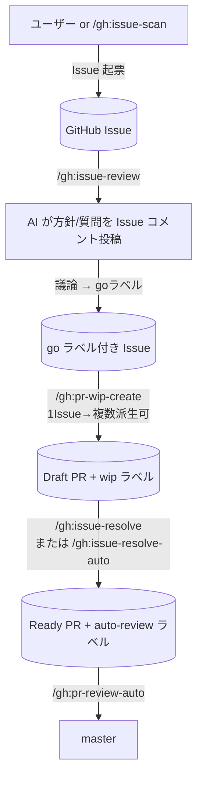

# gh プラグイン

GitHub Issues / Pull Request を真実のソースとして作業フローを回すプラグイン。

## ワークフロー全体像

## セットアップ

| No | 手順 |
|---|---|
| 1 | https://github.com/settings/tokens で Personal Access Token を発行（スコープ: `repo` / `read:org`） |
| 2 | `~/.bashrc` 等に `export GITHUB_PERSONAL_ACCESS_TOKEN=ghp_xxx` を追記 |
| 3 | Claude Code を再起動 |
| 4 | `/mcp` で `github` サーバーが connected か確認 |

## 同梱の MCP サーバー

| サーバー | エンドポイント | 役割 |
|---|---|---|
| `github` | `https://api.githubcopilot.com/mcp/`（公式 Remote HTTP） | issue/PR/repo 全般。default toolsets（`context, repos, issues, pull_requests, users`） |

## スキル一覧

| No | スキル | 概要 |
|---|---|---|
| 1 | `/gh:issue-scan` | コードベースを観点ごとにスキャンして Issue を起票 |
| 2 | `/gh:issue-review` | 未レビュー Issue を読み、方針/質問を Issue コメント投稿 |
| 3 | `/gh:pr-wip-create` | `go` ラベル付き Issue から Draft PR を 1 つ作る（1 Issue 複数派生可） |
| 4 | `/gh:issue-resolve` | 1 Draft PR を拾って実装 → Ready 化 |
| 5 | `/gh:issue-resolve-auto` | `wip` ラベルの Draft PR を N 件並列で実装 → Ready 化 |
| 6 | `/gh:pr-review-auto` | `auto-review` ラベルの Ready PR を直列でレビュー → 合格ならマージ |

## サブエージェント一覧

| No | エージェント | 呼び元 | 役割 |
|---|---|---|---|
| 1 | `issue-scanner` | `/gh:issue-scan` | 1 観点でスキャンし findings を返す |
| 2 | `issue-reviewer` | `/gh:issue-review` | 1 Issue を読みコメント本文を返す |
| 3 | `pr-wip-creator` | `/gh:pr-wip-create` | 1 Issue から Draft PR の雛形を作る |
| 4 | `issue-resolver` | `/gh:issue-resolve` / `issue-resolve-auto` | 1 Draft PR の中身を実装し Ready 化 |
| 5 | `pr-reviewer` | `/gh:pr-review-auto` | 1 PR をレビューし、合格なら自身でマージまで |

## ラベル設計

| ラベル | 意味 | 付与 | 外し |
|---|---|---|---|
| `scan` / `scan:{scope}` | issue-scan 起票 | `issue-scan` | 通常外さない |
| `ai-reviewed` | issue-review 済み | `issue-review` | 再レビューしたい時は手動 |
| `needs-clarification` | QA 待ち | `issue-review` | 議論で解消したら手動 |
| `ready-for-go` | go サイン候補 | `issue-review` | go ラベル付与時に手動 |
| `split-needed` | 分割推奨 | `issue-review` | 分割完了時に手動 |
| `go` | 実装着手 OK | ユーザー | 全派生 PR 完了時に手動 |
| `wip` | Draft PR | `pr-wip-create` | `issue-resolve` が ready 化時 |
| `resolving` | 実装中（排他） | `issue-resolve-auto` 取得時 | 完了時 |
| `auto-review` | レビュー対象 | `issue-resolve` 完了時 | `pr-review-auto` 取得時 |
| `reviewing` | レビュー中（排他） | `pr-review-auto` 取得時 | 完了時 |
| `needs-fix` | request_changes された PR | `pr-review-auto` | 再 push 後に手動 |
| `conflict-needs-human` | コンフリクト未解消 | `pr-review-auto` | 人手解消後 |
| `auto-review-failed` | レビュー or マージ失敗 | `pr-review-auto` | 人手対応後 |
| `resolve-failed` | 実装失敗 | `issue-resolve-auto` | 人手対応後 |

## 直列マージ原則

`pr-review-auto` は **必ず 1 件ずつ** `pr-reviewer` を呼ぶ。並列起動は禁止（master 取り込みとマージの競合を避けるため）。並列実装（`issue-resolve-auto`）は許容、並列マージは禁止。

## 前提

| No | 依存 |
|---|---|
| 1 | GitHub remote（`origin` が github.com）があること |
| 2 | work プラグイン v2.0 以降が有効（`/work:start` / `/work:merge` / `worktree_create` MCP に依存） |
| 3 | 環境変数 `GITHUB_PERSONAL_ACCESS_TOKEN` が設定済み |
